# Architecture Report

## Repository Inventory

Approximate inventory excluding `.git`, `node_modules`, `.next`, caches, and `__pycache__`:

| Metric | Count |
|---|---:|
| Total files | 1738 |
| Python files | 328 |
| Markdown files | 192 |
| TypeScript/TSX files | 278 |
| JSON files | 329 |
| CSV files | 166 |
| Images/PDFs | 133 PNG/PDF plus SVG assets |
| Model/checkpoint artifacts | 28 `.pth`, 18 `.pkl`, 4 `.onnx`, 4 `.db` |

## Top-Level Domains

```text
.
|-- physics/                         # Dynamical systems, neurosymbolic ML, validation, autonomous research loop
|-- satellite/                       # Spacecraft orbital thermal digital twin, API, flight/runtime prototypes
|-- dashboard/                       # Next.js 16 dashboard and interactive UI
|-- autonomous-spacecraft-thermal-os/ # Nested spacecraft-focused distribution/mirror
|-- papers/                          # Local LaTeX/PDF/BibTeX publication artifacts
|-- benchmark/                       # Benchmark specification
|-- datasets/                        # Dataset provenance catalog
|-- reproduce/                       # Reproduction scripts
|-- mathematics/                     # Placeholder for future formal math work
|-- quantum/                         # Placeholder for future quantum work
|-- artifacts/, results/, data/       # Generated outputs and copied datasets
|-- .github/workflows/               # Python and dashboard CI
```

## Major Execution Paths

### Physics Reproducible Pipeline

```text
python -m physics.run_pipeline --system harmonic --config physics/config.yaml
  -> physics/run_pipeline.py
  -> physics/neurosymbolic/pipeline.py
  -> physics/neurosymbolic/config.py
  -> physics/neurosymbolic/neural_ode.py
  -> physics/neurosymbolic/symbolic.py
  -> physics/neurosymbolic/audit.py
  -> results/<system>/
```

Inputs:

- `physics/config.yaml`
- Built-in synthetic trajectories

Outputs:

- `results/<system>/trajectory.png`
- `results/<system>/neural_ode_loss.png`
- `results/<system>/symbolic_coefficients.csv`
- `results/<system>/metrics.csv`
- `results/<system>/pipeline.log`

Observed issue:

- Direct script invocation `python physics/run_pipeline.py ...` fails in this environment due to package import resolution. Module invocation works.

### Legacy Multiphase Physics Pipeline

```text
physics/run_pipeline.py --experiment <id> [flags]
  -> experiments_archive scripts
  -> UCR/ECG loaders
  -> symbolic_discovery
  -> optional knowledge_graph
  -> optional autonomous scientist
  -> session export
```

Integration points:

- SQLite artifacts and generated JSON sessions
- Optional Neo4j graph database
- Optional LLM provider for autonomous discovery
- Optional PySINDy/PySR for symbolic regression

### Satellite Thermal Pipeline

```text
python satellite/run_thermal_pipeline.py --from-stage T9 --to-stage T28
  -> satellite/thermal/multi_node_thermal_network.py
  -> geometry_topology_optimizer.py
  -> hardware_in_the_loop.py
  -> train_thermal_pinn.py
  -> train_thermal_neural_ode.py
  -> closed_loop_thermal_control.py
  -> constellation_modeler.py
  -> material_aging.py
  -> tvac_integration.py
  -> ecss_compliance.py
  -> hpc_acceleration.py
```

Inputs:

- Default thermal parameters
- `satellite/cad/cubesat_cube.stl`
- `satellite/thermal/*.csv`
- `satellite/models/*.pkl`, `.pth`, `.onnx`

Outputs:

- Reports under `satellite/thermal/`, `satellite/reports/`, and root copies
- CSV telemetry
- Plots
- model checkpoints

### Satellite FastAPI Service

```text
satellite/api/thermal_api.py
  -> FastAPI app
  -> SQLite auth DB at satellite/api/auth.db
  -> model artifacts in satellite/models/
  -> thermal solvers in satellite/thermal/
```

Endpoints implemented:

- Auth: `/v1/auth/register`, `/v1/auth/login`
- Usage: `/v1/usage`
- Prediction: `/v1/predict`
- Numerical simulation: `/v1/simulate`
- Model metadata: `/v1/models`
- Design and equations: `/v1/optimal`, `/v1/equations`
- Reporting: `/v1/export-report`
- Operations: `/v1/health`, `/v1/metrics`, `/v1/status`, `/v1/version`

### Dashboard

```text
dashboard/src/app/page.tsx
  -> redirects to /en/dashboard
dashboard/src/app/[lang]/dashboard/page.tsx
  -> overview pages, KPIs, research trace
dashboard/src/app/[lang]/satellite/page.tsx
  -> interactive satellite workflow
  -> polls http://localhost:8000/v1/health
  -> calls http://localhost:8000/v1/simulate
```

Framework:

- Next.js 16
- React 19
- Tailwind CSS 4
- Zustand
- Recharts, Plotly, Framer Motion, lucide-react

Verification:

- `npm run build` passed with chart sizing warnings from Recharts.

## Dependency Graph

```mermaid
graph TD
  Root[Repository Root] --> Physics[physics]
  Root --> Satellite[satellite]
  Root --> Dashboard[dashboard]
  Root --> Papers[papers]
  Root --> Benchmarks[benchmark + datasets + reproduce]
  Root --> Nested[autonomous-spacecraft-thermal-os]

  Physics --> PhysNeuro[physics/neurosymbolic]
  Physics --> PhysCore[physics/core]
  Physics --> PhysSymbolic[physics/symbolic_discovery.py]
  Physics --> PhysKG[physics/knowledge_graph.py]
  Physics --> PhysAuto[physics/core/autonomous]
  Physics --> PhysValidation[physics/core/validation]
  Physics --> PhysData[physics/data + artifacts + models]

  PhysNeuro --> Torch[PyTorch + torchdiffeq]
  PhysNeuro --> Sklearn[scikit-learn]
  PhysNeuro --> SciPy[SciPy + NumPy]
  PhysSymbolic --> PySINDy[optional PySINDy]
  PhysSymbolic --> PySR[optional PySR + Julia]
  PhysKG --> Neo4j[optional Neo4j]
  PhysAuto --> LLM[optional OpenAI/Anthropic API]
  PhysAuto --> Sandbox[Docker optional or subprocess sandbox]

  Satellite --> Thermal[satellite/thermal]
  Satellite --> API[satellite/api/thermal_api.py]
  Satellite --> Flight[satellite/flight]
  Satellite --> Ops[satellite/ops, adcs, emc, radiation, estimation]
  Satellite --> Models[satellite/models]

  Thermal --> ThermalNetwork[multi_node_thermal_network.py]
  Thermal --> Orbit[orbital_environment.py]
  Thermal --> CAD[cad_thermal_importer.py]
  Thermal --> PINN[train_thermal_pinn.py]
  Thermal --> NODE[train_thermal_neural_ode.py]
  Thermal --> UQ[uncertainty_engine.py]
  Thermal --> HIL[hardware_in_the_loop.py]
  Thermal --> FEM[fem_correlation.py]

  API --> FastAPI[FastAPI + Pydantic]
  API --> SQLite[SQLite auth/usage]
  API --> Models
  API --> ThermalNetwork

  Dashboard --> Next[Next.js]
  Dashboard --> API
  Dashboard --> PublicArtifacts[dashboard/public/artifacts]
```



## Module-Level Inventory

### `physics/`

| Subdomain | Purpose | Inputs | Outputs | Integration Points |
|---|---|---|---|---|
| `physics/neurosymbolic` | Single-entry reproducible pipeline | YAML config, synthetic systems | metrics, plots, symbolic coefficients | `physics/run_pipeline.py` module mode |
| `physics/core/neurosymbolic` | Shared neural/symbolic primitives | tensors, trajectories | model predictions, symbolic expressions | Physics and satellite trainers |
| `physics/core/autonomous` | LLM-driven research loop | goals, API keys, generated code | hypotheses, experiment results, reports | LLM APIs, sandbox, SQLite/Neo4j |
| `physics/core/validation` | Scientific audit modules | embeddings, datasets, reports | validation JSON/MD artifacts | dashboard artifacts and reports |
| `physics/core/io` | Artifact/session export | session dictionaries | validated JSON artifacts | dashboard public artifacts |
| `physics/core/schemas` | Data contracts | experiment metadata | Pydantic validation | pipeline/session export |
| `physics/data` | Datasets | MIT-BIH, UCR, QG CSVs | model/audit inputs | ECG and QG pipelines |
| root physics scripts | Legacy and specialized studies | CLI flags, data folders | artifacts, reports, model files | CI, reports, dashboard |

### `satellite/`

| Subdomain | Purpose | Inputs | Outputs | Integration Points |
|---|---|---|---|---|
| `satellite/thermal` | Core thermal physics and ML | thermal parameters, CAD, CSVs | telemetry, plots, reports, models | API, dashboard, reproduction |
| `satellite/api` | FastAPI service | HTTP JSON/query requests, model files | predictions, simulations, reports | dashboard, external callers |
| `satellite/cloud` | SaaS/deployment prototypes | HTTP requests or deployment commands | local server responses, deployment logs | API demos |
| `satellite/flight` | Runtime/export prototypes | trained models | ONNX, C inference code, runtime reports | flight software research |
| `satellite/estimation` | EKF resilience | simulated measurements | reports and plots | digital twin calibration |
| `satellite/adcs`, `emc`, `radiation`, `ops` | Mission environment studies | scripted scenarios | CSVs, reports, plots | qualification evidence |
| `satellite/tests` | Core regression tests | local thermal modules | pytest results | CI |

### `dashboard/`

| Subdomain | Purpose | Inputs | Outputs | Integration Points |
|---|---|---|---|---|
| `src/app` | Next.js route structure | local data and public artifacts | static and interactive pages | dashboard build |
| `src/components` | UI components | typed props | charts, cards, timelines, scientific panels | routes |
| `src/hooks` | Artifact loading hooks | `public/artifacts` JSON | client-side data | dashboard pages |
| `src/stores` | Zustand global state | user interactions | persisted UI state | dashboard pages |
| `public/artifacts` | Static experiment/session data | generated JSON files | dashboard visualizations | physics pipeline outputs |

## Databases, Checkpoints, Artifacts

| Type | Location |
|---|---|
| SQLite knowledge / experiment DBs | `physics/scientific_kb.db`, `physics/artifacts/runs/math_search.db`, `satellite/api/auth.db` when API runs |
| PyTorch checkpoints | `physics/models/*.pth`, `physics/artifacts/*.pth`, `satellite/models/*.pth` |
| sklearn/XGBoost artifacts | `satellite/models/*.pkl` |
| ONNX artifacts | `satellite/flight/*.onnx` |
| Dashboard artifacts | `dashboard/public/artifacts/**` |
| Papers | `papers/system/*`, `physics/papers/*`, `papers/thermal`, `papers/qg` |

## CI/CD

| Workflow | Purpose |
|---|---|
| `.github/workflows/pytest.yml` | Python 3.10, 3.11, 3.12 matrix, installs root requirements and dev requirements, runs pytest with coverage over `physics` and `satellite`. |
| `.github/workflows/dashboard_auto_sync.yml` | Builds dashboard when figure/report/dashboard artifact paths change. |

## Architectural Risks

| Risk | Impact |
|---|---|
| Duplicate root and nested `autonomous-spacecraft-thermal-os` trees | Increases drift and confusion about source of truth. |
| Requirements split and optional dependencies not labeled | Users may hit missing packages for API, PySR, PySINDy, Neo4j, ONNX, Ray, XGBoost, ReportLab, serial hardware, or DeepXDE paths. |
| Direct script/package import mismatch | Main physics command in README fails unless invoked as a module. |
| Generated reports mixed with source code | Makes it hard to distinguish verified implementation from generated claims. |
| External validation claims embedded in docs | Real telemetry, flight readiness, and professional FEM claims need stricter provenance. |
