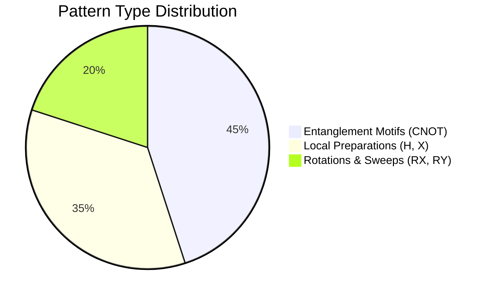

# Scientific Knowledge Observability Report

Generated on 2026-06-04 12:33:31 by the Discovery Observability Layer.

> [!NOTE]
> This dashboard monitors the accumulation, reuse, and transfer efficiency of neurosymbolic and quantum knowledge across optimization cycles.

---

## 1. Executive Summary

| Metric | Current Value | Assessment |
| :--- | :---: | :--- |
| **Total Discovered Motifs** | 0 | Total occurrences of distilled patterns |
| **Unique Knowledge Items** | 0 | Distinct canonical patterns in memory |
| **Knowledge Utilization (Survival) Rate** | 0.0000% | Ratio of injected patterns that survived selection |
| **Transfer Speedup** | N/A | Convergence acceleration factor (Cold vs Warm Start) |

---

## 2. Pattern Growth & Complexity

This section monitors the expansion of the Discovery Memory. A healthy pattern repository shows high frequency for simple entangling primitives.

### Top Distilled Motifs in Memory
- *No patterns extracted yet.*

---

## 3. Knowledge Reuse Dynamics

Tracks the closed loop: Mutation Injection $
ightarrow$ Physical Selection. A high utilization rate demonstrates that distilled patterns possess actual physical utility and survive selection.

- **Total Selected from Memory:** 0
- **Pattern Injection Attempts (Rate Filtered):** 0
- **Successfully Injected Circuits:** 0
- **Successful Injections (Survived):** 0
- **Survival Utilization Rate:** 0.0000%
- **Injection Success Rate (Injected / Attempts):** 0.0000%
- **Score Improvement Rate (Improved Score / Injected):** 0.0000%

> [!TIP]
> A survival rate above **15%** indicates a highly effective transfer loop, where the optimizer is successfully deploying distilled physical primitives instead of searching randomly.

---

## 4. Scientific Evolution Statistics

Aggregated metrics across all generation histories:

* **Peak Fitness Score:** `0.0`
* **Mean Population Score:** `0.0`
* **Genetic Diversity Index:** `0.0`

---

## 5. Transfer Learning Performance

Tracks acceleration gained by pre-populating memory from simpler tasks:

- **Cold Start Convergence Generations:** `N/A`
- **Warm Start Convergence Generations:** `N/A`
- **Transfer Acceleration Speedup:** **`N/A`**

---

## 6. Causal Audit & Motif Value Ranking

Tracks the exact fitness contribution of each reused motif.

| Motif | Executions | Mean Delta Score | Median Delta Score |
| :--- | :---: | :---: | :---: |
| *None* | 0 | 0.0000 | 0.0000 |

---
