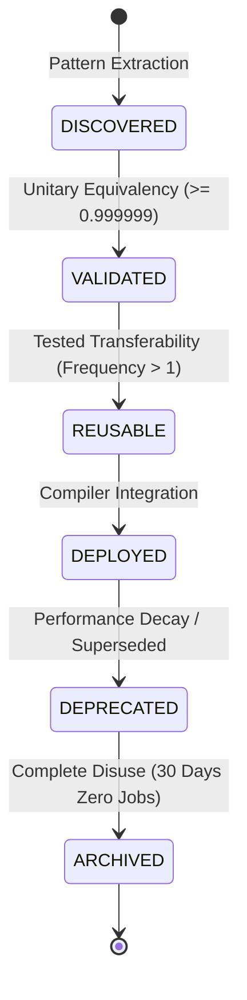

# QADE Motif Governance: Lifecycle Specification

This document defines the formal lifecycle states, transition gates, and governance policies for circuit compilation motifs within the Quantum Algorithm Discovery Engine (QADE).

---

## 1. Lifecycle State Machine Diagram

---

## 2. State-by-State Specifications

### 2.1. DISCOVERED

*   **Description**: A candidate local optimization rewrite pattern identified by QADE's compiler discovery pipeline.
*   **Entry Criteria**:
    *   Subcircuit pattern extracted by comparing pre-optimized and post-optimized circuits.
    *   Demonstrates a nominal gate count reduction ($> 0$) or gate depth reduction ($> 0$).
*   **Exit Criteria**:
    *   Successful unitary verification using classical simulation.
*   **Data Required in this State**:
    *   `motif_id` (Temporary UUID).
    *   `pattern_before`: Sequence of gates, qubit count, gate count.
    *   `pattern_after`: Sequence of gates, qubit count, gate count.
    *   `source_workload`: Unique identifier of the circuit workload from which it was extracted.
    *   `discovery_algorithm`: Specific extraction heuristic used.
*   **Approval Authority**: Automated Discovery Agent / Lead Compiler Engineer.

---

### 2.2. VALIDATED

*   **Description**: The motif has been mathematically proven to preserve circuit semantics.
*   **Entry Criteria**:
    *   Classical statevector simulation confirms unitary equivalence between `pattern_before` and `pattern_after` satisfies:
        $$\frac{1}{2^k} \left| \text{Tr}\left( U(M_{\text{in}})^\dagger U(M_{\text{out}}) \right) \right| \ge 0.999999$$
*   **Exit Criteria**:
    *   Demonstration of successful application and improvement on at least one unseen workload configuration from a different circuit family (tested transferability).
*   **Data Required in this State**:
    *   `validation_fidelity`: Measured unitary trace overlap (e.g. 1.0).
    *   `validator_version`: Semver of the validation tool.
    *   `validation_date`: ISO 8601 timestamp.
    *   `validated`: Boolean flag set to `true`.
*   **Approval Authority**: Automated `MotifValidator` module / QA Lead.

---

### 2.3. REUSABLE

*   **Description**: The motif has demonstrated transferability across unseen workloads and is registered in the QADE database.
*   **Entry Criteria**:
    *   Motif has been applied to at least one unseen circuit configuration.
    *   Frequency of occurrence across all audited workloads is greater than 1 (frequency $> 1$).
*   **Exit Criteria**:
    *   Integration into the production QADE rewrite pass.
*   **Data Required in this State**:
    *   `transferability_score`: Ratio of successful applications to total matches (e.g. 1.0).
    *   `tested_families`: Array of workload families where the motif was applied (e.g., `["Quantum Kernel", "QFT"]`).
    *   `frequency`: Cumulative count of occurrences in the workload corpus.
*   **Approval Authority**: Lead Compiler Engineer / Chief Quantum Architect.

---

### 2.4. DEPLOYED

*   **Description**: The motif is actively used by the QADE rewriter pass prior to placement and routing.
*   **Entry Criteria**:
    *   Merged into the compiler's active motif database release branch.
    *   Successfully passes regression unit tests.
*   **Exit Criteria**:
    *   Performance monitoring flags dephasing degradation on specific backend topologies, or a superior rewrite pattern is discovered.
*   **Data Required in this State**:
    *   `active_compiler_version`: Release version of QADE containing the motif.
    *   `production_execution_count`: Number of compilation runs utilizing this motif.
    *   `success_rate`: Percentage of compilation jobs where physical fidelity meets predicted metrics.
*   **Approval Authority**: Release Engineer / Operations Team.

---

### 2.5. DEPRECATED

*   **Description**: The motif is no longer recommended for active compilation but remains active in existing client pipelines.
*   **Entry Criteria**:
    *   A more general or efficient motif is discovered that supersedes this pattern.
    *   Hardware topology shifts (e.g., retirement of IBM Brisbane Heavy-Hex layout) make the motif redundant.
*   **Exit Criteria**:
    *   Zero active executions for 30 consecutive days.
*   **Data Required in this State**:
    *   `deprecation_date`: ISO 8601 timestamp.
    *   `deprecation_reason`: Text detailing the technical cause.
    *   `superseded_by`: Motif ID of the replacement pattern (if any).
*   **Approval Authority**: Lead Compiler Engineer / Product Manager.

---

### 2.6. ARCHIVED

*   **Description**: The motif has been completely removed from active compiler databases and is stored for historical audit purposes.
*   **Entry Criteria**:
    *   The deprecation period has expired, and the motif has achieved zero active jobs for 30 consecutive days.
*   **Exit Criteria**:
    *   None (terminal state).
*   **Data Required in this State**:
    *   `archive_date`: ISO 8601 timestamp.
    *   `historical_performance`: Cumulative statistics during active deployment.
*   **Approval Authority**: Chief Quantum Architect.
