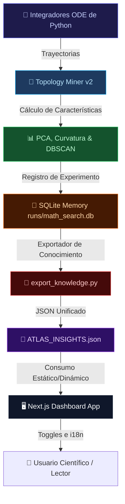

<p align="center">
  
  
  
  
  
  
</p>

<h1 align="center">🌌 Neurosymbolic Dynamic Atlas (ATLAS DINÁMICO)</h1>
<h3 align="center">Latent Feature Extraction, Differential Geometry Projection, and Adaptive Scientific Storytelling</h3>

<p align="center">
  <em>An advanced computational platform mapping the structural organization of nonlinear dynamical systems in latent feature spaces combined with a premium localized educational dashboard.</em>
</p>

---

## 🔬 Proyecto y Visión General

El **Neurosymbolic Dynamic Atlas** es un entorno experimental para el análisis y clasificación de sistemas dinámicos no lineales. En lugar de limitarse a ecuaciones matemáticas explícitas, el pipeline traduce trayectorias integradas numéricamente en **vectores de características estructurales de dimensión fija** (structural embeddings) y studies su organización geométrica, estabilidad y agrupamiento en un espacio latente de baja dimensión.

El objetivo central es responder:
> **¿Pueden familias distintas de sistemas dinámicos exhibir una organización geométrica coherente en el espacio latente de características, independientemente de su forma algebraica explícita?**

---

## ⚡ Estado Actual del Proyecto (Roadmap)

Rastreamos el progreso científico y técnico del sistema a través de las siguientes fases:

* **Fase 1: Arquitectura de Base**  
  `✅ COMPLETADA`  
  Definición del pipeline de simulación e integración de ecuaciones y sistema inicial de almacenamiento en base de datos.
  
* **Fase 2: Interfaz Científica Avanzada**  
  `✅ COMPLETADA`  
  Creación del panel Next.js, carga de datos y despliegue inicial de KPIs y layouts interactivos.

* **Fase 2.5A: Identidad Visual Cinemática**  
  `✅ COMPLETADA`  
  Estilo de diseño premium con paneles de cristal (glassmorphism), tipografía Google Fonts (Outfit/Inter) y microanimaciones optimizadas.

* **Fase 2.5B: Capa de UX Educativa**  
  `✅ COMPLETADA`  
  Implementación del soporte multiidioma nativo (i18n) y selector de complejidad (Simple/Advanced).

* **Fase 2.5C: Narrativa Científica (Scientific Storytelling)**  
  `✅ COMPLETADA`  
  Sistema `/discoveries` con findings, evidence panels, hypotheses, open questions y memoria científica serializable para narrar el proceso de descubrimiento.

* **Fase 2.5D: Capa de Ciencia Interactiva**  
  `✅ COMPLETADA`  
  Integración de simuladores físicos 3D interactivos y atlas geométrico de atractores caóticos.

* **Fase 2.6: Consolidación y Endurecimiento Científico**  
  `✅ COMPLETADA`  
  Estabilización de TypeScript sin warnings, registro de datos unificado `/data/index.ts`, base bibliográfica canónica `/data/bibliography.ts` con BibTeX y DOIs, puente de telemetría dinámica con SWR hooks y suite de QA end-to-end con Playwright.

* **Fase 3A: Memoria de Investigación y Visualización Científica**  
  `📅 PLANIFICADA`  
  Herramientas tridimensionales de persistencia de homología y proyecciones geodésicas avanzadas.

* **Fase 3B: Infraestructura de Telemetría y Watchers**  
  `📅 PLANIFICADA`  
  Monitoreo en tiempo real de experimentos del pipeline mediante WebSockets y watchers dedicados.

---

## 📐 Principios de la Arquitectura (Architectural Principles)

Para evitar la degradación técnica y garantizar un crecimiento limpio, el proyecto se rige por las siguientes directrices:

1. **Desacoplamiento UI/Lógica**: La visualización del frontend no debe computar trayectorias físicas complejas; estas se calculan en el pipeline de Python y se exponen en JSONs serializables.
2. **Serializabilidad estricta en `/data`**: Todos los datos cargados estáticamente por el frontend deben almacenarse en esquemas JSON tipados sin código lógico ni JSX incrustado.
3. **i18n Nativa e Integrada**: Todo texto científico o educativo en los componentes debe estar traducido al inglés (EN) y español (ES) usando diccionarios.
4. **Coexistencia de Complejidad**: Los modos *Simple* y *Advanced* deben convivir en el mismo layout, adaptando dinámicamente la profundidad conceptual desde analogías sencillas hasta formalismo matemático.
5. **Telemetría no Intrusiva**: El registro del estado del backend se realiza directamente en SQLite (`math_search.db`) y se exporta a un archivo de conocimiento unificado para su renderizado.
6. **Frontend Amigable con Agentes**: El código HTML y TSX debe estructurarse de manera semántica con IDs únicos para facilitar el testeo automatizado de interfaces.

---

## ⚙️ Arquitectura de Integración (Python ↔ Frontend)

El flujo de ejecución de datos sigue una arquitectura unidireccional desacoplada:



1. **Pipeline Científico (Python)**: Integra las ecuaciones diferenciales (ode), calcula 8 características estructurales clave, aplica agrupamiento DBSCAN y proyecta mediante PCA.
2. **Persistencia (SQLite)**: La información de los experimentos se almacena estructuradamente en la tabla `meta_insights` en `runs/math_search.db`.
3. **Paso de Mensajes**: El script `export_knowledge.py` compila la información de la base de datos a un formato JSON (`ATLAS_INSIGHTS.json`).
4. **Visualización (Next.js Dashboard)**: El frontend lee los insights científicos exportados y los renderiza en un dashboard responsivo adaptado al usuario.

---

## 📁 Estructura del Repositorio

```text
📦 root/
├── 🧠 core/
│   ├── evaluator_db.py              # Evaluador y auditor de experimentos en base de datos
│   └── orchestrator.py              # Orquestación de ejecuciones del backend
│
├── 🗂️ experiments_archive/          # Biblioteca de experimentos y scripts de simulación
│   ├── topology_miner_v2.py         # Extracción de descriptores de trayectorias
│   ├── continuous_attractors.py     # Integración de Lorenz, Rössler, Chua, etc.
│   ├── continuous_geometry.py       # Cálculo de curvatura latente y métricas geodésicas
│   ├── universal_atlas_visualization.py # Generación de gráficos y proyecciones
│   ├── baseline_benchmark.py        # Comparaciones contra ROCKET/DTW
│   ├── conjecture_engine.py         # Generador de conjeturas del sistema
│   └── ...
│
├── 🖥️ dashboard/                     # Aplicación Next.js 16.2 (React 19)
│   ├── app/                         # Enrutamiento basado en App Router
│   │   ├── [lang]/                  # Enrutamiento localizado (EN/ES)
│   │   │   ├── dashboard/           # Páginas de analíticas, logs y roadmap
│   │   │   ├── learn/               # Secciones de aprendizaje interactivo
│   │   │   └── discoveries/         # Narrativa de discoveries, evidencia e hipótesis
│   │   └── globals.css              # Estilos base y variables CSS variables
│   ├── components/                  # Componentes reutilizables (KPIs, Motion, UI)
│   ├── data/                        # Datos estáticos y serializados
│   ├── lib/                         # Librerías de traducción (i18n) y utils
│   ├── package.json                 # Configuración del frontend y scripts npm
│   └── tsconfig.json                # Configuración de TypeScript
│
├── 📊 artifacts/                    # Artefactos visuales e informes generados
│   ├── latent_curvature.png         # Proyección de curvatura en espacio de embeddings
│   ├── universal_atlas_pca.png      # Atlas universal de atractores mediante PCA
│   └── ...
│
├── 🗄️ runs/                         # Historial de ejecuciones y base de datos
│   └── math_search.db               # SQLite central de telemetría de experimentos
│
├── 🔬 temp_scripts/                 # Scripts auxiliares temporales (ignorados en git)
├── export_knowledge.py              # Exporta meta_insights de la BD sqlite a JSON
├── ATLAS_INSIGHTS.json              # Insights estructurados generados para el frontend
├── README.md                        # Documentación principal del sistema
└── .gitignore                       # Configuración de archivos excluidos
```

---

## 🛠️ Stack Tecnológico & Dependencias

### Backend y Entorno de Simulación
* **Lenguaje**: Python 3.10+
* **Paquetes Requeridos**:
  * `numpy` (Álgebra lineal y computación numérica)
  * `scipy` (Integración ODE y procesamiento de señales)
  * `sympy` (Cálculo algebraico y simbólico)
  * `scikit-learn` (Agrupamiento DBSCAN y reducción PCA)
  * `matplotlib` (Renderizado de gráficos científicos)
  * `networkx` (Cálculo de grafos de vecindad latente)
  * `sqlite3` (Persistencia relacional de telemetría)

### Frontend Dashboard
* **Framework**: Next.js 16.2.6 (App Router) con React 19.2.4
* **Lenguaje**: TypeScript 5+
* **Estilo**: TailwindCSS v4 y Vanilla CSS
* **Animaciones**: Framer Motion 12+, Animejs 4+
* **Gestión de Estado**: Zustand 5.0+
* **Visualización de Ecuaciones**: KaTeX 0.16+
* **Iconografía**: Lucide React 1.16+

---

## 🚀 Guía de Ejecución y Configuración

### 1. Requisitos Previos
Asegúrate de contar con Python 3.10+ y Node.js 18+ instalados en tu sistema.

### 2. Configuración del Backend (Python)
Se recomienda utilizar un entorno virtual para instalar los paquetes de Python:

```bash
# Crear entorno virtual
python -m venv .venv

# Activar entorno virtual
# En Windows:
.venv\Scripts\activate
# En Linux/macOS:
source .venv/bin/activate

# Instalar dependencias requeridas
pip install numpy scipy sympy scikit-learn matplotlib networkx
```

### 3. Ejecución del Pipeline Científico
Puedes ejecutar el pipeline científico completo que genera las simulaciones, las proyecciones y exporta el conocimiento al frontend:

```bash
python run_pipeline.py
```

Esto generará nuevos gráficos en `artifacts/` y actualizará el archivo `ATLAS_INSIGHTS.json`.

### 4. Configuración y Ejecución del Dashboard (Frontend)
El servidor de desarrollo de Next.js incluye HMR (Hot Module Replacement / Watchers automáticos) que compila y actualiza la página instantáneamente conforme editas el código:

```bash
# Entrar al directorio del frontend
cd dashboard

# Instalar dependencias de Node
npm install

# Iniciar servidor de desarrollo con HMR habilitado
npm run dev
```

Abre [http://localhost:3000](http://localhost:3000) en tu navegador para ver el dashboard interactivo en tiempo real.

### 5. Ejecución de Pruebas de Integración (Playwright)
Si el proyecto cuenta con test suites de Playwright configurados para auditorías de UI, puedes correrlos de la siguiente manera:

```bash
# Entrar al directorio del frontend
cd dashboard

# Instalar y correr los tests de Playwright
npx playwright test

# Para abrir la interfaz interactiva de Playwright
npx playwright test --ui
```

---

## 🧠 Características Avanzadas del Sistema

### 1. Telemetría y Gestión de Insights
El sistema registra de forma persistente cada ejecución de experimento mediante `core/evaluator_db.py`. Almacena las configuraciones de parámetros (atractor, pasos de integración, ruido, etc.) y los resultados heurísticos.  
Para consultar los insights recopilados actualmente directamente en terminal:
```bash
python core/evaluator_db.py read_insights
```

### 2. Sistema Localizado en Multiidioma (i18n)
La interfaz del frontend está estructurada bajo el directorio `dashboard/app/[lang]`. Soporta de manera nativa los idiomas **inglés (`en`)** y **español (`es`)**. Las rutas se resuelven dinámicamente basándose en la URL (por ejemplo `/en/dashboard` frente a `/es/dashboard`). Las claves y textos se extraen del diccionario ubicado en `dashboard/lib/i18n/dictionaries.ts`.

### 3. Selector de Complejidad (Simple vs. Advanced)
El panel cuenta con un switch de nivel de complejidad en la barra superior. Su estado se almacena globalmente a través de Zustand (`useAppStore`):
* **Modo Simple**: Minimiza la jerga técnica. Usa explicaciones por analogía (por ejemplo, comparando un atractor caótico con el clima) a través de componentes como `ExplainLikeIm15`.
* **Modo Advanced**: Revela fórmulas matemáticas formateadas con KaTeX, detalles de integradores Runge-Kutta y métricas de curvatura Riemanniana estimadas.

### 4. Descubrimientos Científicos y Narrativa (Storytelling)
El sistema presenta una secuencia interactiva estructurada por fases de descubrimiento que guía al lector a través de animaciones interactivas (`ScientificStory` y `StepByStepDiscovery`). Las principales conclusiones científicas actuales documentadas en la memoria del atlas son:
* **Separabilidad de Manifolds**: El agrupamiento DBSCAN en el espacio de características 8D separa con precisión dinámica continua (flujos de Lorenz/Rössler) de dinámica discreta iterativa (mapa Logístico).
* **Robustez bajo Deformación**: Los coeficientes del espacio latente demuestran resiliencia estructural bajo perturbaciones paramétricas moderadas antes de romper su homología de vecindad.

### 5. Bibliografía Canónica y Research Memory
La capa `dashboard/data/bibliography.ts` centraliza las referencias científicas usadas por discoveries, evidence panels y related research. Cada entrada incluye tipado estricto con `id`, `title`, `authors`, `year`, `venue`, `doi`, `arxiv`, `url`, `tags`, `category`, `citation` y bloques completos de `bibtex`.

Referencias iniciales de revisión por pares (Peer-Reviewed):
* **ROCKET (Clasificación Rápida)**: Dempster, Petitjean & Webb, *Data Mining and Knowledge Discovery*, 2020. DOI `10.1007/s10618-020-00701-z`, arXiv `1910.13051`.
* **UCR Time Series Archive (Validación)**: Dau et al., *IEEE/CAA Journal of Automatica Sinica*, 2019. DOI `10.1109/JAS.2019.1911747`, arXiv `1810.07758`.
* **DTW / Sakoe-Chiba (Alineamiento)**: Sakoe & Chiba, *IEEE Transactions on Acoustics, Speech, and Signal Processing*, 1978. DOI `10.1109/TASSP.1978.1163055`.
* **Atractor Caótico de Lorenz (Teoría de Caos)**: Lorenz, *Journal of the Atmospheric Sciences*, 1963. DOI `10.1175/1520-0469(1963)020<0130:DNF>2.0.CO;2`.
* **Universalidad de Feigenbaum (Cascadas de Bifurcación)**: Feigenbaum, *Journal of Statistical Physics*, 1978. DOI `10.1007/BF01020332`.
* **Fundamentos de IA Neurosimbólica (Integración Lógica-Redes)**: Besold et al., *AAAI Survey*, 2015. arXiv `1711.03902`.

---

## 🔒 Variables de Entorno Necesarias
El frontend de Next.js está diseñado para correr por defecto sin variables obligatorias en desarrollo. Sin embargo, para integraciones personalizadas de bases de datos o adaptaciones en producción, puedes crear un archivo `dashboard/.env.local`:

```text
# Ejemplo de configuración local
NEXT_PUBLIC_APP_URL=http://localhost:3000
NEXT_PUBLIC_DEFAULT_LANG=en
```

---

## 📦 Scripts NPM Disponibles
Dentro de la carpeta `dashboard/`, tienes a tu disposición los siguientes comandos npm:

| Comando | Descripción |
| :--- | :--- |
| `npm run dev` | Lanza el servidor de Next.js en modo desarrollo con HMR en el puerto 3000. |
| `npm run build` | Compila la aplicación Next.js y genera la build optimizada para producción. |
| `npm run start` | Arranca el servidor Next.js de producción utilizando la build previa. |
| `npm run lint` | Ejecuta el análisis de linter para verificar errores de código TypeScript/React. |

---

## Fase 3.1 - Runtime Hardening

El dashboard Next.js fue estabilizado sin reconstruir arquitectura: `lib/realtime` carga `socket.io-client` de forma opcional y cae a polling si no esta disponible, los timers de replay/telemetria/export limpian sus recursos al pausar o desmontar, los graficos interactivos usan ruido determinista para evitar hydration mismatches, y la suite Playwright cubre compare, replay, telemetry, export, overflow responsive y ausencia de console errors/warnings.
