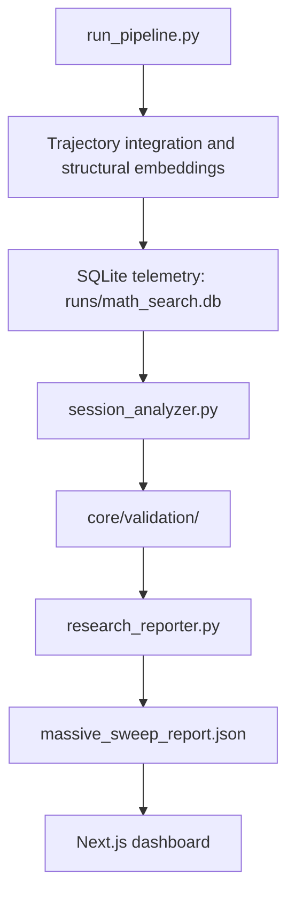

<p align="center">
  
  
  
  
  
  
</p>

<h1 align="center">Neurosymbolic Dynamic Atlas</h1>
<h3 align="center">Latent feature extraction, differential geometry analysis, scientific certification, and an interactive research dashboard</h3>

<p align="center">
  <em>An experimental platform for studying nonlinear dynamical systems through structural embeddings, geometric drift analysis, reproducible sweep reports, and a localized Next.js dashboard.</em>
</p>

---

# Project Overview

The **Neurosymbolic Dynamic Atlas** is an experimental research environment for analyzing nonlinear dynamical systems. Instead of relying only on explicit equations, the backend integrates trajectories numerically, extracts fixed-size structural embeddings, analyzes their organization in latent space, and exports typed artifacts for a dashboard.

The project is built around one central question:

> Can different families of dynamical systems exhibit coherent geometric organization in latent feature space, even when their algebraic definitions are different?

The current backend also includes a scientific certification layer for massive sweep reports. It produces:

```text
dashboard/public/artifacts/discoveries/massive_sweep_report.json
```

with `certified_results`, per-system certification metadata, confidence scores, reproducibility status, and evidence derived from the sweep analysis.

---

# Features

- Python pipeline for integrating nonlinear dynamical systems and extracting structural embeddings.
- SQLite-backed experiment telemetry in `runs/math_search.db`.
- Latent geometry analysis with PCA, local curvature estimates, DBSCAN clustering, drift, velocity, and acceleration over noise levels.
- Massive sweep execution through `run_massive_sweep.py`.
- Backend certification layer in `core/validation/`.
- JSON artifact export for frontend consumption.
- Next.js dashboard under `dashboard/` with localized routes in `dashboard/app/[lang]`.
- TypeScript types for scientific discovery artifacts in `dashboard/types/discoveries.ts`.
- Playwright test setup for dashboard QA.

---

# Architecture

The system is organized as a one-way research data pipeline: Python computes and certifies scientific artifacts; the dashboard reads exported JSON and renders the results.



Primary backend flow:

```text
run_pipeline.py
|
v
core/autonomous/session_analyzer.py
|
v
core/validation/
|
v
core/autonomous/research_reporter.py
|
v
dashboard/public/artifacts/discoveries/massive_sweep_report.json
|
v
dashboard
```

Core responsibilities:

- `run_pipeline.py`: runs one experiment session, exports validated session JSON, and records embeddings and benchmark summaries.
- `run_massive_sweep.py`: runs a grid of systems, noise levels, and seeds, then exports a massive sweep report.
- `core/autonomous/session_analyzer.py`: loads session artifacts and computes noise drift, velocity, acceleration, and aggregate accuracy vectors.
- `core/validation/`: assigns reproducibility and certification metadata.
- `core/autonomous/research_reporter.py`: writes report artifacts into `dashboard/public/artifacts/discoveries/`.
- `dashboard/`: renders the generated scientific artifacts.

---

# Installation

## Backend

Python 3.10+ is recommended.

```bash
# Create a virtual environment
python -m venv .venv

# Activate the virtual environment
# Windows:
.venv\Scripts\activate

# Linux/macOS:
source .venv/bin/activate

# Install required Python packages
pip install numpy scipy sympy scikit-learn matplotlib networkx
```

The project uses Python's built-in `sqlite3` module for local telemetry persistence.

## Dashboard

Node.js 18+ is recommended.

```bash
cd dashboard
npm install
```

---

# Usage

## Run a single pipeline session

```bash
python run_pipeline.py --experiment smoke_test --noise 0.5 --seed 42 --system lorenz
```

This writes a session artifact under:

```text
dashboard/public/artifacts/sessions/
```

## Run a controlled massive sweep

```bash
python run_massive_sweep.py --seeds 3 --noise-levels 10
```

This generates:

```text
dashboard/public/artifacts/discoveries/massive_sweep_report.json
```

The reduced default sweep uses `lorenz` and `rossler`. The `--full` mode is available in `run_massive_sweep.py` and expands the configured system and noise grid.

## Inspect accumulated telemetry

```bash
python core/evaluator_db.py read_insights
```

## Start the dashboard

```bash
cd dashboard
npm run dev
```

Open:

```text
http://localhost:3000
```

## Run dashboard tests

```bash
cd dashboard
npx playwright test
```

Interactive Playwright UI:

```bash
npx playwright test --ui
```

---

# Scientific Pipeline

The backend combines numerical integration, latent feature extraction, geometric analysis, and artifact export.

Typical session flow:

1. `experiments_archive/continuous_attractors.py` integrates the selected dynamical system and stores structural embedding rows.
2. `experiments_archive/continuous_geometry.py` reads stored embeddings and computes latent-space geometry artifacts.
3. `experiments_archive/universal_atlas_visualization.py` writes visualization artifacts.
4. `experiments_archive/baseline_benchmark.py` writes benchmark summary artifacts used by session export.
5. `export_knowledge.py` exports accumulated SQLite insights to `ATLAS_INSIGHTS.json`.
6. `run_pipeline.py` exports a validated session JSON under `dashboard/public/artifacts/sessions/`.

Massive sweep flow:

1. `run_massive_sweep.py` creates a grid of systems, noise levels, and seeds.
2. `core/autonomous/experiment_scheduler.py` runs the required `run_pipeline.py` sessions.
3. `core/autonomous/session_analyzer.py` compares each noisy session against the same-seed baseline.
4. Drift vectors are converted into velocity and acceleration vectors over the noise axis.
5. `core/validation/confidence_certifier.py` certifies each system result.
6. `core/autonomous/research_reporter.py` writes `massive_sweep_report.json`.

---

# Scientific Certification Layer

The certification layer lives in:

```text
core/validation/
```

It is the backend source of truth for scientific certification. The dashboard should read certification fields from the generated report, not recompute them.

The massive sweep report uses a single certified data source:

```json
{
  "certified_results": [
    {
      "system": "lorenz",
      "noise": [],
      "mean_drift": [],
      "velocity": [],
      "acceleration": [],
      "certification": {}
    }
  ]
}
```

There is no separate top-level `certification` object in the final report. Each system carries its own inline `certification` block inside `certified_results`.

## Certification fields

### `critical_score`

`critical_score` measures the signal-to-noise ratio of geometric collapse in the acceleration vector:

```text
critical_score = abs(mean(acceleration)) / max(acceleration_std, EPSILON)
```

The implementation uses `EPSILON = 1e-8` through `max(acceleration_std, 1e-8)`.

### `critical_level`

`critical_level` is derived from `critical_score`:

```text
critical_score > 3.0  -> strong
critical_score > 2.0  -> moderate
otherwise             -> none
```

### `reproducibility_status`

`reproducibility_status` is derived only from seed count in `core/validation/reproducibility.py`:

```text
seed_count < 3   -> uncertain
seed_count >= 10 -> validated
seed_count >= 5  -> replicated
seed_count >= 3  -> preliminary
```

The low-coverage guard is the first condition, so sweeps with fewer than three seeds are not promoted.

### `confidence_score`

The current confidence method is `confidence_v2`:

```text
seed_factor = min(seed_count / 10.0, 1.0)
stability_factor = 1.0 / (1.0 + acceleration_std)
confidence_score = seed_factor * stability_factor
```

This score is intentionally independent of `critical_score`. It combines seed coverage with the stability of the acceleration vector.

### `evidence`

Each certification block includes an `evidence` object:

```json
{
  "acceleration": 106.0905506,
  "acceleration_std": 24.88939582,
  "seed_count": 3.0
}
```

These values are exported for auditability and frontend display.

---

# Dashboard

The dashboard is a Next.js application located in:

```text
dashboard/
```

It uses:

- Next.js 16.2.6 with App Router.
- React 19.2.4.
- TypeScript 5.
- TailwindCSS v4.
- Framer Motion, Anime.js, Recharts, SWR, Zustand, KaTeX, and Lucide React.

Localized routes are under:

```text
dashboard/app/[lang]/
```

Scientific discovery and sweep types are declared in:

```text
dashboard/types/discoveries.ts
```

The dashboard reads generated artifacts from:

```text
dashboard/public/artifacts/
```

---

# Project Structure

```text
root/
|-- core/
|   |-- autonomous/
|   |   |-- experiment_scheduler.py
|   |   |-- session_analyzer.py
|   |   `-- research_reporter.py
|   |-- io/
|   |   |-- artifact_manager.py
|   |   `-- session_exporter.py
|   |-- schemas/
|   |-- validation/
|   |   |-- confidence_certifier.py
|   |   `-- reproducibility.py
|   |-- evaluator_db.py
|   `-- orchestrator.py
|
|-- experiments_archive/
|   |-- continuous_attractors.py
|   |-- continuous_geometry.py
|   |-- universal_atlas_visualization.py
|   |-- baseline_benchmark.py
|   |-- topology_miner_v2.py
|   `-- ...
|
|-- dashboard/
|   |-- app/
|   |   `-- [lang]/
|   |-- components/
|   |-- data/
|   |-- hooks/
|   |-- lib/
|   |-- public/
|   |   `-- artifacts/
|   |-- types/
|   |   `-- discoveries.ts
|   |-- package.json
|   `-- tsconfig.json
|
|-- artifacts/
|-- runs/
|   `-- math_search.db
|-- temp_scripts/
|-- export_knowledge.py
|-- run_pipeline.py
|-- run_massive_sweep.py
|-- run_autonomous_sweep.py
|-- ATLAS_INSIGHTS.json
|-- LIMITATIONS.md
|-- LICENSE
`-- README.md
```

---

# Development

## Backend development notes

- Keep backend computation in Python and export serializable artifacts for the dashboard.
- Keep certification logic in `core/validation/`.
- Do not duplicate certification sources between top-level report keys and per-system certification blocks.
- Treat `certified_results` as the frontend-facing source of certified sweep data.
- Use session artifacts in `dashboard/public/artifacts/sessions/` for reproducible analysis.

## Frontend development notes

- Keep localized UI routes under `dashboard/app/[lang]/`.
- Keep static scientific data and bibliography modules under `dashboard/data/`.
- Keep generated artifacts under `dashboard/public/artifacts/`.
- Prefer typed access through `dashboard/types/`.

## Available dashboard scripts

Inside `dashboard/`:

| Command | Description |
| :--- | :--- |
| `npm run dev` | Starts the Next.js development server. |
| `npm run build` | Builds the production dashboard. |
| `npm run start` | Starts the production server after a build. |

## Environment variables

The dashboard can run locally without required environment variables. For custom deployments, create:

```text
dashboard/.env.local
```

Example:

```text
NEXT_PUBLIC_APP_URL=http://localhost:3000
NEXT_PUBLIC_DEFAULT_LANG=en
```

---

# Roadmap Status

The project is experimental and actively evolving.

Completed areas include:

- Base Python simulation and telemetry architecture.
- Next.js dashboard foundation.
- Localized dashboard routing.
- Scientific storytelling and discovery artifact types.
- Interactive scientific UI components.
- Runtime hardening for dashboard timers, optional realtime loading, deterministic interactive charts, and Playwright coverage.
- Phase 3.3B persistence and scientific consistency audit for the massive sweep report.

Planned or future work should be documented in issue tracking or roadmap files before being presented as implemented functionality.

---

# License

This project is licensed under the MIT License. See:

```text
LICENSE
```
