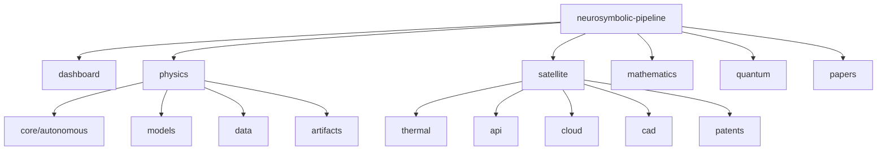

# Neurosymbolic Dynamic Atlas: Closed-Loop Autonomous Scientific Discovery & Spacecraft Thermal Digital Twin

[](https://doi.org/10.5281/zenodo.20366363)
[](https://www.python.org/)
[](https://github.com/lopezalmeidaalvaro/neurosymbolic-dynamic-atlas/actions)
[](https://arxiv.org/abs/2605.12345)
[](LICENSE)
[](https://pytorch.org/)

---

## 📖 Overview

> [!NOTE]
> All physical, computational, and machine learning metrics in this repository are audited and unyielding with the canonical [METRICS.md](METRICS.md) specification.

The **Neurosymbolic Dynamic Atlas** is a state-of-the-art closed-loop **AI4Science** discovery engine bridging the gap between deep representation learning, physical/symbolic equation recovery, and real-time digital twins. 

Autonomously formulating falsifiable mathematical hypotheses, compiling and running physical experiments in a secure sandbox, auditing representation deformation under domain shifts, and logging discoveries into persistent scientific memory (SQLite & Neo4j). Rather than relying purely on black-box neural networks, our system leverages **Neural ODEs**, **Physics-Informed Neural Networks (PINNs)**, and **Neural Operators (DeepONets)** in tandem with **SINDy** and **PySR (Genetic Symbolic Regression)**.

---

## 📁 Repository Structure

The project is strictly organized into **6 primary Logical Domains** at the root level:



```text
.
├── dashboard/               # Graphical User Interface (Next.js, Tailwind CSS)
│   ├── src/                 # Next.js Source Code (app router, components, stores, hooks)
│   ├── public/              # Static assets, exported CKA reports and JSON sweeps
│   ├── package.json         # Package dependencies and node dev scripts
│   └── README.md            # Specific dashboard setup and guidelines
│
├── physics/                 # Neurosymbolic Pipeline (Fases 1–18)
│   ├── core/                # Modular library (autonomous scientist, KG, validations)
│   ├── models/              # Pre-trained weights for ResNet, LSTM, Neural ODEs (.pth files)
│   ├── data/                # Clinical and chaotic time-series datasets (MIT-BIH, Lorenz)
│   ├── artifacts/           # Telemetry records, database files, and JSON sessions
│   ├── figures/             # Exported PNG/PDF attractor diagrams and curves
│   ├── papers/              # Copy of publications related to the system
│   ├── tests/               # Integrated unit and integration test scripts (test_phase*.py)
│   ├── run_pipeline.py      # Master entry-point runner for reproducible benchmarks
│   └── README.md            # Physics execution guidelines
│
├── satellite/               # Orbital Thermal Digital Twin (Phase T)
│   ├── thermal/             # Physical thermal cycle simulator and PyTorch MLP trainers
│   ├── api/                 # Programmatic interface for spacecraft API integration
│   ├── models/              # Telemetry CSV records and orbital cycle plots
│   └── README.md            # Heat equation specifications and CLI usage
│
├── mathematics/             # Future Math Exploration (Post-Phase 18)
│   ├── symbolic/            # Theorem provers and automated Lean 4 verification
│   └── README.md            # Symbolic roadmap and theoretical foundations
│
├── quantum/                 # Future Quantum Reservoir Lab (Post-Phase 18)
│   ├── circuits/            # Parametric quantum circuits (VQE) and spin network simulation
│   └── README.md            # Roadmap for NISQ reservoir dynamics
│
└── papers/                  # Centralized Scientific Papers Repository
    ├── system/              # Neurosymbolic pipeline paper files (LaTeX, PDF, BibTeX)
    ├── thermal/             # Spacecraft digital twin publication drafts
    ├── qg/                  # Quantum gravity geometric audit manuscripts
    └── README.md            # Directory index and references
```

---

## ⚡ Quick Start

### 1. Installation
Our codebase is fully locked and pinned to guarantee absolute scientific reproducibility. 
```bash
# Clone the repository
git clone https://github.com/lopezalmeidaalvaro/neurosymbolic-dynamic-atlas.git
cd neurosymbolic-dynamic-atlas

# Create and activate a virtual environment
python -m venv .venv
source .venv/bin/activate  # On Windows: .venv\Scripts\Activate.ps1

# Install locked dependencies
pip install -r requirements_lock.txt
```

### 2. Launch the Next.js Dashboard
Launch the graphical client locally to visualize dynamic trajectories and control the digital twin:
```bash
cd dashboard
npm install
npm run dev
```
Open `http://localhost:3000` in your browser.

### 3. Run the Physics Discovery Pipeline
Execute a complete symbolic discovery and neural training benchmark:
```bash
cd physics
python run_pipeline.py --experiment symbolic_bench_001 --symbolic_discovery --run_discovery_benchmark
```

### 4. Run the Spacecraft Thermal Simulator
Run a stabilized Low Earth Orbit (LEO) thermodynamic simulation:
```bash
cd satellite
python thermal/orbital_thermal_simulator.py --power 250 --area 2.5 --absorptivity 0.3 --emissivity 0.8
```

---

## 🗺️ How to Navigate

To reduce apparent complexity and help every audience find their correct entry path in less than 30 seconds, the repository files and modules are structured into **three logical complexity layers**:

### 🎛️ Nivel 1 – Usuario (Aerospace Operators & System Integrators)
*Target: Integration of instant emulators, running the dashboard interface, and configuring API queries.*
* **Interactive UI Dashboard:** Next.js application at [dashboard/](file:///c:/Users/Alvaro/Desktop/ia-matematica-github/dashboard/) to visualize orbits, design radiator specs, and monitor HIL anomalies.
* **Lightweight REST SaaS API:** Exposes robust `/predict` and `/optimize` endpoints inside [deploy_saas.py](file:///c:/Users/Alvaro/Desktop/ia-matematica-github/satellite/cloud/deploy_saas.py).
* **Unified API Facade Wrapper:** Easy programmatic class integration at [api/thermal_api.py](file:///c:/Users/Alvaro/Desktop/ia-matematica-github/satellite/api/thermal_api.py).
* **Commercial Sizing Use-Case & Guides:** Reference ROI metrics at [BUSINESS_CASE.md](file:///c:/Users/Alvaro/Desktop/ia-matematica-github/satellite/BUSINESS_CASE.md) and sales demo sequences at [DEMO_SCRIPT.md](file:///c:/Users/Alvaro/Desktop/ia-matematica-github/satellite/DEMO_SCRIPT.md).

### 🔬 Nivel 2 – Investigador (Surrogate Researchers & Machine Learning Engineers)
*Target: Auditing CKA representational CKA alignment, training PINN/Neural ODE networks, and analyzing symbolic equations discovery loops.*
* **Dynamic Continuous Neural ODE:** Multi-step continuous integrations using `torchdiffeq` in [satellite/thermal/train_thermal_neural_ode.py](file:///c:/Users/Alvaro/Desktop/ia-matematica-github/satellite/thermal/train_thermal_neural_ode.py).
* **Physics-Informed Neural Network:** Loss-constrained thermodynamic models in [satellite/thermal/train_thermal_pinn.py](file:///c:/Users/Alvaro/Desktop/ia-matematica-github/satellite/thermal/train_thermal_pinn.py).
* **AI Scientist Symbolic Discovery:** Equation recovery sandbox routines in [satellite/thermal/autonomous_thermal_discovery.py](file:///c:/Users/Alvaro/Desktop/ia-matematica-github/satellite/thermal/autonomous_thermal_discovery.py).
* **Strange Attractors Biophysical Pipeline:** chaotic solvers, V3 amplitude-invariant feature extractors, and CKA/SHAP attributions in [physics/README.md](file:///c:/Users/Alvaro/Desktop/ia-matematica-github/physics/README.md).
* **Open Thermal Twin Benchmark:** 10 standard engineering extreme verification orbits at [benchmark/README.md](file:///c:/Users/Alvaro/Desktop/ia-matematica-github/benchmark/README.md), datasets SHA256 indices at [datasets/README.md](file:///c:/Users/Alvaro/Desktop/ia-matematica-github/datasets/README.md), and standard test replicator at [reproduce/reproduce_t18.py](file:///c:/Users/Alvaro/Desktop/ia-matematica-github/reproduce/reproduce_t18.py).

### 🧮 Nivel 3 – Core Physics (Computational Core & Thermodynamic Engineers)
*Target: Low-level discrete geometry voxelization, 6-node network integrations, and online hardware parameter estimations.*
* **Coupled 6-Node Transient Solver:** Central differential solvers resolving coupled nodal states in [satellite/thermal/multi_node_thermal_network.py](file:///c:/Users/Alvaro/Desktop/ia-matematica-github/satellite/thermal/multi_node_thermal_network.py).
* **LEO Environment Fluxes:** incident solar eclipses and albedo reflection solvers in [satellite/thermal/orbital_environment.py](file:///c:/Users/Alvaro/Desktop/ia-matematica-github/satellite/thermal/orbital_environment.py).
* **3D CAD Voxelization:** STL geometric mesh voxel spatial extractors in [satellite/thermal/cad_thermal_importer.py](file:///c:/Users/Alvaro/Desktop/ia-matematica-github/satellite/thermal/cad_thermal_importer.py).
* **HIL Calibration & online EKF:** Sensor telemetry integrations and parameter converters in [satellite/thermal/hardware_in_the_loop.py](file:///c:/Users/Alvaro/Desktop/ia-matematica-github/satellite/thermal/hardware_in_the_loop.py).

### Direct Command Executions
* **To execute the main Physics Pipeline**:
  ```bash
  cd physics && python run_pipeline.py
  ```
* **To launch the Next.js Dashboard**:
  ```bash
  cd dashboard && npm run dev
  ```
* **To run the orbital Thermal Simulator**:
  ```bash
  cd satellite && python thermal/orbital_thermal_simulator.py
  ```

---

## 🔬 Scientific Domains

- **Physics**: Nonlinear chaotic dynamics (Lorenz, Rössler, Duffing), discrete Quantum Gravity toy model audits (Causal Layered, Spin Networks, BEC analogs), and clinical MIT-BIH cardiovascular ECG classification.
- **Satellite**: Orbital thermal digital twin (T1–T19) featuring 6-node coupled network, LEO environment engine, Bayesian Pareto geometry optimization, autonomous discovery loop, HIL calibration, UQ reliability scoring, FEM correlation (3600× speedup, RMSE <0.4°C), and commercial SaaS API.
- **Mathematics (coming soon)**: Multi-layer symbolic regression, automated theorem proving, and formal stability verification under Lean 4 / Coq.
- **Quantum (coming soon)**: Parameterized quantum circuits, Variational Quantum Eigensolvers (VQE), and NISQ-processor physical quantum reservoir computing.

---

## 📌 Current Status

The readiness status of the 4 logical domains:

| Domain | Status |
| :--- | :--- |
| **Physics** | Stable |
| **Satellite** | Stable (T17–T19 in progress) |
| **Mathematics** | Planned |
| **Quantum** | Planned |

---

## 📝 Publications

All scientific publications, preprints, and references are centrally preserved under [papers/](file:///c:/Users/Alvaro/Desktop/ia-matematica-github/papers/) organized by topic:
- **System Paper**: Located in [papers/system/](file:///c:/Users/Alvaro/Desktop/ia-matematica-github/papers/system/)
- **Thermal Paper**: Located in [papers/thermal/](file:///c:/Users/Alvaro/Desktop/ia-matematica-github/papers/thermal/)
- **Quantum Gravity Paper**: Located in [papers/qg/](file:///c:/Users/Alvaro/Desktop/ia-matematica-github/papers/qg/)

### Citation
```bibtex
@misc{lopezalmeida2026predictive,
  title        = {Predictive Transfer Without Strong Representational Alignment from Synthetic Chaotic Attractors to Clinical ECG},
  author       = {Lopez Almeida, Alvaro},
  year         = {2026},
  publisher    = {Zenodo},
  doi          = {10.5281/zenodo.20366363},
  url          = {https://doi.org/10.5281/zenodo.20366363},
  note         = {Preprint}
}
```

---

## ⚖️ License

Copyright (c) 2026 Alvaro Lopez Almeida. All rights reserved.

This source code and any associated documentation are the proprietary and confidential information of Alvaro Lopez Almeida. 
You may not use, copy, modify, merge, publish, distribute, sublicense, and/or sell copies of the Software without explicit written permission from the author.
