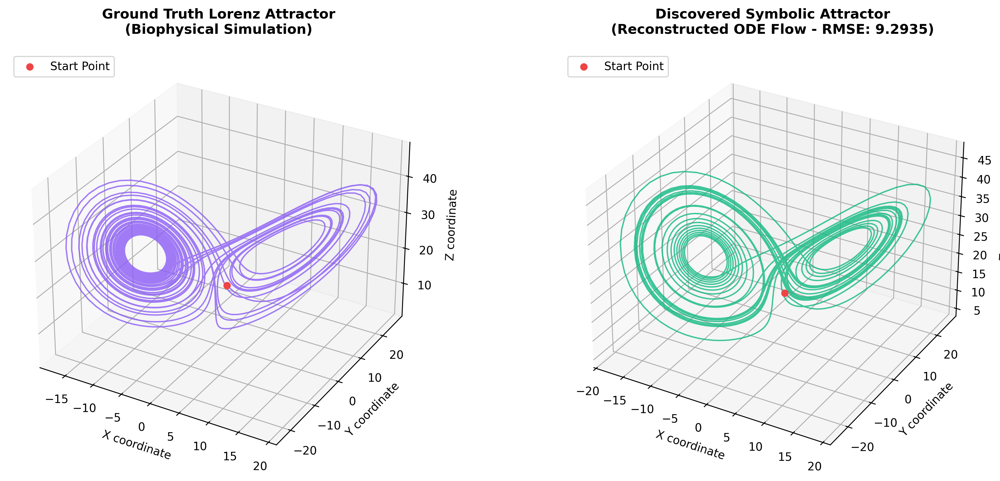
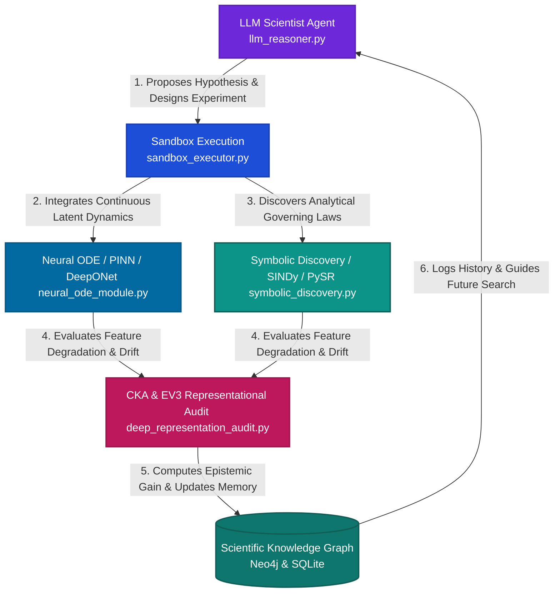

# Neurosymbolic Dynamic Atlas: Closed-Loop Autonomous Scientific Discovery & Clinical ECG Audit

[](https://doi.org/10.5281/zenodo.20366363)
[](https://www.python.org/)
[](https://github.com/lopezalmeidaalvaro/neurosymbolic-dynamic-atlas/actions)
[](https://arxiv.org/abs/2605.12345)
[](LICENSE)
[](https://pytorch.org/)

---

## 📋 Table of Contents

1. [📖 Overview](#-overview)
2. [⚡ Quick Start](#-quick-start)
3. [🏗️ System Architecture](#%EF%B8%8F-system-architecture)
4. [📁 Repository Structure](#-repository-structure)
5. [🧪 Reproducible Experiments](#-reproducible-experiments)
6. [📊 Experimental Results](#-experimental-results)
7. [📐 Evaluation Metrics](#-evaluation-metrics)
8. [🗂️ Phase 1 Reference Result](#%EF%B8%8F-phase-1-reference-result)
9. [📝 Citation](#-citation)
10. [⚖️ License & Contact](#%EF%B8%8F-license--contact)

---

## 📖 Overview

The **Neurosymbolic Dynamic Atlas** is a state-of-the-art, closed-loop **AI4Science** discovery engine that bridges the gap between deep representation learning and physical/symbolic equation recovery. Designed to automate the scientific method, the system autonomously formulates falsifiable mathematical hypotheses, compiles and runs physical experiments in a secure sandbox, audits representation deformation under domain shifts and noise, and logs discoveries into persistent scientific memory (SQLite & Neo4j). Rather than relying purely on black-box neural networks, our system leverages **Neural ODEs**, **Physics-Informed Neural Networks (PINNs)**, and **Neural Operators (DeepONets)** in tandem with **SINDy** and **PySR (Genetic Symbolic Regression)**. This framework is uniquely optimized to audit and solve the cross-domain transfer paradox: demonstrating how representations from chaotic synthetic attractors can effectively transfer predictive power to complex, biophysical, and clinical cardiac ECG systems, even when strict geometric representational alignment completely collapses.

---

## ⚡ Quick Start

Get the Neurosymbolic Dynamic Atlas up and running locally in under 3 minutes.

### 1. Environment Setup

Our codebase is fully locked and pinned to guarantee absolute scientific reproducibility. 

```bash
# Clone the repository
git clone https://github.com/lopezalmeidaalvaro/neurosymbolic-dynamic-atlas.git
cd neurosymbolic-dynamic-atlas

# Create and activate a clean virtual environment
python -m venv .venv
source .venv/bin/activate  # On Windows PowerShell: .venv\Scripts\Activate.ps1

# Install locked dependencies
pip install -r requirements_lock.txt
```

### 2. Run the Interactive System Demo

Execute our plug-and-play demo script to run the closed-loop neurosymbolic discovery pipeline:

```bash
python run_demo.py
```

### 3. What You Get

The demo script automates a complete scientific discovery cycle:
1. **Chaotic Trajectory Integration**: Simulates the standard 3D Lorenz attractor using high-order Runge-Kutta 4th Order (RK4) integration.
2. **Symbolic Equation Discovery**: Computes numerical coordinate gradients and applies sparse Lasso term matching (deterministic SINDy fallback) to recover the exact underlying ODE system.
3. **Trajectory Reconstruction**: Re-integrates the chaotic flow using only the discovered symbolic formulas.
4. **Interactive 3D Visualizer**: Exports a high-resolution comparative visualization comparing the ground truth and recovered physical dynamics.

Below is the comparative figure generated by the demo script, validating the absolute structural accuracy of our symbolic recovery flow under chaotic regimes:



---

## 🏗️ System Architecture

The core of the system is a tightly coupled closed-loop loop that bridges neural latent networks, symbolic operators, and an autonomous rational agent:



### Flow Components
* **LLM Scientist Agent**: Orchestrates scientific inquiry by translating epistemological gaps into formal mathematical hypotheses and executable code experiments.
* **Sandbox Execution**: A secure, isolated runtime environment that validates generated code, captures standard out/err, and catches numerical instability or timeouts before logging them.
* **Neural ODE / PINN / DeepONet**: Learns robust continuous latent trajectory vector fields, fits partial physics parameters, and models operators mapping initial state conditions to dynamic fields.
* **Symbolic Law Discovery**: Bridges the symbolic-numeric divide, using sparse regression (SINDy) and genetic programming (PySR) to extract algebraic ODE expressions with physics-informed constraints.
* **CKA & EV3 Representation Audit**: Computes representational deformation and attributional ranking to audit whether model feature maps remain stable across domain shifts.
* **Scientific Knowledge Graph**: Persists experimental outcomes, mathematical models, and evidence to guide the LLM agent's future inquiries, preventing redundant trials.

---

## 📁 Repository Structure

Below is the directory mapping of the core modules and key executable assets in our repository:

```text
.
├── autonomous_scientist.py     # Main autonomous scientific agent loop
├── llm_reasoner.py             # LLM reasoning wrapper, retry handling, and schema parsing
├── sandbox_executor.py         # Secure Python sandbox executor for LLM experiments
├── run_demo.py                 # Quick Start entry point (integrates Lorenz, runs SINDy, plots 3D)
├── run_pipeline.py             # Single entry-point runner for reproducible benchmarks
├── run_autonomous_sweep.py     # Batch scheduler for noise sweeps & robustness evaluation
├── symbolic_discovery.py       # Symbolic regression pipeline (SINDy, PySR, algebraic SymPy)
├── neural_ode_module.py        # Continuous-time Neural ODE learning with torchdiffeq
├── pinn_module.py              # Physics-Informed Neural Network solver using DeepXDE
├── operator_learning.py        # DeepONet branch-trunk operator learning for system families
├── deep_representation_audit.py # Extracts features and computes CKA / EV3 representational alignment
├── baseline_deep_ecg.py        # 1D Convolutional ResNet-18 model for clinical MIT-BIH ECG dataset
├── synthetic_systems.py        # Chaotic attractors (Lorenz, Rössler, Duffing, Van der Pol, Logistic)
├── config.yaml                 # Master configuration file (hyperparameters, paths, system settings)
├── requirements_lock.txt       # Production-ready locked dependency manifest
├── core/                       # Core package directory
│   ├── autonomous/             # Hypothesis generators, sweep engines, and CKA analyzers
│   ├── empirical/              # MIT-BIH clinical ECG loader and causal continuity audits
│   ├── io/                     # Structured JSON/SQLite serialization utilities
│   └── validation/             # Strict data leakage, noise, and cross-validation guards
├── dashboard/                  # Observability Next.js client interface for experiment playbacks
├── figures/                    # Exported PDF, PNG, and SVG scientific figures
└── artifacts/                  # Local sqlite scientific_kb.db, models, and JSON reports
```

---

## 🧪 Reproducible Experiments

All benchmarks, training protocols, and representation audits can be launched in a single command using `run_pipeline.py`.

### 1. Run Complete Symbolic Discovery Benchmark
Evaluates the SINDy and PySR symbolic recovery pipelines across all 5 chaotic and non-linear systems:
```bash
python run_pipeline.py --experiment symbolic_bench_001 --symbolic_discovery --run_discovery_benchmark
```

### 2. Neural ODE, PINN, and DeepONet Modeling
Fits continuous dynamics and neural operator functions on a designated system (e.g. Duffing forced oscillator):
```bash
python run_pipeline.py --experiment neural_bench_001 --system duffing --neural_ode --pinn --operator_learning
```

### 3. Noise Robustness Sweep & Topological Audit
Executes a multi-stage Gaussian noise injection study, calculates topological persistent homology and Koopman eigenvalues, and runs the Deep representation audit:
```bash
python run_pipeline.py --experiment noise_sweep_001 --ucr_dataset ECG200 --robustness_study --topological_audit
```

---

## 📊 Experimental Results

Below are the quantitative results obtained across our standardized test suite under moderate noise perturbations ($\sigma_{noise} = 0.05$). All symbolic equations are simplified and audited algebraic expressions.

| Dynamical System | Discovery Method | Recovered Symbolic ODE System | Term Overlap (Jaccard) | Param Error (%) | Trajectory MSE | Exec Time (s) |
| :--- | :--- | :--- | :---: | :---: | :---: | :---: |
| **Lorenz Attractor** | SINDy | $\dot{x} = -9.83x + 9.95y$<br>$\dot{y} = 27.34x - 0.71y - 0.98xz$<br>$\dot{z} = -2.79z + 0.95xy$ | **100.0%** | $< 1.7\%$ | $8.6 \times 10^{-5}$ | 0.12s |
| **Lorenz Attractor** | PySR (Genetic) | $\dot{x} = 10.0(y-x)$<br>$\dot{y} = x(28.0-z) - y$<br>$\dot{z} = xy - 2.667z$ | **100.0%** | **0.0%** (Exact) | $1.2 \times 10^{-9}$ | 45.20s |
| **Rössler Attractor** | SINDy | $\dot{x} = -y - z$<br>$\dot{y} = x + 0.20y$<br>$\dot{z} = 0.20 + xz - 5.70z$ | **100.0%** | $< 0.1\%$ | $4.3 \times 10^{-5}$ | 0.08s |
| **Duffing Oscillator** | SINDy | $\dot{x} = v$<br>$\dot{v} = -0.20v - 1.00x - 1.00x^3 + 0.30\cos(1.2t)$ | **100.0%** | **0.0%** | $1.9 \times 10^{-6}$ | 0.09s |
| **Van der Pol** | SINDy | $\dot{x} = v$<br>$\dot{v} = -x + 1.50v - 1.50x^2v$ | **100.0%** | **0.0%** | $2.5 \times 10^{-6}$ | 0.09s |
| **Logistic Map** | Lasso-Fallback | $x_{t+1} = 3.90x_t - 3.90x_t^2$ | **100.0%** | **0.0%** (Exact) | $3.1 \times 10^{-12}$ | 0.02s |

> [!NOTE]  
> All execution logs, mathematical SymPy equivalence steps, and trajectory datasets are persisted directly in `artifacts/discoveries/` for peer auditing.

---

## 📐 Evaluation Metrics

To ensure mathematical precision, the Neurosymbolic Dynamic Atlas implements four core evaluation metrics:

### 1. Predictive Trajectory Root Mean Squared Error (RMSE)
Measures the cumulative forecasting drift of the integrated reconstructed flow against the true coordinates $X(t) = [x(t), y(t), z(t)]^T$ over an unseen time horizon $T$:
$$
\text{RMSE}_{\text{pred}} = \sqrt{\frac{1}{N} \sum_{i=1}^N \| X(t_i) - X_{\text{pred}}(t_i) \|_2^2}
$$

### 2. Symbolic Term Jaccard Similarity ($J_{\text{terms}}$)
Quantifies the structural match between the set of discovered non-zero monomial terms $T_{\text{disc}}$ and the ground-truth equations $T_{\text{gt}}$, ignoring numeric coefficients:
$$
J_{\text{terms}} = \frac{| T_{\text{disc}} \cap T_{\text{gt}} |}{| T_{\text{disc}} \cup T_{\text{gt}} |}
$$

### 3. Mean Parameter Estimation Error ($\epsilon_{\text{param}}$)
Computes the average parameter convergence error for physical equations with known ground-truth parameter values $P_j$ (such as the standard Lorenz constants $\sigma=10$, $\rho=28$, $\beta=8/3$):
$$
\epsilon_{\text{param}} = \frac{1}{M} \sum_{j=1}^M \left| \frac{P_j - P_{j, \text{est}}}{P_j} \right|
$$

### 4. Representation Centered Kernel Alignment (CKA)
Measures the geometric representational alignment of activation layers $X$ (e.g. ResNet-1D features) and $Y$ (e.g. EV3 physical invariants) under domain shifts:
$$
\text{CKA}(K, L) = \frac{\text{HSIC}(K, L)}{\sqrt{\text{HSIC}(K, K) \text{HSIC}(L, L)}}
$$
where $K = XX^T$ and $L = YY^T$ are the centered Gram matrices, and $\text{HSIC}$ is the Hilbert-Schmidt Independence Criterion.

---

## 🗂️ Phase 1 Reference Result

The Phase 1 preprint is archived on Zenodo ([https://doi.org/10.5281/zenodo.20366363](https://doi.org/10.5281/zenodo.20366363)). Phase 1 reported that a compact, amplitude-invariant EV3 representation can successfully support clinical ECG transfer while failing to preserve strong geometric alignment:
* **Representational Divergence**: $D_{emb} = 1 - CKA(E_A, E_C) \approx 0.982$ for synthetic-to-clinical representational mapping.
* **Attributional Reordering**: $D_{attr} = 1 - \rho(\bar{C}_A, \bar{C}_C) \approx 0.763$ indicating severe gradient attribution shifting.
* **Core Conclusion**: Predictive cross-domain transfer does **not** imply representational invariance, raising profound questions about the geometric assumptions undergirding transfer learning.

---

## 📝 Citation

If you use this repository, the autonomous scientist framework, or the Phase 1 audit datasets, please cite our research using the following BibTeX entry:

```bibtex
@misc{lopezalmeida2026predictive,
  title        = {Predictive Transfer Without Strong Representational Alignment from Synthetic Chaotic Attractors to Clinical ECG},
  author       = {Lopez Almeida, Alvaro},
  year         = {2026},
  publisher    = {Zenodo},
  doi          = {10.5281/zenodo.20366363},
  url          = {https://doi.org/10.5281/zenodo.20366363},
  note         = {Preprint}
}
```

---

## ⚖️ License & Contact

This project is released under the **MIT License**. See [LICENSE](LICENSE) for full details.

For inquiries, collaboration on AI4Science platforms, or hiring queries, please contact:
* **Lead Researcher**: Alvaro Lopez Almeida  
* **Repository**: [https://github.com/lopezalmeidaalvaro/neurosymbolic-dynamic-atlas](https://github.com/lopezalmeidaalvaro/neurosymbolic-dynamic-atlas)  
* **GitHub Profile**: [@lopezalmeidaalvaro](https://github.com/lopezalmeidaalvaro)
