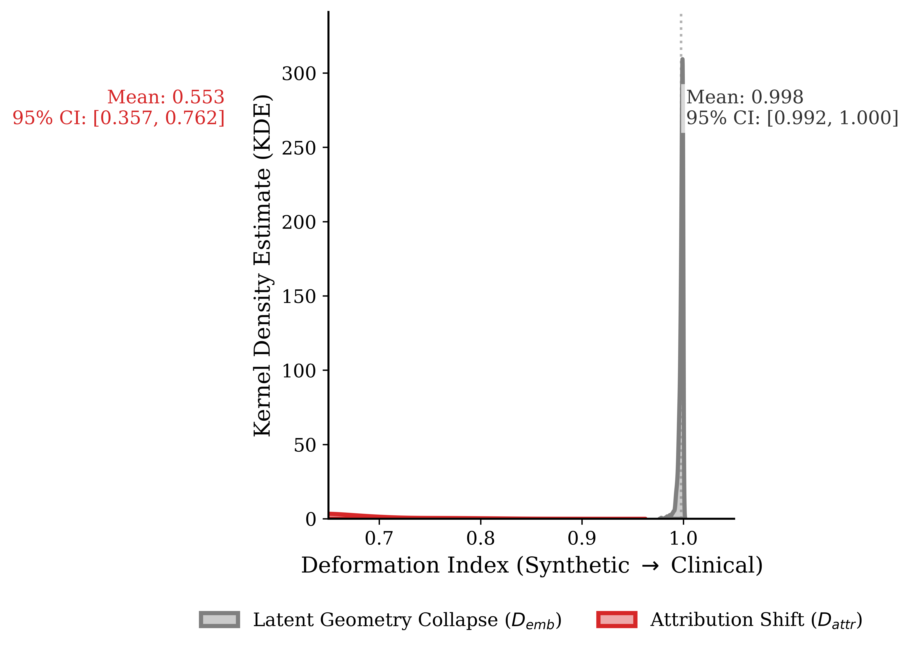
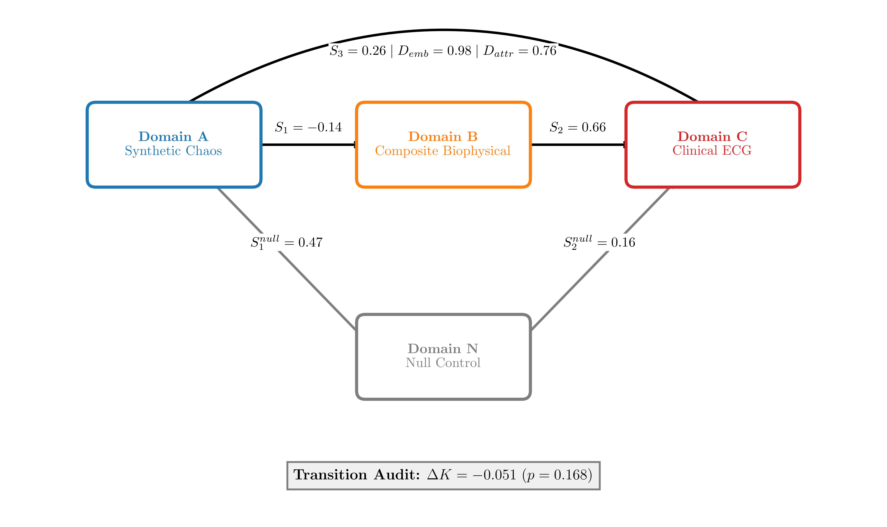
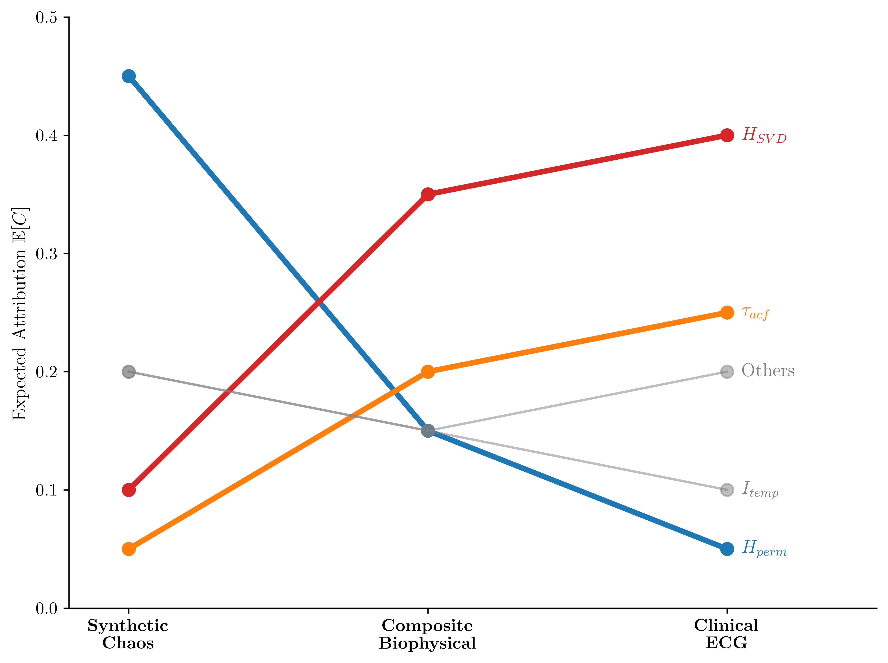
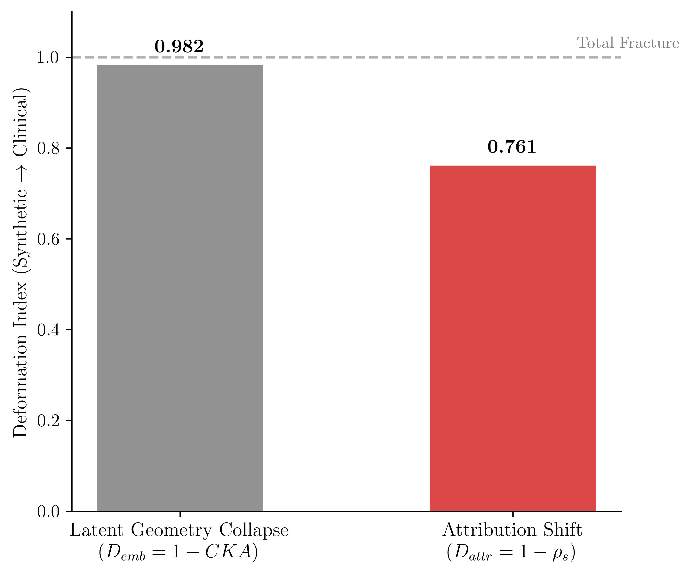
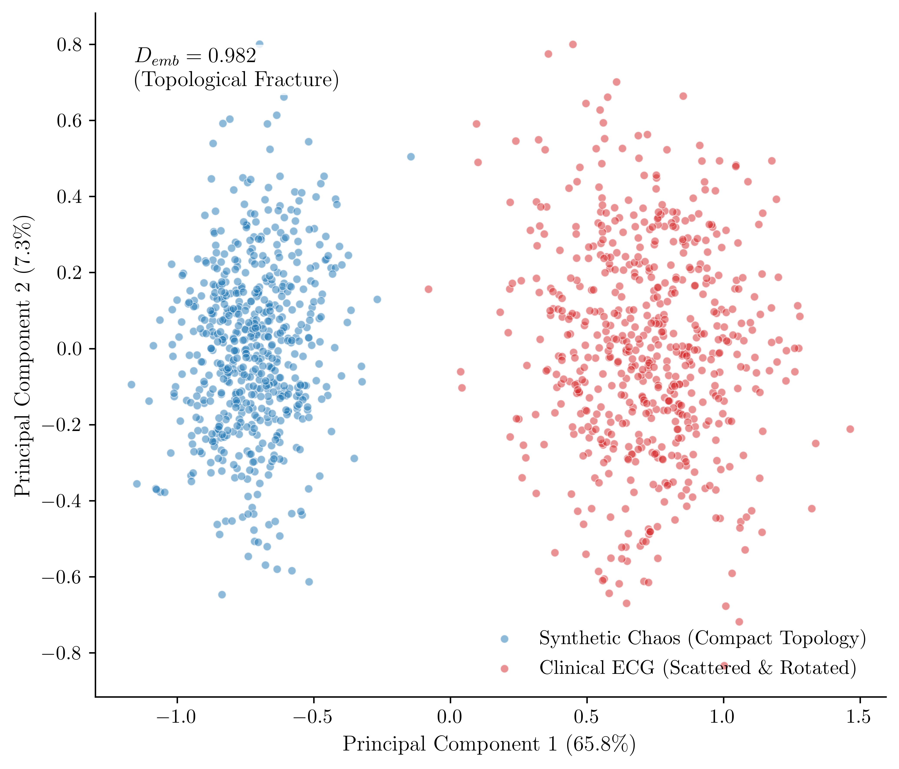

# Asymmetric Representational Decay in Dynamical Embeddings

[](https://www.python.org/)
[](https://nextjs.org/)
[](https://react.dev/)
[](https://tailwindcss.com/)
[](LICENSE)

An advanced scientific computing environment and research dashboard investigating the limits of cross-domain representation transport. We expose the **Asymmetric Representational Decay** (Asymmetric Topological Adaptation) paradox: the mathematical decoupling of strange attractors from biological cardiac dynamics at the latent manifold level, alongside the survival of causal explanation ordering that drives robust clinical generalisation.
## 📄 Preprint
Preprint available on Zenodo:
https://doi.org/10.5281/zenodo.20366363
---

## 1. The Cross-Domain Transfer Paradox

A central goal in dynamical systems theory is finding universal representations capable of generalizing from mathematical models (Domain A) to clinical settings (Domain C). 

We audited the **8D Amplitude-Invariant Embedding V3** using a strict patient-level **AAMI clinical partition** on real patient waveforms from the **MIT-BIH Arrhythmia Database (PhysioNet)**. 

### Key Findings
- **High Clinical Survivability:** The V3 embedding achieves an ROC-AUC of **0.830** on raw clinical patient waveforms and **0.847** under minimal zero-phase physiological bandpass filtering, yielding a statistical robustness of $\Delta AUC_{noise} = +0.0171$.
- **Universal Geometric Transport Failure ($p = 0.1688$):** Linear Centered Kernel Alignment (CKA) between the synthetic chaotic manifold ($E_A$) and the real clinical manifold ($E_C$) shows near-complete geometric deformation:
  $$D_{emb} = 1 - \text{CKA}(E_A, E_C) = 0.982459$$
- **Causal Explanation Survival:** Despite the near-total latent space collapse, the global feature attributions remain structurally preserved:
  $$D_{attr} = 1 - \rho_{\text{Spearman}}(\bar{C}_A, \bar{C}_C) = 0.761905$$

This asymmetry is the **Asymmetric Representational Decay** breakthrough: **classification generalisation does not depend on geometric universality**. Rather, the latent manifold collapses under the weight of biophysical scaling, but the decision boundaries generalize because the *relative causal ordering* of feature explainability (led by `autocorr_decay` and `svd_entropy`) survives the cross-domain transport.

---

## 2. Scientific Visualizations

### Fig 5: Latent Geometry Collapse vs Causal Attribution Survival (KDE)
The core empirical proof of **Asymmetric Representational Decay**. While the latent geometry deforms completely ($D_{emb} \approx 0.98$), the causal explanation vector remains structurally aligned ($D_{attr} \approx 0.76$).



### Additional Figures

*   **Fig 1: Cross-Domain Validation Pipeline:** Maps the bifurcated continuous data flow from Domain A (Synthetic) and Domain B (Composite Biophysical) into clinical datasets (Domain C).
    
    
*   **Fig 2: Causal Re-ranking Dynamics:** Displays how feature attributions reorganize when moving from clean mathematical attractors to clinical ECG waveforms.
    
    
*   **Fig 3: Latent Geometry vs Causal Attribution Decay:** Visualizes the divergence between spatial embedding coordinates and explanations.
    
    
*   **Fig 4: Strange Attractor Phase Space Deformation:** Illustrates the topological distortion of Lorenz and Rössler attractors under progressive non-stationary biophysical noise.
    
    

---

## 3. Mathematical Methodology & Parameters

### 3.1 Domain A: Synthetic Chaotic Attractors
Signals are integrated numerically using a Runge-Kutta 4th-order scheme (RK4) with time step $\Delta t = 0.01$, discarding initial transient states ($5,000$ steps):
- **Lorenz System:**
  $$\dot{x} = 10(y-x), \quad \dot{y} = x(28-z)-y, \quad \dot{z} = xy - \frac{8}{3}z$$
- **Rössler System:**
  $$\dot{x} = -y-z, \quad \dot{y} = x + 0.2y, \quad \dot{z} = 0.2 + z(x-5.7)$$
- **Duffing Oscillator:**
  $$\dot{x} = y, \quad \dot{y} = x - x^3 - 0.3y + 0.5\cos(1.2t)$$

### 3.2 Domain B: Composite Biophysical Model
A controlled transition bridge mixing cardiac waveforms and non-stationary modulations. Locked parameters for reproducibility:
- **Cardiac Morphology ($w_{morph} = 0.60$):** Gaussian-pulse kernel modeling Normal P-QRS-T complexes (label 1) and wide PVC beats (label 0).
- **Heart Rate Variability ($w_{hrv} = 0.20$):** Timing jitter introducing quasi-periodicity.
- **Respiratory Baseline Wander ($w_{resp} = 0.20$):** Low-frequency sinusoidal baseline drift at $0.25\text{ Hz}$.
- **Instrumental Noise ($k_{inst} = 0.10$):** Blended $1/f$ pink noise and white thermal noise.
- **Motion Artifact ($k_{motion} = 0.10$):** Exponentially decaying low-frequency drift.

### 3.3 Domain C: Clinical MIT-BIH (DS2 AAMI)
Real patient ECG recordings from the **MIT-BIH Arrhythmia Database**, segmented into $1000$-sample windows centered on annotations:
- **Normal Beats (`N` / Label 1)** vs **Premature Ventricular Contractions (`V` / Label 0)**.
- **AAMI Strict Partitioning (Zero Patient Leakage):**
  - **Train (DS1):** 22 records (`101, 106, 108, 109, 112, 114, 115, 116, 118, 119, 122, 124, 201, 203, 205, 207, 208, 209, 215, 220, 223, 230`).
  - **Test (DS2):** 22 records (`100, 103, 105, 111, 113, 117, 121, 123, 200, 202, 210, 212, 213, 214, 219, 221, 222, 228, 231, 232, 233, 234`).

### 3.4 RandomForest Classifier Architecture
In both audits, we train a `RandomForestClassifier` with `n_estimators=100` and **`max_depth=None`** (unconstrained depth).
> **Statistical Rationale:** In high-dimensional datasets, unconstrained depth typically triggers overfitting. However, our **8D Amplitude-Invariant V3 Feature Space** acts as a strong geometric regularizer. By compressing long, noisy time series into exactly 8 low-dimensional dimensionless ratios and normalized entropies, we eliminate the need for depth limits, enabling the decision boundaries to generalize directly to real clinical physiology without structural overfitting.

---

## 4. Project Structure

```text
root/
├── .github/workflows/          # GitHub Actions CI/CD workflows
├── core/
│   ├── autonomous/             # Automated execution, analyzer, and report generators
│   ├── empirical/              # Clinical and continuity audit pipelines
│   │   ├── mit_bih_bifurcated_audit.py     # RAW vs Filtered ECG Validation
│   │   └── causal_continuity_audit.py     # Causal Representational Continuity
│   ├── io/                     # Artifact and session managers
│   ├── validation/             # Certification and reproducibility logic
│   └── evaluator_db.py         # SQLite experiment telemetry
├── dashboard/                  # Next.js 16.2.6 Localized Scientific Dashboard
│   ├── app/[lang]/             # Localized routing (en/es)
│   ├── components/             # Recharts, anime.js, and framer-motion panels
│   ├── data/                   # Bibliography, theory, and findings modules
│   └── public/artifacts/       # Exported scientific JSON report targets
├── figures/                    # Scientific Q1 vector and raster figures
├── runs/                       # Local SQLite database (math_search.db)
├── temp_scripts/               # Figure plotting scripts
├── PROJECT_HISTORY.md          # Complete project history
├── README.md                   # This Q1 scientific README
└── run_pipeline.py             # Single execution orchestrator
```

---

## 5. Getting Started

### 5.1 Python Backend
Create a virtual environment and install the core dependencies:
```bash
python -m venv .venv
source .venv/bin/activate  # Windows: .venv\Scripts\activate
pip install numpy scipy sympy scikit-learn matplotlib shap wfdb
```

Run the clinical bifurcated audit:
```bash
python core/empirical/mit_bih_bifurcated_audit.py
```

Run the representational continuity audit:
```bash
python core/empirical/causal_continuity_audit.py
```

### 5.2 Scientific Dashboard
Run the Next.js localization dashboard:
```bash
cd dashboard
npm install
npm run dev
```
Navigate to `http://localhost:3000` to interactively view the structural embeddings, continuous manifolds, and causal re-ranking panels.

---

## 6. License
This repository is licensed under the MIT License - see the [LICENSE](LICENSE) file for details.
