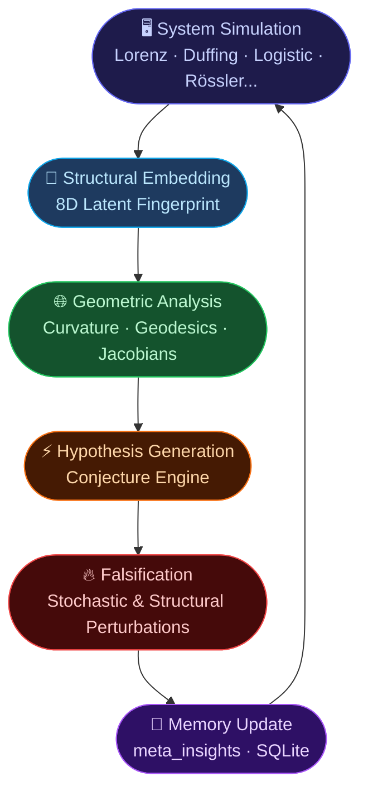

<p align="center">
  
  
  
  
  
</p>

<h1 align="center">🌌 Neurosymbolic Automated Discovery Engine</h1>
<h3 align="center">Geometric Latent Analysis of Dynamical Systems</h3>

<p align="center">
  <em>An autonomous scientific agent that formulates, tests, and falsifies hypotheses about chaos and universality — using geometry as its primary language.</em>
</p>

---

## 🧠 Overview

This project is an experimental **neurosymbolic research framework** designed to explore whether complex dynamical systems can be classified *geometrically* rather than *algebraically*.

Instead of analyzing equations directly, the engine transforms dynamical trajectories into **latent structural embeddings** and studies their geometry using an interdisciplinary toolkit:

| Domain | Role |
| :--- | :--- |
| Dynamical Systems Theory | System simulation & trajectory generation |
| Differential Geometry | Curvature, geodesics, metric tensors |
| Statistical Physics | Universality, phase transitions, scaling |
| Topological Analysis | Manifold structure, clustering, continuity |
| Machine Learning | Embedding, projection (PCA, DBSCAN), prediction |
| Autonomous Epistemic Falsification | Hypothesis generation & stress testing |

The system operates as a **closed scientific loop**: it simulates, embeds, geometrizes, conjectures, falsifies, and updates its own knowledge base — without human intervention.

---

## 🔬 Core Hypothesis

> **Dynamical systems may be more naturally classified by the geometry they induce in latent representation spaces than by their explicit algebraic form.**

The framework experimentally investigates whether **chaotic behavior, bifurcations, synchronization, and universality classes** emerge as intrinsic geometric properties of latent manifolds — not as features of the underlying equations.

> *"Equations may not be the fundamental identity of dynamical systems. Geometry may be."*

---

## ⚙️ Architecture — The Epistemological Loop

The engine's core is an **autonomous epistemological cycle**. Every experimental session traverses the following pipeline:



### The Four Memory Pillars

| Pillar | Implementation | Role |
| :--- | :--- | :--- |
| **Episodic Memory** | `runs/math_search.db` — SQLite nodes | Chronological log of all executions & costs |
| **Semantic Memory** | `meta_insights` table | Heuristics, structural rules, confidence scores |
| **Topological Miner** | `experiments_archive/topology_miner_v2.py` | Extracts geometric fingerprints from trajectories |
| **Isolated Evaluator** | `core/evaluator_db.py` | Sandboxed execution & telemetry engine |

---

## 📊 Main Contributions

### 1 · Structural Embedding Space *(Embedding v2)*

Each dynamical system is transformed into an **8-dimensional structural representation** — a geometric fingerprint of its behavior:

| Feature | Physical / Mathematical Interpretation |
| :--- | :--- |
| **Max. Lyapunov Exponent** | Sensitivity to initial conditions — the signature of chaos |
| **Spectral Entropy** | Frequency disorder and turbulence degree |
| **Dominant Frequency** | Principal oscillatory mode of the attractor |
| **Variance** | Spatial spread of trajectories in phase space |
| **Autocorrelation Decay** | Memory loss rate / ergodicity index |
| **Kurtosis** | Extreme-event structure and heavy-tail behavior |
| **Skewness** | Symmetry breaking in the trajectory distribution |
| **RMS Energy** | Global dynamical power of the system |

### 2 · Latent Kinematics

Continuous parametric sweeps across dynamical families revealed **latent velocity fields, acceleration discontinuities, bifurcation walls, and topological phase transitions**. The onset of chaos manifests as *explosive geometric displacement* inside the embedding manifold.

### 3 · Geometric Differential Analysis

The latent manifold is treated as a **discrete Riemannian variety**. The engine computes:
- Local curvature & metric tensor expansion
- Geodesic divergence & flow fields
- Jacobian collapse near singular geometric regions

> **Key observation:** Chaotic regimes consistently correspond to regions of **negative curvature** and **exponential geodesic divergence**.

### 4 · Autonomous Epistemological Engine

The conjecture engine autonomously:
1. Detects structural correlations across system families
2. Clusters dynamical universality classes
3. Generates formal conjectures with confidence scores
4. Designs targeted falsification experiments
5. Updates semantic memory (`meta_insights`) with validated rules

### 5 · Universal Dynamical Atlas

The system mapped and geometrically separated multiple dynamical families in a unified latent space:

`Logistic Map` · `Duffing Oscillator` · `Van der Pol` · `Kuramoto Network` · `Lorenz Attractor` · `Rössler Attractor` · `Chua Circuit`

> **Experimental evidence:** Continuous strange attractors form **coherent latent topological continents**, while discrete chaotic maps inhabit geometrically distinct, isolated regions.

---

## 🌌 The Chaos Atlas — Visual Evidence

Key visualizations produced autonomously by the engine during experimental sessions:

| Latent Curvature Map | Geodesic Divergence Field |
| :---: | :---: |
|  |  |
| *Negative curvature zones correlate with chaotic onset* | *Exponential geodesic separation defines chaos geometrically* |

| Universal Atlas (PCA) | Deformation Flow |
| :---: | :---: |
|  |  |
| *Continuous attractors cluster into distinct manifold regions* | *Parametric deformation reveals topological phase transitions* |

### 🏆 Autonomous Discoveries

The engine independently formalized the following structural findings:

- ✅ **Feigenbaum Universality** — Scaling constants in period-doubling bifurcations survive across structurally different map families (logistic, sine).
- ✅ **Continuous/Discrete Separation** — Strange attractors and discrete chaotic maps are geometrically separable in the 8D latent space without using algebraic labels.
- ✅ **Geodesic Divergence as Chaos** — Exponential separation of geodesic trajectories on the latent manifold provides a geometry-native definition of chaotic behavior.
- ⚠️ **GP Prediction Failure** — Gaussian Process models fail globally due to latent caustics and manifold folding — indicating non-trivial topological structure.

---

## ⚙️ How It Works

A typical experimental cycle from the command line:

**1. Query the knowledge base:**
```bash
python core/evaluator_db.py read_insights
```

**2. Run a sandboxed experiment:**
```bash
python core/evaluator_db.py eval none ode_integration scipy \
    experiments_archive/geodesic_flow.py --notes "Geodesic divergence test"
```

**3. Export the semantic brain:**
```bash
python export_knowledge.py
# → Writes ATLAS_INSIGHTS.json with all validated meta-insights
```

The engine then:
1. **Extracts embeddings** — computes 8D latent structural signatures from generated trajectories
2. **Projects geometrically** — applies PCA, DBSCAN, cosine similarity, curvature tensors, and Jacobian dynamics
3. **Updates memory** — promotes surviving structural rules into `meta_insights` with updated confidence scores

---

<details>
<summary>📁 Repository Structure — <em>Click to expand</em></summary>

```text
📦 root/
├── 🧠 core/
│   ├── evaluator_db.py          # Sandboxed execution engine + SQLite memory interface
│   └── ...                      # Orchestrator, insight injection, telemetry
│
├── 🗂️ experiments_archive/
│   ├── geodesic_flow.py         # Geodesic divergence analysis
│   ├── latent_curvature.py      # Riemannian curvature estimation
│   ├── topology_miner_v2.py     # Core topological feature extractor
│   ├── feigenbaum_hunt.py       # Universality constant verification
│   ├── lorenz_sim.py            # Lorenz attractor simulation
│   ├── continuous_attractors.py # Rössler, Duffing, Van der Pol
│   ├── conjecture_engine.py     # Autonomous hypothesis generation
│   └── ...                      # 40+ archived research scripts
│
├── 📊 artifacts/
│   ├── latent_curvature.png     # Curvature manifold visualization
│   ├── geodesic_divergence.png  # Geodesic flow divergence map
│   ├── universal_atlas_pca.png  # Multi-system latent projection
│   ├── universal_atlas_data.json
│   └── ...                      # All generated reports, images, datasets
│
├── 🔬 temp_scripts/             # Active sandbox — current experiments
├── 🗄️ runs/
│   └── math_search.db           # SQLite: episodic memory + meta_insights
│
├── export_knowledge.py          # Exports meta_insights → ATLAS_INSIGHTS.json
├── ATLAS_INSIGHTS.json          # 📦 The exported semantic brain of the engine
└── README.md
```

</details>

<details>
<summary>📦 Dependencies — <em>Click to expand</em></summary>

**Core requirements:**

```bash
pip install numpy scipy sympy scikit-learn matplotlib networkx
```

| Package | Purpose |
| :--- | :--- |
| `numpy` | Numerical arrays, linear algebra |
| `scipy` | ODE integration, signal analysis, optimization |
| `sympy` | Symbolic mathematics, formal verification |
| `scikit-learn` | PCA, DBSCAN, Gaussian Process, manifold tools |
| `matplotlib` | Visualization and plot generation |
| `networkx` | Execution graph construction |
| `sqlite3` | Built-in — episodic and semantic memory |

**Optional (enhanced visualization):**

```bash
pip install pandas seaborn plotly
```

</details>

---

## ⚠️ Scientific Disclaimer

> This repository is an **experimental computational research framework**. The geometric interpretations and latent-space hypotheses are exploratory in nature and should not be interpreted as formally established physical laws.
>
> The project investigates whether geometric latent representations can reveal meaningful organizational structures in nonlinear dynamics. Further mathematical formalization, theoretical validation, and peer-reviewed analysis would be required before drawing strong scientific conclusions.

---

## 📄 License & Status

**License:** MIT © 2026 Alvaro &nbsp;|&nbsp; **Status:** `Experimental Research Prototype — Actively Evolving`
