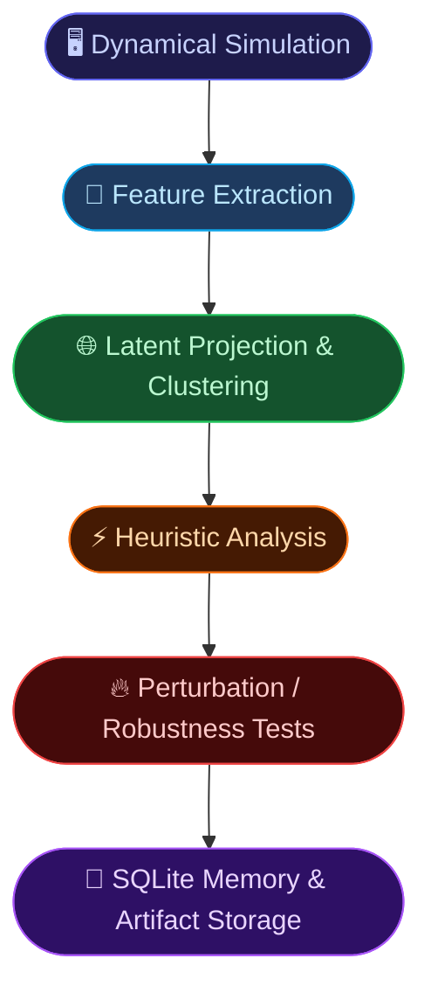
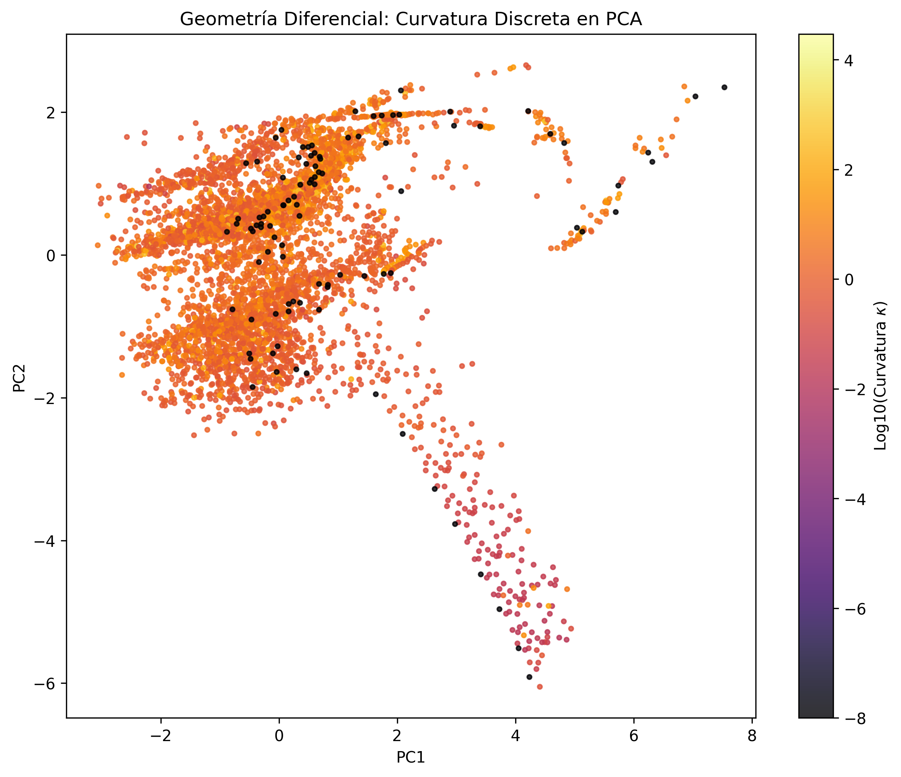
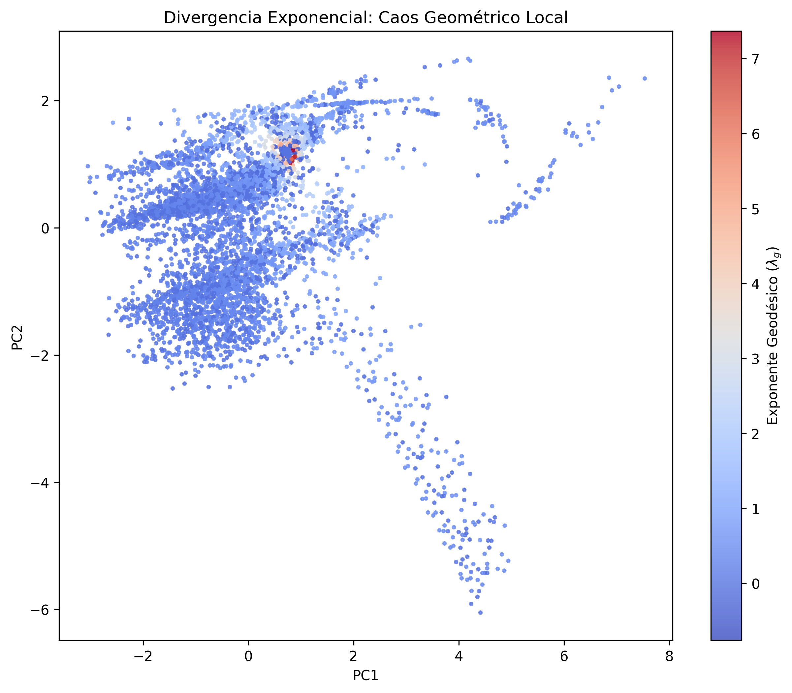
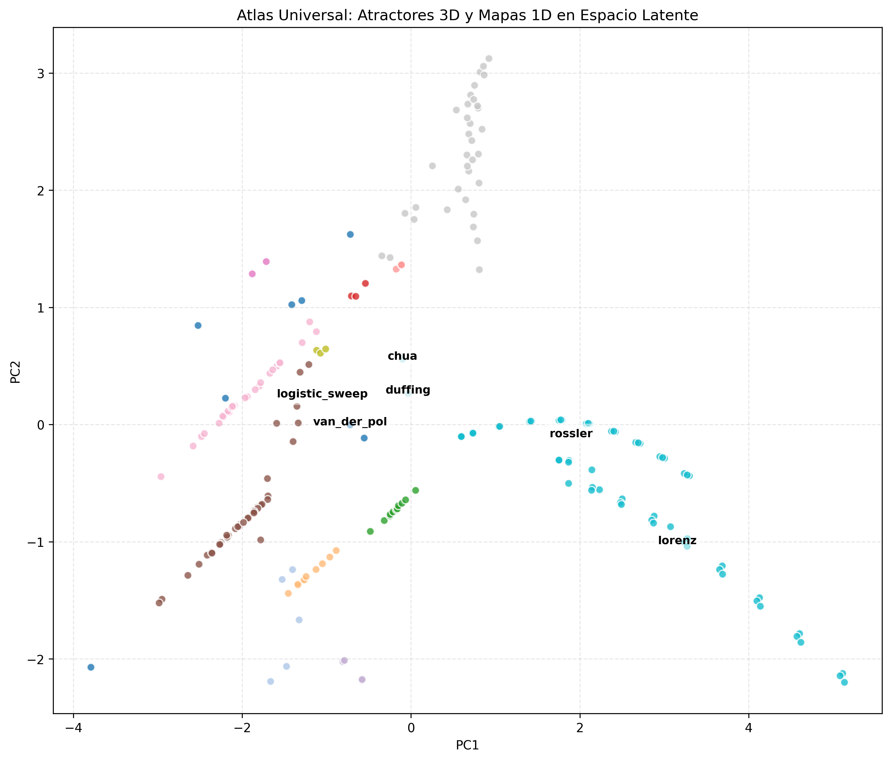
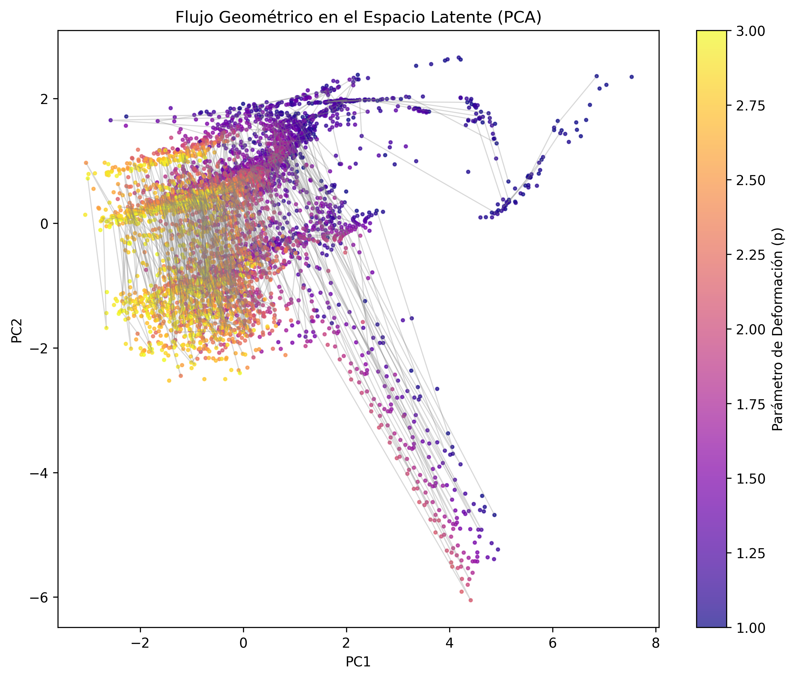

<p align="center">
  
  
  
  
  
</p>

<h1 align="center">🌌 Neurosymbolic Pipeline for Dynamical Systems Analysis</h1>
<h3 align="center">Latent Feature Extraction, Clustering, and Experimental Heuristic Evaluation</h3>

<p align="center">
  <em>An experimental computational framework for exploring geometric organization in nonlinear dynamical systems through latent feature embeddings.</em>
</p>

---

# 🧠 Overview

This repository contains an experimental **neurosymbolic research pipeline** for studying nonlinear dynamical systems using statistical feature extraction, latent-space projections, and automated experiment tracking.

Rather than analyzing systems exclusively through their explicit equations, the framework transforms simulated trajectories into **fixed-dimensional structural embeddings** and studies how different dynamical regimes organize in feature space.

The project combines:

| Domain | Role |
| :--- | :--- |
| Dynamical Systems Theory | Simulation of chaotic and periodic systems |
| Time-Series Feature Engineering | Extraction of structural descriptors |
| Statistical Analysis | Similarity, clustering, robustness tests |
| Manifold Learning | PCA projections and neighborhood structure |
| Experiment Tracking | SQLite-based episodic memory |
| Automated Evaluation | Sandboxed execution and artifact persistence |

The repository is best understood as a **computational experimentation platform** rather than a fully autonomous scientific discovery agent.

---

# 🔬 Research Goal

The central research question explored in this project is:

> **Can families of dynamical systems exhibit meaningful geometric organization in latent feature space independently of their explicit algebraic form?**

The framework investigates whether:
- chaotic systems,
- periodic systems,
- bifurcation regimes,
- and continuous vs. discrete dynamics

can be separated or clustered using structural descriptors extracted directly from trajectories.

---

# ⚙️ Architecture

The system operates as an automated experimental pipeline:



---

# 🧱 Core Components

| Component | Implementation | Role |
| :--- | :--- | :--- |
| **Episodic Memory** | `runs/math_search.db` | Stores experiment history and metadata |
| **Semantic Memory** | `meta_insights` table | Stores heuristic observations and experiment summaries |
| **Feature Extraction Engine** | `topology_miner_v2.py` | Computes structural descriptors from trajectories |
| **Sandboxed Evaluator** | `core/evaluator_db.py` | Runs and audits experiments |
| **Artifact System** | `artifacts/` | Persists plots, reports, JSON outputs |

---

# 📊 Structural Embedding Space (Embedding v2)

Each trajectory is represented by an 8-dimensional feature vector built from classical dynamical and statistical descriptors:

| Feature | Interpretation |
| :--- | :--- |
| Max Lyapunov Exponent | Sensitivity to initial conditions |
| Spectral Entropy | Frequency-domain disorder |
| Dominant Frequency | Main oscillatory mode |
| Variance | Spatial spread |
| Autocorrelation Decay | Temporal memory loss |
| Kurtosis | Heavy-tail behavior |
| Skewness | Distribution asymmetry |
| RMS Energy | Global signal energy |

These descriptors are then used for:
- PCA projections
- clustering (DBSCAN)
- cosine similarity analysis
- neighborhood graph analysis
- perturbation experiments

---

# 🌌 Experimental Findings

The experiments conducted so far suggest several reproducible patterns inside the embedding space.

## 1 · Continuous vs. Discrete Separation

Continuous attractors (Lorenz, Rössler, Chua) and discrete maps (logistic family) tend to occupy distinct regions in PCA projections of the embedding space.

This result is empirical and depends on the selected features and scaling strategy.

---

## 2 · Robustness Under Structural Perturbations

Parametric deformation experiments showed that some dynamical families preserve neighborhood structure under moderate perturbations.

Examples explored include:
- logistic map deformations,
- asymmetric polynomial variants,
- continuous parameter sweeps.

---

## 3 · Latent Neighborhood Dynamics

k-NN graph analysis and shortest-path measurements reveal that transitions between regimes often correspond to abrupt changes in local neighborhood structure.

These analyses currently operate on:
- Euclidean distances,
- PCA embeddings,
- and graph shortest paths,

rather than formally defined Riemannian geometry.

---

## 4 · Heuristic Geometric Proxies

Several exploratory scripts estimate:
- local trajectory curvature,
- velocity/acceleration changes in latent projections,
- Jacobian-like neighborhood deformation metrics.

These should be interpreted as **heuristic geometric proxies**, not rigorous differential-geometric quantities.

---

# 🖼️ Visual Outputs

The framework generates visual artifacts automatically during experiments.

| Latent Curvature Projection | Neighborhood Divergence |
| :---: | :---: |
|  |  |

| Universal PCA Atlas | Deformation Flow |
| :---: | :---: |
|  |  |

These visualizations are intended as exploratory analysis tools rather than formal proofs.

---

# ⚙️ How It Works

## 1. Query stored insights

```bash
python core/evaluator_db.py read_insights
```

## 2. Execute an experiment

```bash
python core/evaluator_db.py eval none ode_integration scipy \
    experiments_archive/geodesic_flow.py \
    --notes "Neighborhood divergence experiment"
```

## 3. Export stored experiment summaries

```bash
python export_knowledge.py
```

This exports the contents of `meta_insights` into:

```text
ATLAS_INSIGHTS.json
```

---

# 📁 Repository Structure

```text
📦 root/
├── 🧠 core/
│   ├── evaluator_db.py
│   ├── orchestrator.py
│   └── ...
│
├── 🗂️ experiments_archive/
│   ├── topology_miner_v2.py
│   ├── latent_curvature.py
│   ├── geodesic_flow.py
│   ├── continuous_attractors.py
│   ├── feigenbaum_hunt.py
│   ├── conjecture_engine.py
│   └── ...
│
├── 📊 artifacts/
│   ├── latent_curvature.png
│   ├── geodesic_divergence.png
│   ├── universal_atlas_pca.png
│   └── ...
│
├── 🔬 temp_scripts/
├── 🗄️ runs/
│   └── math_search.db
│
├── export_knowledge.py
├── ATLAS_INSIGHTS.json
└── README.md
```

---

# 📦 Dependencies

## Core Requirements

```bash
pip install numpy scipy sympy scikit-learn matplotlib networkx
```

| Package | Purpose |
| :--- | :--- |
| `numpy` | Numerical computing |
| `scipy` | ODE integration & signal analysis |
| `sympy` | Symbolic mathematics |
| `scikit-learn` | PCA, clustering, ML utilities |
| `matplotlib` | Visualization |
| `networkx` | Graph operations |
| `sqlite3` | Built-in database backend |

## Optional Packages

```bash
pip install pandas seaborn plotly
```

---

# 🔬 Current Limitations

This repository should be interpreted carefully.

## Important limitations include:

- The feature space is manually engineered.
- Similarity metrics depend heavily on feature scaling.
- PCA projections are heuristic visualizations.
- The system does **not** autonomously derive mathematical theories.
- The "semantic memory" stores experiment summaries and heuristics, not formal symbolic reasoning.
- Geometric terminology in early experiments (e.g. "geodesics", "metric tensor") should be interpreted as graph- or embedding-based approximations rather than rigorous differential geometry.

---

# 🚧 Future Work

Several directions are planned to improve rigor and reproducibility.

## 1 · Benchmarking Against Baselines

Compare the embedding pipeline against:
- ROCKET
- DTW + kNN
- catch22
- TDA-based descriptors

using standardized time-series datasets.

---

## 2 · True Topological Data Analysis (TDA)

Replace heuristic geometric proxies with:
- persistent homology,
- Betti numbers,
- persistence landscapes,
- Ollivier-Ricci curvature on graphs.

Potential libraries:
- `giotto-tda`
- `ripser`
- `GraphRicciCurvature`

---

## 3 · Generative Experiment Design

Future versions may integrate LLM-driven experiment generation where:
- hypotheses,
- perturbation strategies,
- and falsification scripts

are generated dynamically rather than manually authored.

---

# ⚠️ Scientific Disclaimer

> This repository is an experimental computational research framework intended for exploratory analysis in nonlinear dynamics and representation learning.
>
> The results presented here are heuristic and empirical in nature. They should not be interpreted as formal physical laws or rigorous differential-geometric proofs.
>
> Many analyses rely on feature engineering, dimensionality reduction, and neighborhood-based approximations whose mathematical interpretation remains an open research problem.

---

# 📄 License & Status

**License:** MIT © 2026 Alvaro

**Status:** `Experimental Research Prototype — Active Development`
