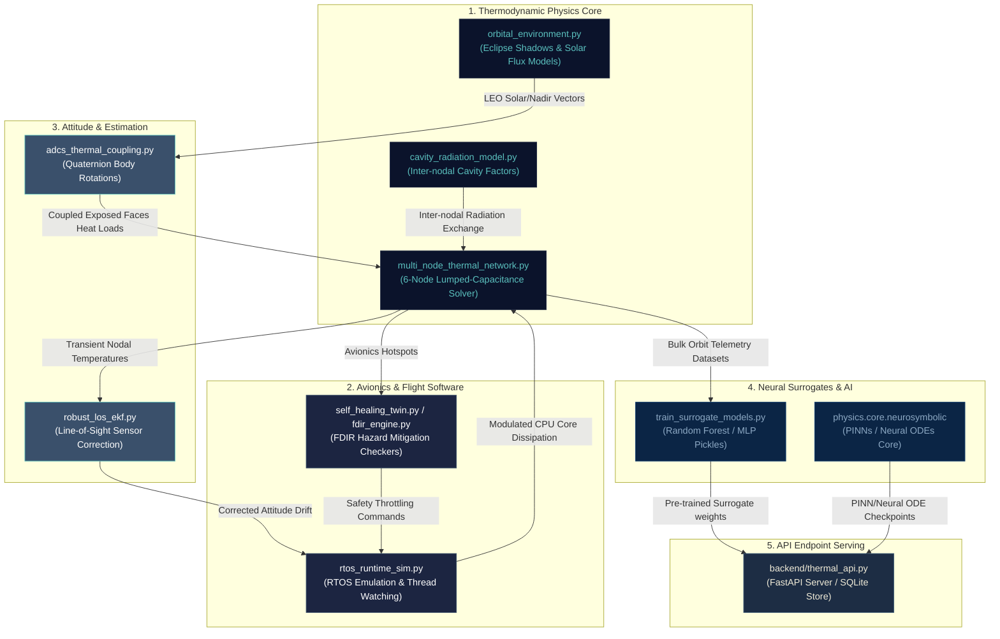
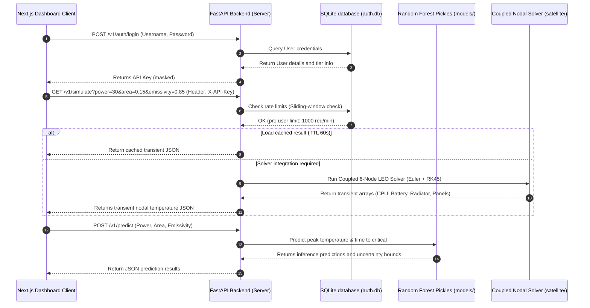

# AST-OS Software Architecture & Dependency Graph

This document registers the modular relationships, software couplings, data integration loops, and ML dependencies of the standalone **Autonomous Spacecraft Thermal OS (AST-OS)** platform.

---

## 1. System-Level Architecture & Coupling Loops

AST-OS is composed of highly decoupled, modular subsystems that exchange information dynamically during LEO orbital simulations. The following Mermaid diagram maps the data flows and couplings:



---

## 2. API Telemetry & Interface Data Integration

The FastAPI backend acts as a highly structured API gateway, loading pre-trained weights and serving the Next.js scientific observatory.



---

## 3. Deep Software Module Breakdowns

### 1. `satellite/adcs/adcs_thermal_coupling.py`
* **Purpose:** Computes spacecraft pointing mode quaternions (Nadir-pointing, Sun-pointing, and Slew/spinning) to dynamically determine solar absorption and Earth infrared incident heat fluxes on the 6 exposed spacecraft faces.
* **Imports:**
  - `satellite.thermal.multi_node_thermal_network` (specifically `ThermalNetwork` and `SIGMA`)
  - `config` (to register paths)

### 2. `satellite/autonomy/self_healing_twin.py` & `fdir_engine.py`
* **Purpose:** Onboard Failure Detection, Isolation, and Recovery (FDIR) loops. Detects avionics sensor anomalies, structural radiator cracks, or heater failures, modulating spacecraft operations to prevent hardware burnout.
* **Imports:**
  - `satellite.thermal.multi_node_thermal_network` (isothermal simulation states)
  - `physics.core.neurosymbolic.pinn` (compares real sensor temperatures against PINN constraints to isolate sensor drifts)

### 3. `satellite/estimation/robust_los_ekf.py`
* **Purpose:** Formulates the attitude quaternion and gyro drift Extended Kalman Filter, dynamically adjusting state covariance variables based on active thermal expansion models.
* **Imports:**
  - `satellite.thermal.multi_node_thermal_network`
  - `config`

### 4. `satellite/thermal/`
* **Core Simulator scripts:**
  - `multi_node_thermal_network.py`: Solves the transient coupled nodal equations.
  - `orbital_environment.py`: Models circular LEO orbits flux variables.
  - `geometry_topology_optimizer.py`: Handles radiator Bayesian multi-objective topological optimizations.
  - `hardware_in_the_loop.py` & `hil_real_hardware.py`: Standard HIL calibration matrices.
* **AI Training scripts:**
  - `train_thermal_pinn.py`: PINN training utilizing PyTorch custom conservation losses.
  - `train_thermal_neural_ode.py`: Neural ODE solver optimizing trajectory gradients via `torchdiffeq`.
  - `train_surrogate_models.py`: RandomForest, XGBoost, and MLP regression models.
* **Dependencies:**
  - `physics.core.neurosymbolic` (PINN models, ODE nets, SINDy sparse identifiers)
  - `physics.experiment_versioning` (`ExperimentTracker` integration logging runs)

### 5. `physics/`
* **Purpose:** Isolated, nested physics emulators directory serving the spacecraft simulator stack.
* **Modules:**
  - `physics.core.neurosymbolic.pinn`: Exposes `SharedPINNNet`.
  - `physics.core.neurosymbolic.neural_ode`: Exposes `SharedODEFunc` and `SharedNeuralODEModel`.
  - `physics.core.neurosymbolic.symbolic`: Exposes `deterministic_symbolic_recovery`.
  - `physics.experiment_versioning`: Exposes `ExperimentTracker` and git decorators.

---

## 4. Critical ML & Data Model Coupling

During FastAPI server startup (`backend/thermal_api.py`), several pre-trained machine learning checkpoints and preprocessing scalers are loaded into memory to support ultra-low latency sub-millisecond AI surrogate inference:

```text
  [FastAPI Backend Start]
           │
           ├───► Loads "satellite/models/surrogate_rf.pkl" (Random Forest Model)
           ├───► Loads "satellite/models/scaler_X.pkl" (StandardScaler inputs)
           ├───► Loads "satellite/models/scaler_y.pkl" (StandardScaler outputs)
           └───► Loads "satellite/models/surrogate_metrics.json" (Benchmark scores)
```

If the PyTorch emulators are activated, the following checkpoints are loaded dynamically:
* `satellite/models/pinn_thermal.pth`: State dict loading weights into `SharedPINNNet`.
* `satellite/models/neural_ode_thermal.pth`: State dict loading weights into `SharedODEFunc`.
* `satellite/flight/surrogate.onnx`: Compiled ONNX model for high-efficiency C-inference and microcontroller integrations.
* `satellite/flight/pinn_thermal.onnx`: Compiled PINN in ONNX format.
