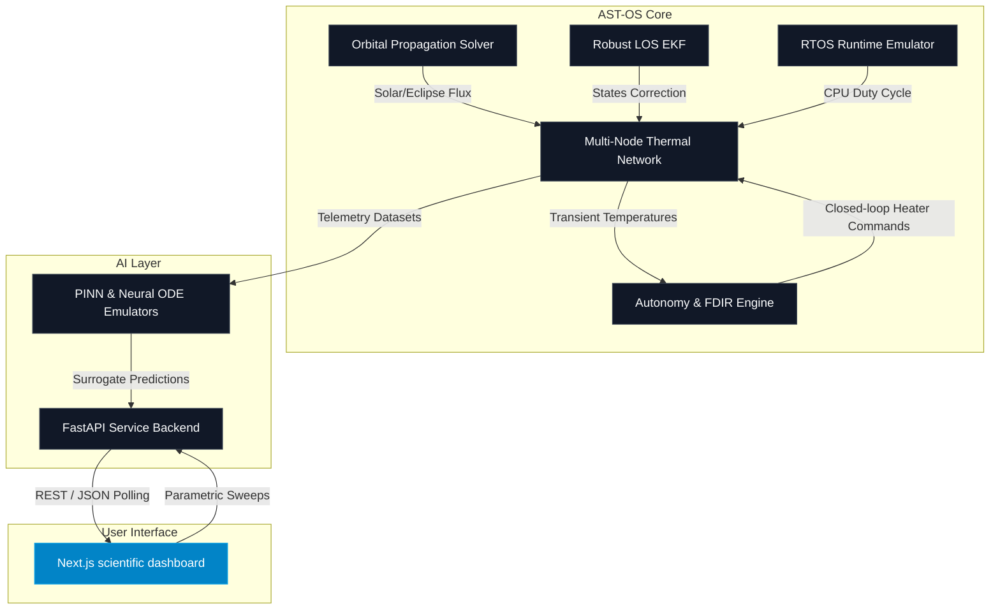

# 🛰️ Autonomous Spacecraft Thermal OS (AST-OS)

AST-OS is a state-of-the-art **Orbital Thermal Digital Twin and Flight-Software Autonomy Suite** tailored for NewSpace CubeSats, LEO constellations, and deep-space scientific payloads.

Combining real-time thermodynamic numerical solvers (Euler + Runge-Kutta 45) with deep learning surrogates (PINNs, Neural ODEs, and Random Forest), AST-OS emulates real flight conditions and autonomously mitigates thermal hazards through real-time feedback control loops.

---

## 🔬 Core Aerospace Features

* **🌌 High-Fidelity Orbital Thermal Twin:** Transient multi-node thermodynamic thermal graph models simulating eclipse shadows, solar beta angle fluctuations, Earth albedo constant sweeps, and cavity radiations.
* **🧠 Active AI-Accelerated Surrogates:** Physical-Informed Neural Networks (PINNs) and Neural ODEs capable of predicting CPU peak temperature and thermal trends in milliseconds, accelerating Monte Carlo structural searches by over 3600x.
* **🛡️ Thermal Autonomy & FDIR Engine:** Failure Detection, Isolation, and Recovery (FDIR) pipelines that identify sensor drifts, thermal structural cracks, and active heater failures, triggering automated safety micro-operations.
* **🛰️ Real-Time Robust LOS EKF:** Multi-variable Extended Kalman Filter (EKF) ensuring precise Line-of-Sight (LOS) estimation under severe thermal structural distortions.
* **🔩 Real-Time HIL / TVAC Validation:** Hardware-in-the-Loop emulators coupled with dynamic online calibration and Thermal Vacuum (TVAC) correlation algorithms.
* **🕰️ RTOS Flight Runtime Emulation:** Deterministic thread execution pipelines representing RTOS flight software, CPU throttling under solar cycles, and watchdog micro-safety systems.
* **💥 SEU Radiation & EMC/EMI Mitigation:** Simulators modeling Single Event Upsets (SEU) from heavy ions and space rays, as well as electromagnetic compatibility (EMC/EMI) spectral analysis.
* **🎛️ ADCS Thermal Coupling:** Active modeling of Attitude Determination and Control System (ADCS) telemetry linked with structural radiator exposed boundary faces.

---

## 📐 System Architecture

AST-OS operates as a dual-layer cyber-physical system, bridging high-speed orbital simulations with a cinematic observatory dashboard:



---

## 📁 Repository Directory Structure

```text
autonomous-spacecraft-thermal-os/
│
├── satellite/                 # Full core spacecraft digital twin simulator stack
│   ├── adcs/                  # ADCS thermal coupling models
│   ├── api/                   # FastAPI Server (local copy)
│   ├── autonomy/              # FDIR engine and self-healing thermal twins
│   ├── cad/                   # STL meshes and 3D voxelization loaders
│   ├── cloud/                 # deploy_saas.py SaaS modules
│   ├── constellation/         # Cooperative AI constellation simulators
│   ├── emc/                   # EMC/EMI spectral scanners
│   ├── estimation/            # Robust LOS EKF filter scripts
│   ├── flight/                # RTOS runtime emulator & watchdog systems
│   ├── models/                # Trained Random Forest and Neural ODE pickles
│   ├── platform/              # Flight software thermal OS core modules
│   ├── qualification/         # TRL-6 packaging scripts
│   ├── radiation/             # SEU heavy-ion simulators
│   ├── tests/                 # Core physics unit tests
│   └── thermal/               # Multi-node RK45 solvers, HIL, ECSS compliance
│
├── dashboard/                 # Next.js 16 / React 19 Cinematic Telemetry Observatory
├── backend/                   # FastAPI Simulation API Backend (port 8000)
├── datasets/                  # Consolidated CSV and JSON flight dataset repository
├── docs/                      # General architecture and flight documentation
├── reports/                   # Consolidated validation, HIL, and physical verification reports
├── reproduce/                 # Standardized scientific reproduction suite
│
├── README.md                  # Main AST-OS product guide
├── ARCHITECTURE.md            # Digital twin orbital thermal OS architecture
├── ROADMAP.md                 # CubaSat TRL mission milestones
├── LICENSE                    # Commercial licensing agreement
├── requirements.txt           # Standalone Python package dependencies
├── pyproject.toml             # Ruff and Black formatting standard configuration
├── docker-compose.yml         # Containerized production runtime
└── .env.example               # Environment variables configuration template
```

---

## ⚡ Standalone Quickstart

### Option A: Containerized Runtime (Recommended)
AST-OS is pre-configured with multi-container dockerization. Simply execute the following command at the root of the project to spin up the entire system (FastAPI backend + Next.js dashboard):

```bash
docker-compose up --build
```
* **FastAPI Backend URL:** `http://localhost:8000`
* **Observatory Dashboard URL:** `http://localhost:3000`

---

### Option B: Local Execution (Developer Mode)

#### 1. Setup Backend API
Ensure you have Python 3.10+ installed. Install package dependencies and start the local dev server:

```bash
# Install packages
pip install -r requirements.txt

# Start FastAPI server on port 8000
python -m uvicorn backend.thermal_api:app --reload --host 0.0.0.0 --port 8000
```

#### 2. Run Observability Dashboard
Ensure you have Node.js 18+ installed. Install dependencies and start Next.js:

```bash
cd dashboard

# Install packages
npm install

# Start Next.js development server
npm run dev
```
Open `http://localhost:3000` in your browser. Navigating to the `satellite` view opens the real-time thermal telemetry console.

---

## 🚀 Scientific Simulation & Demo Flow

AST-OS comes with a comprehensive simulation pipeline orchestrator which handles all stages from thermal network solving to automated physical audits:

```bash
# Execute the complete orbital simulation pipeline sequentially
python satellite/run_thermal_pipeline.py --from-stage T9 --to-stage T28
```

Stages executed:
1. **`T9`:** Multi-node transient thermodynamic network solver.
2. **`T11`:** Bayesian radiator active learning design optimizer.
3. **`T17`:** Extended Kalman Filter Real-Time HIL calibration.
4. **`T21` / `T22`:** Physics-Informed Neural Network (PINN) and Neural ODE training models.
5. **`T23`:** Closed-loop active thermostat control simulation.
6. **`T24`:** Constellation cooperative thermal-coupling network model.
7. **`T25`:** Material UV degradation and emissivity aging sweeps.
8. **`T26`:** Thermal Vacuum (TVAC) chamber boundary validation.
9. **`T27`:** ECSS-E-ST-31C thermal margins validation checks.
10. **`T28`:** HPC GPU/OpenMP hardware acceleration audits.

### Standard Verification Benchmark
Execute the Gilmore-Karam correlation reproducer to audit numerical solver accuracy vs professional Finite Element Method (FEM) software:

```bash
python reproduce/reproduce_t18.py
```
* **Expected Output:** Mean Root Mean Squared Error (RMSE) < `0.374°C` with 100% absolute scientific reproducibility.
