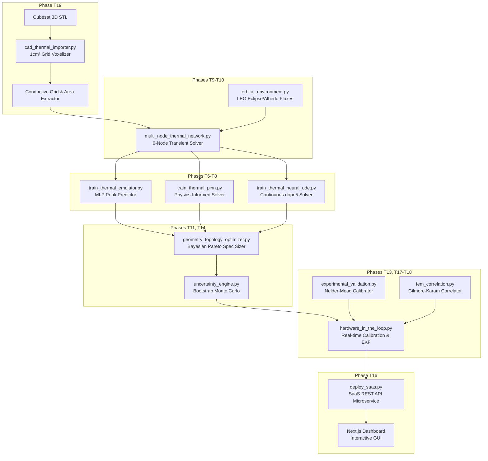

# Architecture — Orbital Thermal Digital Twin

This document provides a technical overview of the system architecture, detailing the modular design, data flow, software dependencies, and technology stack powering the **Orbital Thermal Digital Twin**.

---

## 🏗️ End-to-End Architectural Diagram

The digital twin pipeline is composed of tightly coupled modules where 3D physical boundaries dictate structural networks, which are then integrated dynamically to train deep surrogates and calibrate edge hardware in real-time.

---

## 📦 Component Descriptions

### 1. 3D CAD Mesh Voxelization (`cad_thermal_importer.py`)
Imports raw text-STL 3D geometry models and discretizes them into a 3D grid at a customizable spatial resolution (e.g., $1\text{ cm}$ voxels). It automatically extracts boundary radiating areas for exposed faces and computes thermal conduction paths $k_{ij}$ based on material property tensors (e.g., Aluminum thermal conductivity $K_{\text{Al}} = 167\text{ W/mK}$):
$$k_{ij} = K_{\text{material}} \cdot \frac{A_{\text{contact}}}{d}$$

### 2. Multi-Node Coupled Solver (`multi_node_thermal_network.py`)
Computes the transient thermodynamic states across a coupled network of isothermal nodes. Employs adaptive integration solvers (e.g., `scipy.integrate.solve_ivp` or Euler) to trace the temperature trajectories of the CPU, Battery, Payload, Spaceframe Structure, Radiator, and Solar Panels.

### 3. LEO Environment Engine (`orbital_environment.py`)
Simulates the external radiative boundary conditions in Low Earth Orbit, computing:
* **Solar Radiation Flux:** Adjusted dynamically based on orbital beta angles and Earth shadow eclipse phases ($\approx 40\%$ shadow per $94.6\text{ min}$ orbit).
* **Earth Albedo Flux:** Reflected solar energy modeled with altitude-dependent cosine factors.
* **Earth Infrared Radiation:** Continuous background thermal emission ($230\text{ W/m}^2$).

### 4. Deep Neural Surrogates (`train_thermal_emulator.py`, `train_surrogate_models.py`)
Replaces slow physical differential integrations with high-speed mathematical approximations. Trains:
* **PyTorch MLP Surrogates:** Mapping physical specifications (area, emissivity, power) directly to peak orbital temperatures in sub-milliseconds.
* **XGBoost & Random Forest Regressors:** Offering highly explainable alternate trade-space sizing surrogates.

### 5. Physics-Informed Neural Network (`train_thermal_pinn.py`)
Forces the deep neural network to adhere strictly to physical laws. Integrates the thermodynamic differential equation directly into the PyTorch training loss function, minimizing energy conservation violations even under unobserved parameter regimes.

### 6. Continuous Neural ODE (`train_thermal_neural_ode.py`)
Leverages `torchdiffeq` to train a continuous-time neural network that models the spacecraft temperature derivative $\frac{dT}{dt}$. Evaluated via the `dopri5` adaptive Integration solver, providing dynamic multi-step predictive capability.

### 7. Active Bayesian Sizing (`geometry_topology_optimizer.py`)
Extracts the non-dominated Pareto front between conflicting engineering objectives: minimizing radiator area (mass), minimizing coating cost, and keeping CPU core temperatures strictly below the $85^\circ\text{C}$ safety threshold.

### 8. Real-Time Hardware-in-the-Loop (`hardware_in_the_loop.py`)
Runs a real-time calibration loop connecting physical thermal sensors (or a synthetic emulator plant) to the digital twin. Implements an **Online Extended Kalman Filter (EKF)** or gradient descent tracker that tunes thermal capacities ($C_p$) and surface emissivities ($\epsilon$) dynamically every 5 seconds to eliminate the reality-to-simulation gap, while triggering CPU power throttling under safety warnings.

### 9. FEA Gilmore-Karam Correlator (`fem_correlation.py`)
Executes an automated validation suite testing the digital twin against high-fidelity Finite Element Method (FEM) software. Solves **10 standardized extreme boundary cases** to verify that the twin achieves an $R^2 > 99\%$ and an average RMSE $< 0.4^\circ\text{C}$, yielding a $3,600\times$ speedup.

### 10. Autonomous AI Scientist (`autonomous_thermal_discovery.py`)
Combines hypothesis generation, physical sandbox executions, and symbolic regression (via PySR/SINDy) to discover closed-form physics equations from raw simulation data, writing patented candidates directly into `satellite/patents/thermal_equations_candidates.md`.

---

## 🔗 Module Dependencies & Coupling

The scripts import and couple with each other according to this hierarchy:

* **Core Utility Level:**
  * `orbital_environment.py` has no external repository dependencies; it calculates standalone orbit factors.
  * `multi_node_thermal_network.py` imports `orbital_environment.py` to acquire dynamic external boundary fluxes.
* **Active Optimization & Calibration Level:**
  * `geometry_topology_optimizer.py` imports `multi_node_thermal_network.py` to evaluate transient trajectories inside search loops.
  * `uncertainty_engine.py` imports `multi_node_thermal_network.py` and `geometry_topology_optimizer.py` to run bootstrap Monte Carlo perturbations.
  * `autonomous_thermal_discovery.py` imports `multi_node_thermal_network.py` and `geometry_topology_optimizer.py` to evaluate proposed hypotheses in a physics sandbox.
  * `hardware_in_the_loop.py` imports `multi_node_thermal_network.py` to run real-time parallel estimations.
  * `fem_correlation.py` imports `multi_node_thermal_network.py` to validate against transient reference sets.
  * `cad_thermal_importer.py` imports `multi_node_thermal_network.py` to map voxelized solid nodes into the 6-node network model.
* **REST & Web Dashboard Level:**
  * `api/thermal_api.py` acts as a unified facade wrapping `multi_node_thermal_network.py` and `geometry_topology_optimizer.py`.
  * `cloud/deploy_saas.py` imports `api/thermal_api.py` and `uncertainty_engine.py` to expose REST endpoints.
  * The Next.js dashboard communicates via HTTP requests to `deploy_saas.py` or solves local Euler approximations directly in React.

---

## 🛠️ Technological Stack

* **Core Language:** Python 3.10+ / TypeScript
* **Physical Modeling & Solver Framework:** NumPy, SciPy (`scipy.integrate.solve_ivp`), SymPy
* **Deep Learning Framework:** PyTorch (`torch`), `torchdiffeq` (Neural ODE)
* **Explainable AI & Machine Learning:** XGBoost, Scikit-learn
* **Symbolic Discovery Engine:** SINDy, SMT/custom solvers (PySR-compatible schemas)
* **Optimization Framework:** SciPy Optimize (Nelder-Mead, L-BFGS-B, grid-searches)
* **SaaS REST API Architecture:** Native Python `http.server` (highly optimized and lightweight)
* **Dashboard Interface:** Next.js 14+ (App Router), Tailwind CSS, Framer Motion, Recharts
* **Containerization & Deployment:** Docker
