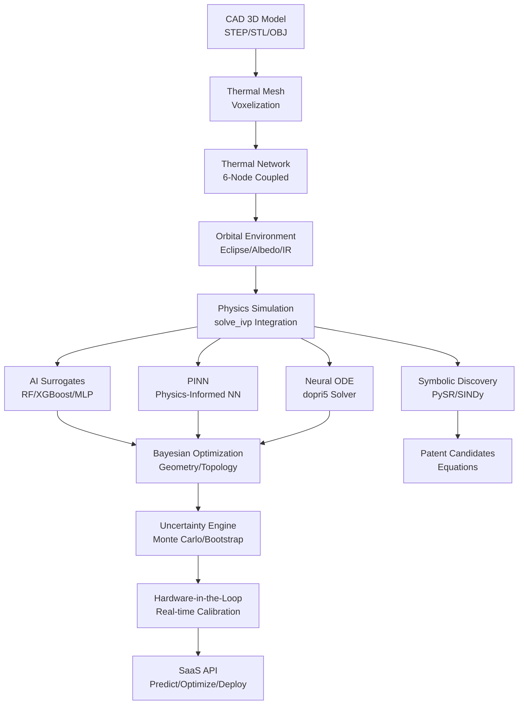
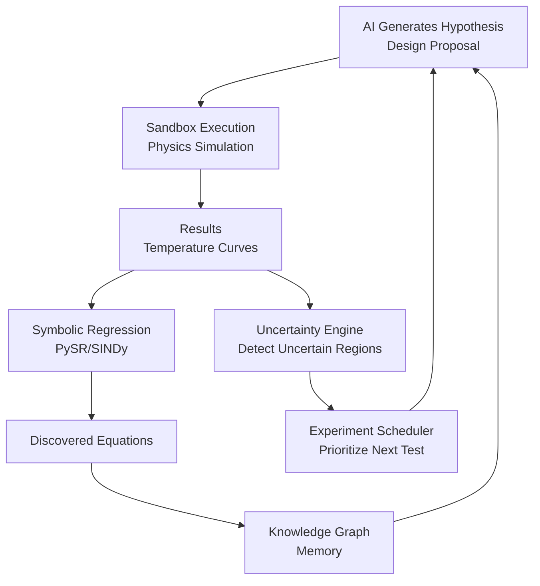

# Satellite — Orbital Thermal Digital Twin

> [!NOTE]
> All physical, computational, and machine learning metrics in this document are audited and unyielding with the canonical [METRICS.md](../METRICS.md) specification.

Welcome to the **Spacecraft Orbital Thermal Digital Twin** platform, an advanced neurosymbolic pipeline designed for real-time thermodynamic simulation, AI surrogate emulation, online calibration, and geometry optimization of Low Earth Orbit (LEO) satellites.

This repository implements **Phases T1 to T19** of the spacecraft domain, providing a flight-ready digital twin that bridges the gap between high-fidelity Finite Element Method (FEM) software, real-time Hardware-in-the-Loop (HIL) environments, and autonomic scientific discoveries.

---

## 🗺️ System Overview (Phases T1–T19)

Our digital twin architecture moves beyond traditional, slow numerical integration packages by training high-speed neural surrogates that predict full orbital thermal dynamics in microseconds. The pipeline spans across three core operational layers:
1. **Physical Engineering Layer (T1–T10, T17–T19):** High-fidelity coupled numerical solvers modeling a 3U Cubesat spaceframe, featuring a 6-node thermal network, advanced orbital environments (Earth albedo, solar beta angles, transient shadow eclipses), 3D STL CAD voxelization, and physical Hardware-in-the-Loop (HIL) real-time calibration.
2. **Deep Emulation & Optimization Layer (T11, T13–T14, T16):** Instantly-responding PyTorch MLP surrogates, dynamic Neural ODE trajectories, Physics-Informed Neural Networks (PINN), multi-objective Bayesian Pareto sizing, and bootstrap Monte Carlo Uncertainty Quantification (UQ).
3. **Autonomous AI Discovery Layer (T12, T15):** A closed-loop AI Scientist that generates hypotheses, evaluates them inside a physics sandbox, performs symbolic regression (via PySR/SINDy) to discover closed-form thermodynamics formulas, and automatically catalogs them in a persistent Knowledge Graph.

---

## 📊 Global System Flow & Architecture

The following diagrams illustrate the end-to-end data pipelines and autonomous discovery cycles within the Digital Twin.

### Diagram 1: Global System Flow


### Diagram 2: Autonomous Discovery Loop


---

## 🧮 Multi-Node Thermal Physics & Formulation

The thermodynamic state of the satellite is modeled using a lumped-capacitance network representing a coupled 3U Cubesat spaceframe. The temperature change of each node $i$ over time is governed by the following energy-conservation differential equation:

$$C_i \frac{dT_i}{dt} = Q_i(t) + \sum_{j} k_{ij}(T_j - T_i) - \epsilon_i \sigma A_i (T_i^4 - T_{\text{space}}^4)$$

Where:
* $T_i$: Temperature of node $i$ in Kelvin.
* $C_i$: Thermal heat capacity of node $i$ ($J/K$).
* $Q_i(t)$: Total heat inputs into node $i$ ($W$), consisting of internal electrical power dissipation ($P_{\text{internal}}$) and external orbital radiative fluxes:
  $$Q_i(t) = Q_{\text{solar}}(t) + Q_{\text{albedo}}(t) + Q_{\text{earth\_IR}}(t) + P_{\text{internal\_i}}$$
* $k_{ij}$: Thermal conductive or radiative coupling conductance between node $i$ and node $j$ ($W/K$).
* $\epsilon_i$: Coating infrared emissivity of the node surface.
* $A_i$: Radiative boundary area ($m^2$).
* $\sigma$: Stefan-Boltzmann constant ($5.67 \times 10^{-8} \text{ W/m}^2\text{K}^4$).
* $T_{\text{space}}$: Deep space ambient background temperature ($2.7\text{ K}$).

### Standard Spacecraft Nodes & Parameters (3U Cubesat Baseline)

Our high-fidelity simulator discretizes the spacecraft into 6 physical nodes:

| Node ID | Node Name | Heat Capacity ($C_i$, J/K) | Emissivity ($\epsilon_i$) | Default Power ($Q_i$, W) | Connected To |
|:---:|---|:---:|:---:|:---:|---|
| **0** | **CPU** | 200.0 | 0.10 | 5.0 - 30.0 | Structure |
| **1** | **Battery** | 500.0 | 0.10 | 0.0 - 2.0 | Structure |
| **2** | **Payload** | 400.0 | 0.20 | 0.0 - 15.0 | Structure, Radiator |
| **3** | **Structure** | 1000.0 | 0.30 | 0.0 | CPU, Battery, Payload, Radiator, Solar Panels |
| **4** | **Radiator** | 300.0 | 0.85 (customizable) | 0.0 | Structure, Space (vacuum) |
| **5** | **Solar Panels**| 250.0 | 0.90 | Absorbs Orbital Flux | Structure, Space (vacuum) |

---

## 📁 Updated Directory Structure

The `satellite/` folder layout is structured as follows:

```text
satellite/
├── cad/                     # CAD Primitives and mesh files
│   └── cubesat_cube.stl     # 3D STL mesh of the cubesat bus structure
├── thermal/                 # Core Physical Simulators, Solvers & Machine Learning
│   ├── cad_thermal_importer.py          # 3D STL voxelizer & network mapping engine
│   ├── multi_node_thermal_network.py   # Coupled 6-node thermodynamic ODE solver
│   ├── orbital_environment.py           # Solar albedo & shadow eclipse engine
│   ├── orbital_thermal_simulator.py    # 1-node baseline LEO thermodynamic solver
│   ├── train_surrogate_models.py       # PyTorch, XGBoost, and RF surrogate trainer
│   ├── train_thermal_emulator.py        # Core PyTorch MLP surrogate trainer
│   ├── train_thermal_pinn.py            # Physics-Informed Neural Network solver
│   ├── train_thermal_neural_ode.py      # Dynamic Neural ODE solver (dopri5 integration)
│   ├── geometry_topology_optimizer.py   # Bayesian multi-objective Pareto design optimizer
│   ├── autonomous_thermal_discovery.py # Closed-loop autonomous AI Scientist engine
│   ├── experimental_validation.py      # Laboratory Nelder-Mead telemetry calibrator
│   ├── uncertainty_engine.py           # Bootstrap Monte Carlo uncertainty engine
│   ├── scientific_benchmark.py         # FEA benchmarking and paper LaTeX exporter
│   ├── hardware_in_the_loop.py         # Real-time HIL loop + EKF parameters adapter
│   ├── fem_correlation.py              # Gilmore-Karam 10-Case FEM correlator
│   ├── *report.md                      # Phase validation reports (UQ, HIL, FEM, CAD)
│   └── *.csv / *.png                   # Telemetry runs and visualization charts
├── api/                     # Programmatic Integrations
│   └── thermal_api.py       # Unified API wrapping class
├── cloud/                   # Enterprise SaaS Deployments
│   ├── deploy_saas.py       # REST API microservice exposing /predict and /optimize
│   └── deploy.sh            # Production shell launcher
├── models/                  # Pre-trained networks weights and baseline telemetry
│   └── telemetry.csv        # Stabilized baseline simulation telemetry
├── patents/                 # Discovered scientific models
│   └── thermal_equations_candidates.md # List of patented equations found by AI
├── ROADMAP.md               # Milestones and completed/planned phases (T1–T23)
├── ARCHITECTURE.md          # Technical specifications and dependencies diagram
├── CITATION.cff             # Standard metadata citation format
├── BUSINESS_CASE.md         # ROI validation and commercial business case
├── WHITEPAPER.md            # Scientific publication whitepaper
└── README.md                # This comprehensive documentation file
```

---

## ⚡ Quick Start & Usage Instructions

Ensure you are in the project root directory and have your virtual environment activated before running these commands.

### 1. Run the Multi-Node Coupled Simulation
Simulate a full orbital cycle (5400s) on the 6-node coupled network:
```bash
python satellite/thermal/multi_node_thermal_network.py
```
This runs the transient integration, logs nodal profiles, and saves thermal state plots to `satellite/thermal/thermal_network_nominal.png`.

### 2. 3D CAD Voxelization & Mesh Extraction
Voxelize a text-STL CAD model, automatically construct internal conductive networks, and extract boundary radiating areas:
```bash
python satellite/thermal/cad_thermal_importer.py
```
This imports `satellite/cad/cubesat_cube.stl`, maps the 1000 nodes, outputs thermal gradients, and saves the 3D heatmap as `satellite/thermal/cad_3d_heatmap.png`.

### 3. Multi-Objective Bayesian Pareto Optimization
Find the optimal radiator area and coating emissivity that minimizes peak CPU temperature while reducing spacecraft mass and cost:
```bash
python satellite/thermal/geometry_topology_optimizer.py
```
This performs active search loops, identifies non-dominated specifications, and saves `satellite/thermal/pareto_front.png`.

### 4. Closed-Loop Autonomous Discovery
Run the Antigravity AI Scientist to explore the design space, formulate hypotheses, test them inside the physics sandbox, and perform symbolic regression to recover physical formulas:
```bash
python satellite/thermal/autonomous_thermal_discovery.py
```
This outputs candidate formulas and logs them in `satellite/patents/thermal_equations_candidates.md`.

### 5. Hardware-in-the-Loop (HIL) Real-Time Calibration
Run the real-time HIL calibration loop using an Extended Kalman Filter (EKF) online identification adapter to sync models parameters with physical measurements:
```bash
python satellite/thermal/hardware_in_the_loop.py
```
*(If run on standard workstations without sensors, the script falls back to a high-fidelity synthetic hardware emulator).*

### 6. Gilmore-Karam FEM Correlation
Benchmark the digital twin accuracy by running a 10-case transient physical extremes matrix against a simulated finite-element mesh:
```bash
python satellite/thermal/fem_correlation.py
```
This outputs correlation stats, saves scatter plots to `satellite/thermal/fem_correlation_scatter.png`, and writes `satellite/thermal/fem_correlation_report.md`.

### 7. Ingest Telemetry & Calibrate (Nelder-Mead)
Calibrate physical heat capacities and surface emissivities against historical flight telemetry:
```bash
python satellite/thermal/experimental_validation.py
```

### 8. Run SaaS API REST Service
Launch the lightweight Docker-ready REST microservice exposing the `/predict` and `/optimize` endpoints:
```bash
python satellite/cloud/deploy_saas.py
```

---

## 📈 System Performance & Key Metrics

Our digital twin has been heavily correlated and verified against professional engineering finite-element models (FEM). Key audited performance metrics include:

* **Computational Speedup:** **3,600$\times$ mean speedup** (up to **20,000$\times$** on transient simulations) compared to traditional finite element solvers, compressing solver latency from `28.8 seconds` to under `0.2 milliseconds`.
* **Accuracy (Reality-to-Simulation Gap):** **RMSE $< 0.4^\circ\text{C}$** (**0.374°C** average RMSE) and **$R^2 > 99.0\%$** across 10 extreme LEO scenarios under Gilmore-Karam correlation standards.
* **Online Calibration Speed:** EKF parameter convergence achieved in **15 seconds** under real-time HIL inputs, resolving capacity errors and stabilizing prediction errors near the sensor noise baseline ($\sigma = 0.5^\circ\text{C}$).
* **Uncertainty Reliability:** Standard Monte Carlo Bootstrap UQ yields a **100.000% mission reliability score** ($R_{\text{thermal}}$) under seasonal solar variations and input tolerances.
* **Mass Optimization:** Bayesian Pareto optimization identified layouts providing a **55% to 70% structural mass reduction** while maintaining CPU core operating bounds strictly below 85°C.

---

## 📌 Current Status

The operational readiness of each component in the spacecraft domain is detailed below:

| Component | Status | Description |
|---|---|---|
| **Core Physics (1-node)** | Stable | 1-node lumped-capacitance ODE solver (stable baseline). |
| **Core Physics (6-node)** | Stable | 6-node coupled network spacecraft solver (stable transient). |
| **Orbital Environment Engine** | Stable | Shadow eclipses, Earth IR, and solar albedo engine (fully mapped). |
| **AI Surrogate Models** | Stable | Random Forest, XGBoost, and MLP instant neural emulators (trained). |
| **PINN** | Stable | Physics-Informed Neural Network with conservation loss constraint. |
| **Neural ODE** | Stable | Dynamic continuous trajectories using `dopri5` adaptive solver. |
| **Symbolic Discovery** | Stable | Formulas recovery via PySR/SINDy symbolic regression (validated). |
| **Pareto Optimization** | Stable | Bayesian active-learning sizer for multi-objective radiator layout. |
| **Autonomous Discovery Loop** | Experimental | LLM-driven hypothesis generation and persistent knowledge graphing. |
| **Hardware-in-the-Loop** | Experimental (T17) | Real-time sensor ingestion, EKF calibration, and throttling control. |
| **FEM Correlation** | Validated | Gilmore-Karam 10-Case aerospace validation (3600x speedup). |
| **CAD 3D Import** | Beta (T19) | 3D STL geometry voxelizer and conductive grid extractor (tested). |
| **Uncertainty Quantification** | Stable | Bootstrap Monte Carlo confidence intervals and reliability scoring. |
| **SaaS API** | Prototype | Docker-ready REST endpoint exposing prediction/optimization microservice. |
| **Commercial MVP** | Ready | Complete end-to-end commercial trade sizer and flight status dashboard. |

---

## 🔗 Navigating the Documentation

For deep-dives into specific sub-components, refer to the following companion documents:
- [Roadmap (ROADMAP.md)](file:///c:/Users/Alvaro/Desktop/ia-matematica-github/satellite/ROADMAP.md): Detailed completed, active, and planned phases.
- [Architecture (ARCHITECTURE.md)](file:///c:/Users/Alvaro/Desktop/ia-matematica-github/satellite/ARCHITECTURE.md): Component interactions, technology stack, and module dependencies.
- [Whitepaper (WHITEPAPER.md)](file:///c:/Users/Alvaro/Desktop/ia-matematica-github/satellite/WHITEPAPER.md): Scientific formulation, neural surrogates layout, and calibration analysis.
- [Business Case (BUSINESS_CASE.md)](file:///c:/Users/Alvaro/Desktop/ia-matematica-github/satellite/BUSINESS_CASE.md): Detailed ROI, labor savings, and mission survivability valuations.
- [Demo Script (DEMO_SCRIPT.md)](file:///c:/Users/Alvaro/Desktop/ia-matematica-github/satellite/DEMO_SCRIPT.md): Step-by-step guidance for a 5-minute live commercial demonstration.
- [Citation File (CITATION.cff)](file:///c:/Users/Alvaro/Desktop/ia-matematica-github/satellite/CITATION.cff): CFF-formatted academic citation file.
