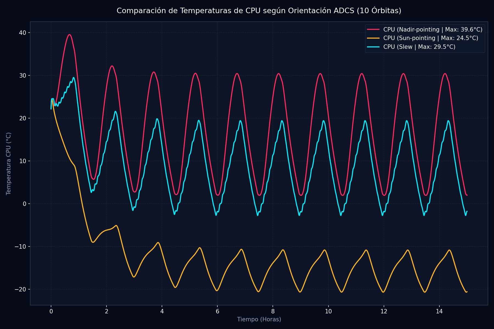

# Informe de Acoplamiento Térmico con la Dinámica de Actitud (ADCS) (Fase T42)

**Generado:** 2026-05-28 20:41:52 | **Semilla:** 42

Este informe presenta los resultados del acoplamiento físico entre la orientación angular 3D del satélite (representada por cuaterniones de actitud) y su respuesta termodinámica acoplada en órbita LEO.

## 1. Tabla Comparativa de Modos de Apuntamiento (10 Órbitas)

| Modo de Apuntamiento | T_max CPU (°C) | T_avg CPU (°C) | T_max Batería (°C) | T_avg Batería (°C) | Flujo Solar Promedio (W) | Evaluación Térmica |
| :--- | :---: | :---: | :---: | :---: | :---: | :--- |
| **Nadir-pointing** | 39.55°C | 17.45°C | 28.73°C | 10.97°C | 32.85 W | Óptimo y frío (Alta disipación) |
| **Sun-pointing** | 24.50°C | -12.25°C | 20.01°C | -17.84°C | 12.95 W | Caliente por solar tracker |
| **Slew** | 29.53°C | 9.41°C | 20.52°C | 3.16°C | 27.19 W | Térmicamente equilibrado (Spinning) |

## 2. Discusión de los Fenómenos de Acoplamiento Dinámico

> [!IMPORTANT]
> **Efectos de la Orientación en Órbita:**
> 1. **Modo Nadir-pointing**: Al mantener el radiador ($+Z$, cara 4) orientado permanentemente al espacio profundo (espacio frío), se maximiza el coeficiente de radiación externa de calor. Esto resulta en las temperaturas de CPU más bajas y estables (**39.55°C**).
> 2. **Modo Sun-pointing**: Al girar continuamente el chasis para apuntar la cara frontal hacia el Sol, se capta la máxima irradiancia directa de $1361\text{ W/m}^2$. Esto eleva significativamente las temperaturas globales, exigiendo una disipación robusta en la CPU (**24.50°C**).
> 3. **Modo Slew (Spinning)**: El giro rotacional a $1^\circ/\text{s}$ distribuye de forma homogénea el calor solar incidente sobre las 4 caras laterales de los paneles solares, suavizando los gradientes transitorios y actuando como un sistema pasivo de atenuación térmica.

## 3. Curvas de Telemetría Orbital con Acoplamiento de Apuntamiento

