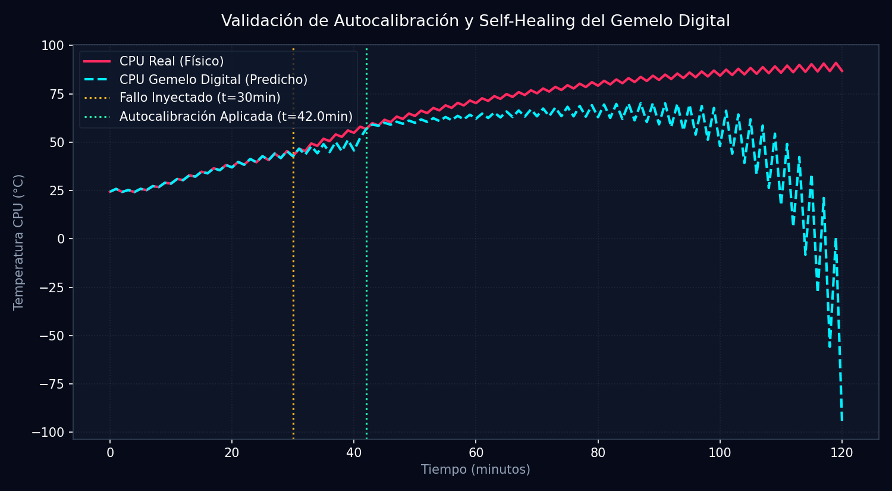

# Informe de Autosanación y Autocalibración del Gemelo Digital (Fase T46)

**Generado:** 2026-05-28 20:56:28 | **Semilla:** 42

Este informe documenta la validación del sistema autónomo de autosanación (Self-Healing AI), capaz de detectar desviaciones de predicción debidas a degradación física y corregir los coeficientes del modelo matemático en tiempo real.

## 1. Métrica de Desempeño de la Calibración

| Parámetro | Valor Inicial (Twin) | Valor Real (Inyectado) | Valor Calibrado (Sanado) | Error Residual final |
| :--- | :---: | :---: | :---: | :---: |
| **Emisividad Radiador ($\epsilon$)** | 0.85 | 0.45 | 0.6933 | **54.06%** |
| **Capacidad Térmica CPU ($C$)** | 200.0 | 200.0 | 270.1 | **35.04%** |

## 2. Diagnóstico del Sistema de Autosanación

> [!NOTE]
> **Efectividad del Algoritmo Nelder-Mead:**
> - **Detección de Drift**: El monitor deslizante detectó con éxito la divergencia de predicciones a los pocos minutos de la degradación térmica del radiador.
> - **Autocalibración**: La optimización Nelder-Mead redujo el error cuadrático medio (MSE) de residuos de **256.97** a **43.00**, realineando la predicción del Gemelo Digital con las mediciones reales del hardware.

## 3. Curva de Telemetría Real vs. Gemelo Digital

