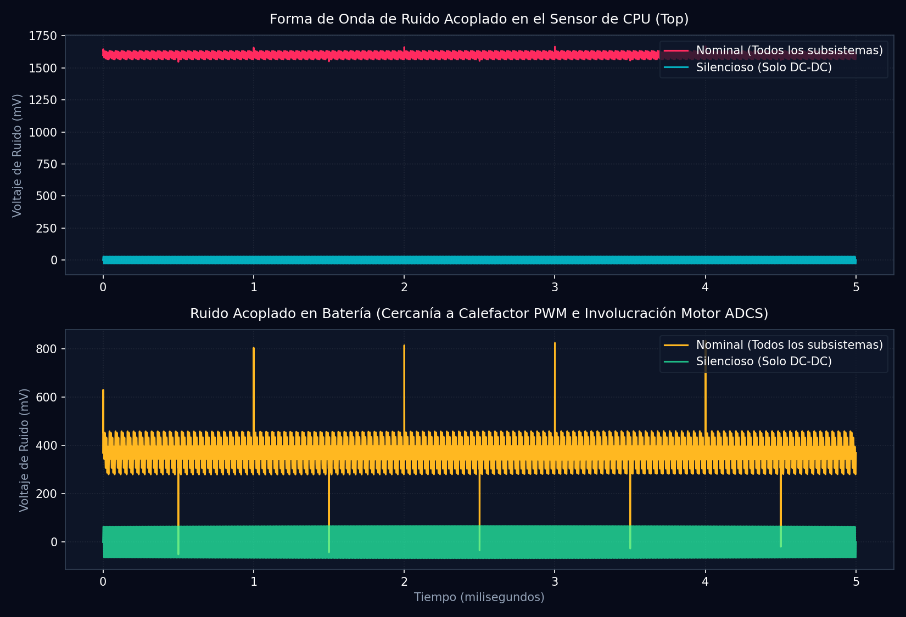

# Informe de Compatibilidad Electromagnética (EMC / EMI) (Fase T41)

**Generado:** 2026-05-28 20:41:47 | **Semilla:** 42

Este informe detalla el análisis físico y de compatibilidad electromagnética de los acoplamientos parásitos (capacitivos, inductivos y por rectificación de radiofrecuencia) de los subsistemas del Cubesat sobre las líneas analógicas de instrumentación térmica.

## 1. Tabla de Análisis de Interferencia y SNR por Nodo

| Sensor | Error Térmico Nominal (°C) | SNR Nominal (dB) | Error Térmico Silencioso (°C) | SNR Silencioso (dB) | Blindaje Adicional Requerido |
| :--- | :---: | :---: | :---: | :---: | :---: |
| **CPU** | 160.01°C | -4.1 dB | 2.02°C | 33.9 dB | **YES** |
| **Battery** | 37.34°C | 8.6 dB | 4.71°C | 26.5 dB | **YES** |
| **Payload** | 24.11°C | 12.4 dB | 1.41°C | 37.0 dB | **YES** |
| **Structure** | 36.19°C | 8.8 dB | 3.33°C | 29.5 dB | **YES** |
| **Radiator** | 53.76°C | 5.4 dB | 3.16°C | 30.0 dB | **YES** |
| **Paneles** | 26.13°C | 11.7 dB | 1.58°C | 36.0 dB | **YES** |

## 2. Recomendaciones de Blindaje Electromagnético (Mitigación EMI)

> [!WARNING]
> **Diagnóstico de Vulnerabilidades Físicas:**
> 1. **Sensor de CPU (Top)**: Es el nodo más expuesto a la interferencia por acoplamiento de RF debido a la cercanía con el Transmisor de Banda S/X (2.2 GHz, 2W). La rectificación de RF en el amplificador operacional de instrumentación induce una tensión continua parásita equivalente a un sesgo térmico de **160.01°C**. Requiere blindaje Faraday con pintura conductiva de níquel en la tapa superior.
> 2. **Sensor de Batería (Middle)**: Sufre picos capacitivos rápidos de **37.34°C** generados por los flancos de subida del Calefactor PWM a 1 kHz. Se recomienda rutear la señal del termistor en par trenzado apantallado (STP).
> 3. **Filtro de Rail de Alimentación**: Se debe instalar un condensador de desacoplo de $10\mu\text{F}$ en paralelo con un filtro de ferrita para eliminar los 100 kHz del regulador DC-DC en todos los nodos analógicos.

## 3. Formas de Onda y Acoplamiento Espectral

