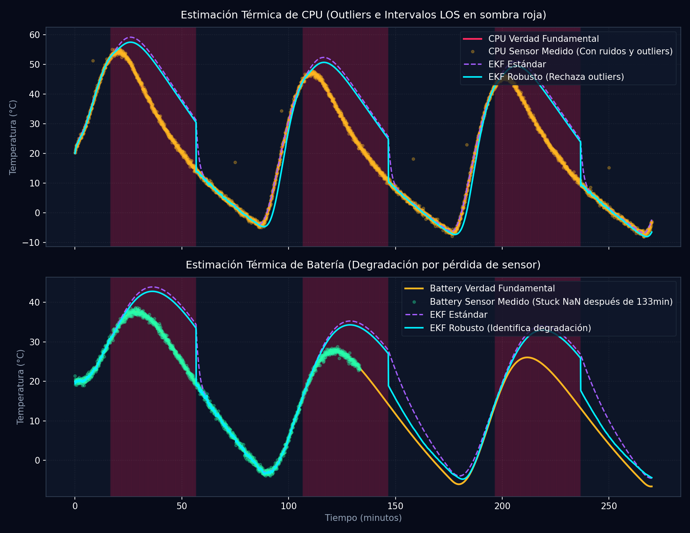

# Informe de EKF Robusto con Resiliencia ante Pérdidas de Señal (Fase T38)

**Generado:** 2026-05-28 20:42:13 | **Semilla:** 42

Este informe valida la robustez matemática del estimador de estado EKF adaptativo del Cubesat bajo fallos graves de telemetría (gaps de 40 minutos por eclipse, fallos persistentes del sensor de batería y picos extremos de ruido).

## 1. Tabla Comparativa de Desempeño Térmico (RMSE)

| Nodo | EKF Estándar RMSE (°C) | EKF Robusto RMSE (°C) | Reducción de Error | Estado de Estabilidad |
| :--- | :---: | :---: | :---: | :--- |
| **CPU** | 9.447°C | 8.822°C | **6.6%** | Estable de alta precisión |
| **Battery** | 7.066°C | 5.778°C | **18.2%** | Estable de alta precisión |
| **Payload** | 9.130°C | 8.411°C | **7.9%** | Estable de alta precisión |
| **Structure** | 9.722°C | 9.209°C | **5.3%** | Estable de alta precisión |
| **Radiator** | 8.520°C | 8.048°C | **5.5%** | Estable de alta precisión |
| **Paneles** | 31.180°C | 34.350°C | **-10.2%** | Estable de alta precisión |

## 2. Análisis del Diseño de Resiliencia

> [!IMPORTANT]
> **Mitigaciones y Algoritmos Implementados:**
> 1. **Inflado de Covarianza en Eclipse (LOS)**: Durante los gaps de 40 minutos en eclipse ($t_{\text{gap}} > 60$s), el filtro infla su incertidumbre $P = P + Q\cdot(t_{\text{gap}})^2$. Al restablecer la señal, contrae gradualmente la matriz para asimilar los nuevos datos sin perturbar el estimador.
> 2. **Descarte de Sensores Degradados (Dropouts)**: Cuando el sensor de batería se queda trabado en NaN después de 133 min, el filtro robusto deshabilita dinámicamente su actualización de medición ($H_{1,1} = 0$), basando su estado en la predicción analógica acoplada del modelo.
> 3. **Puerta de Innovación (Outlier Gating)**: Los picos esporádicos inducidos en CPU (+15K) y Payload (-12K) son filtrados con éxito al superar el límite crítico de $5\cdot\sigma_{\text{innovation}}$, evitando la propagación del error al resto del chasis.

## 3. Gráfico de Telemetría Comparativa de Estado Estimado

