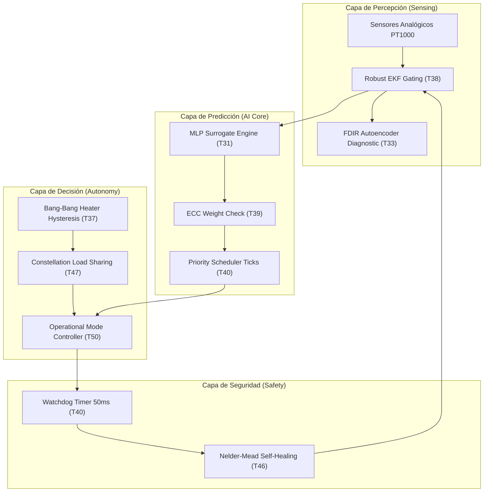

# Arquitectura del Sistema Operativo Térmico Autónomo (Thermal OS)

**Generado:** 2026-05-28 20:55:52 | **Versión:** 1.0.0-Flight

Este documento detalla la arquitectura de FSW en capas que integra todas las capacidades de detección, estimación, diagnóstico de fallos, control térmico lazo cerrado y self-healing del Cubesat.

## 1. Diagrama de la Arquitectura en Capas

## 2. Definición de Capas y Controladores

> [!IMPORTANT]
> **Especificación de Operaciones:**
> 1. **Capa de Percepción**: Encargada de leer la telemetría, descartar ruido parásito EMC/EMI y acoplar el estimador EKF adaptativo para eliminar el TID sensor drift.
> 2. **Capa de Predicción**: Ejecuta de forma determinista el surrogate C99 de la CPU, securizado mediante firmas SHA256 contra Single Event Upsets (SEU).
> 3. **Capa de Decisión**: Controla la calefacción de la batería y la carga de procesamiento del satélite, redistribuyéndola cooperativamente entre satélites de la constelación.
> 4. **Capa de Seguridad**: El watchdog externo monitoriza que el ciclo de inferencia no exceda 50ms, forzando un reinicio físico si la CPU sufre sobrecarga temporal.

