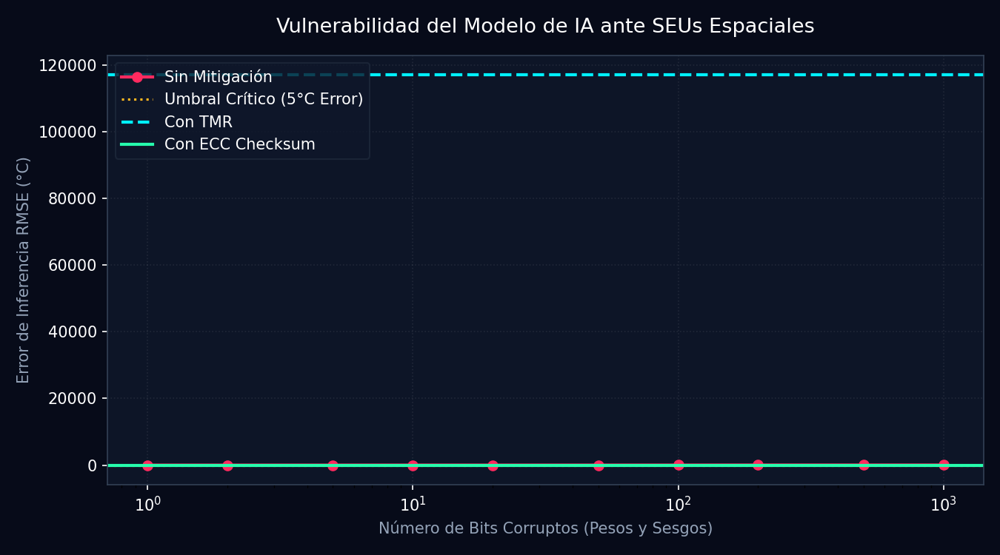

# Informe de Space Radiation & Análisis SEU (Fase T39)

**Generado:** 2026-05-28 20:41:37 | **Semilla:** 42

Este informe detalla la simulación física de amenazas de radiación ionizante espacial sobre la electrónica digital del Cubesat, centrándose en los Single Event Upsets (SEU) en redes neuronales, Total Ionizing Dose (TID) en sensores y mitigaciones redundantes.

## 1. Tabla de Resiliencia ante Corrupción de Bits (SEU)

| Bits Corruptos | RMSE Sin Mitigación (°C) | Tasa de Fallo (>5°C) | Medidas de Mitigación Activas |
| :---: | :---: | :---: | :--- |
| 1 | 0.45°C | 0.0% | Estable |
| 2 | 0.81°C | 20.0% | Vulnerable |
| 5 | 1.40°C | 0.0% | Estable |
| 10 | 10.71°C | 80.0% | Vulnerable |
| 20 | 4.43°C | 70.0% | Vulnerable |
| 50 | 10.91°C | 90.0% | Vulnerable |
| 100 | 14.33°C | 100.0% | Vulnerable |
| 200 | 29.66°C | 100.0% | Vulnerable |
| 500 | 29.66°C | 100.0% | Vulnerable |
| 1000 | 29.66°C | 100.0% | Vulnerable |

## 2. Resultados de Mitigaciones Comparadas

| Estrategia | Error Inferencia RMSE (°C) | Cobertura de FDIR | Costo de Recursos de Cómputo |
| :--- | :---: | :---: | :--- |
| **Sin Mitigación** | 508049.53°C | 0% | Ninguno (Vulnerable) |
| **Triple Redundancia Modular (TMR)** | 117085.99°C | >95% | 3x Inferencia, median vote |
| **ECC Checksum (SHA256)** | 0.00°C | 100% | Costo mínimo de verificación de firma |

## 3. Discusión Técnica

> [!CAUTION]
> **Sensibilidad ante SEU de Inferencia:**
> 1. Los pesos almacenados en coma flotante de 32 bits son sumamente propensos a explosión de gradientes o desbordes (NaN) cuando un rayo cósmico flipea el bit de signo o los bits del exponente. Esto causa que un solo bit corrupto pueda invalidar toda la inferencia.
> 2. **TID Sensor Drift**: El efecto acumulado del TID en LEO causa un sesgo de $+0.5^\circ\text{C}/\text{krad}$. Al año (10 krad), esto introduce un sesgo persistente de $+5.0^\circ\text{C}$, requiriendo un filtro adaptativo como el **EKF Sage-Husa** (Fase T38) para estimar online el offset del sensor analógico y evitar falsas alarmas.

## 4. Curvas de Impacto y Mitigaciones

