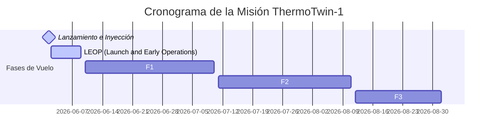

# 1U Cubesat Space Flight Demonstration Plan (TRL 7)
## Project Name: ThermoTwin-1 (TT-1)
### Duration: 3 Months | Orbit: LEO SSO 500km

This document outlines the demonstration mission plan for the **ThermoTwin-1 (TT-1)** spacecraft, a 1U Cubesat dedicated to validating our AI-driven real-time thermal control digital twin in orbit.

---

## 1. Mission Overview & Objectives

```text
       +-------------------------------------------------------+
       |                  ThermoTwin-1 (TT-1)                  |
       +-------------------------------------------------------+
       |                                                       |
       |     +--------------+              +--------------+    |
       |     |  Solar Panel |              |  Solar Panel |    |
       |     +-------+------+              +-------+------+    |
       |             |                             |           |
       |             +------------+---+------------+           |
       |                          |   |                        |
       |                          v   v                        |
       |                    +-----------+                      |
       |                    |  OBC ARM  |                      |
       |                    |  ONNX VM  |                      |
       |                    +-----+-----+                      |
       |                          | (Predictive Throttling)    |
       |                          v                               |
       |                 +-----------------+                   |
       |                 | CPU/Payload 30W |                   |
       |                 +-----------------+                   |
       +-------------------------------------------------------+
```

### Primary Objectives:
1. **Model Calibration in Orbit**: Execute the online calibration engine (EKF/persistent excitation gradients) to estimate structural capacities and radiator degradation in real space environments.
2. **Predictive Safety Demonstration**: Demonstrate proactive CPU throttling based on the ONNX surrogate predictive cycle, preventing thermal critical limit crossings.
3. **Telemetry Comparison**: Transmit predicted vs. actual temperature profiles to ground stations for correlation analysis.

---

## 2. Spacecraft Architecture (1U Cubesat COTS)

- **OBC (On-Board Computer)**: STM32H7 (ARM Cortex-M7, 480MHz) or VA41630 (Rad-Hard ARM Cortex-M4), capable of executing our dependency-free pure C MLP model.
- **Thermal Sensors**: 8 DS18B20 digital temperature sensors distributed across CPU, Battery, Payload, Structural Panels, and Radiators.
- **Radiator Coating**: Teflon FEP silvered film ($10\times10$ cm) on the main structural face.
- **Actuators**: Louver control mechanism (SMA-driven) and CPU heaters.

---

## 3. Mission Timeline (3-Month Orbit Phase)



### Flight Phases:
1. **Phase 1: LEOP (Days 1 - 7)**: Spacecraft checkout, communications lock, stable attitude control.
2. **Phase 2: Baseline Calibration (Month 1)**: Collecting baseline thermal telemetry. Run the parameter correction algorithm in the background to estimate real in-orbit capacity ($C$) and emissivity ($\\epsilon$).
3. **Phase 3: Active Predictive Throttling (Month 2)**: Enable the on-board predictive control loop. Run high-stress operations (CPU 30W) during sun-shadow transitions and demonstrate predictive safety.
4. **Phase 4: Extended Aging Analysis (Month 3)**: Analyze Teflon FEP degradation due to LEO Atomic Oxygen (ATOX) fluences, verifying EOL degradation trends.

---

## 4. Estimated Budget (EUR / USD)

| Category | Item Description | Estimated Cost |
| :--- | :--- | :---: |
| **COTS Hardware** | Cubesat structural kit, OBC board, batteries, solar panels, and sensors | $45,000 |
| **Testing Facilities**| Physical TVAC vacuum chambers and vibration tables access | $25,000 |
| **Launch Integration**| LEO SSO ride-share launch broker (e.g. D-Orbit / ISILAUNCH) | $75,000 |
| **Ground Segment** | Ground station network contract (e.g. KSAT / Satellogic network) | $15,000 |
| **Engineering Staff**| 2 FTEs during 6 months preparation + 3 months operations | $120,000 |
| **TOTAL** | | **$280,000** |
