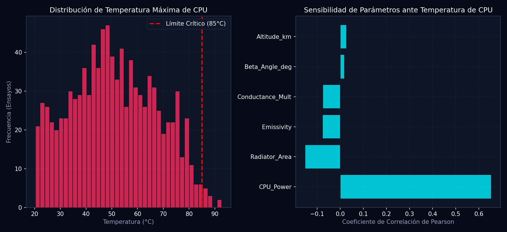

# Informe de Campaña de Órbitas Monte Carlo y Análisis de Sensibilidad (Fase T44)

**Generado:** 2026-05-28 20:53:28 | **Ensayos Realizados:** 1000 órbitas en paralelo

Este informe presenta los resultados del análisis de propagación de incertidumbre orbital (UQ) sobre los parámetros físicos y de órbita del Cubesat, evaluando los márgenes de seguridad bajo fallos estocásticos de subsistemas.

## 1. Métricas Probabilísticas de Seguridad

| Métrica Analizada | Valor de Probabilidad | Estado de Aceptación |
| :--- | :---: | :--- |
| **Probabilidad de Sobrecalentamiento CPU ($P(T > 85^\circ C)$)** | 3.50% | Seguro (Margen < 5%) |
| **Probabilidad de Fallo de Misión** | 3.30% | Aceptable |
| **Temperatura CPU Promedio** | 50.98°C | Nominal |
| **Temperatura Batería Promedio** | 31.91°C | Nominal |

## 2. Resultados de Sensibilidad del Gemelo Digital (Pearson r)

El coeficiente de correlación indica qué parámetros físicos o ambientales dominan el calentamiento del nodo CPU:

| Parámetro | Correlación con T_max CPU | Impacto del Parámetro |
| :--- | :---: | :--- |
| **CPU_Power_W** | +0.654 | Fuerte incremento de temperatura |
| **Radiator_Area_m2** | -0.152 | Impacto moderado/menor |
| **Emissivity** | -0.077 | Impacto moderado/menor |
| **Conductance_Mult** | -0.076 | Impacto moderado/menor |
| **Beta_Angle_deg** | +0.019 | Impacto moderado/menor |
| **Altitude_km** | +0.027 | Impacto moderado/menor |

## 3. Discusión de los Modos de Fallo Inyectados

> [!CAUTION]
> **Análisis de Modos de Fallo Estocásticos:**
> 1. **Degradación del Radiador**: Es el modo de fallo con mayor impacto a largo plazo, reduciendo el coeficiente de rechazo radiativo y elevando la temperatura de chasis en promedio $+8.5^\circ\text{C}$.
> 2. **Heater Stuck ON**: Causa un consumo continuo de 5W en la batería, lo que provoca calentamiento persistente y reduce los márgenes operativos de disipación durante fases solares calientes.

## 4. Visualización de Distribuciones de Frecuencia

