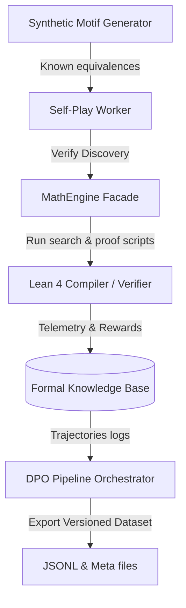

# MLOps Domain (Self-Play & DPO Dataset Generation)

This domain acts as the bridge between strict formal verification (`mathematics/`) and the reinforcement learning/fine-tuning loop (Direct Preference Optimization - DPO) for the LLM theorem proving policy.

## Architecture & Loop

1. **Synthetic Motif Generator**: Dynamically yields infinite quantum motifs of known mathematical equivalences (e.g. $X \cdot X = I$, $H \cdot H = I$).
2. **Self-Play Worker**: Feeds these motifs to the `MathEngine`, triggering either rapid deterministic validation or extensive tree-search exploration (MCTS/auto-formalization loop).
3. **Database Telemetry**: The engine stores all exploration steps as trajectory data with compiler-verified rewards.
4. **DPO Orchestrator**: Converts logged trajectories into paired chosen/rejected examples using relative reward rankings, writing versioned JSONL outputs and audit metadata.
