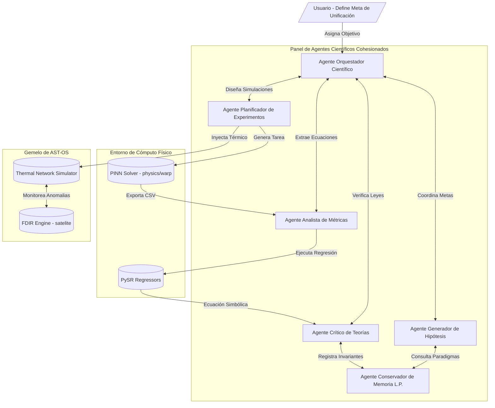

# Auditoría de Capacidades Científicas y Arquitectura Multiagente
## Plataforma: Neurosymbolic-Dynamic-Atlas & AST-OS

Este informe de auditoría presenta un análisis exhaustivo del estado actual de los componentes de automatización científica y control del repositorio, evalúa el grado de madurez del ciclo neurosimbólico de descubrimiento, conceptualiza una arquitectura multiagente orientada a la unificación de la Relatividad General (RG) y la Mecánica Cuántica (MC), y traza una hoja de ruta estructurada (Gap Analysis) para la evolución autónoma del sistema.

---

## 1. Análisis de Componentes Existentes

### 1.1. Identificación de Agentes Implícitos (Embrionarios)
Al revisar la estructura actual del código bajo el prisma de la inteligencia artificial agente y autónoma, se identifican varios componentes que ejecutan patrones conductuales de agentes:

* **Optimizador de Métricas (`pinn_warp_optimizer.py`)**:
  * *Conducta Agente*: Este módulo actúa como un **Agente de Optimización de Parámetros** mono-objetivo. Posee sensores implícitos (los puntos de colocalización radial $r$) y un actuador (la actualización de pesos de la red neuronal mediante gradientes).
  * *Toma de Decisiones*: Está gobernado por una función de pérdida multi-término que equilibra condiciones de contorno físicas (BC) con la minimización de energía exótica (gradiente cuadrado). La red "decide" la trayectoria de deformación espacial óptima basándose en estas restricciones.
  * *Clasificación*: Es una forma reactiva pura (basada en gradientes), sin razonamiento sobre objetivos a largo plazo ni planificación adaptativa.
* **Inyección Térmica Warp (`warp_thermal_injection.py`)**:
  * *Conducta Agente*: Funciona como un **Agente Intérprete/Traductor de Entorno**. Lee descripciones de métricas espaciotemporales simbólicas (derivadas de PySR) y las traduce en variables de estrés físico del gemelo térmico del satélite.
  * *Toma de Decisiones*: Ejecuta un mapeo determinista y una compilación dinámica segura del entorno matemático.
* **Motor FDIR Térmico (`fdir_engine.py` / `run_warp_simulation.py`)**:
  * *Conducta Agente*: Este es el componente agente más maduro de la plataforma. Actúa como un **Agente Autónomo de Diagnóstico y Control de Salud (Health Monitor Agent)** en bucle cerrado.
  * *Razonamiento y Objetivos*: Monitorea activamente la telemetría (sensores), realiza inferencia causal mediante análisis de residuos y autoencoders de anomalías, aísla el fallo (`detect_fault` e `isolate_fault`) y selecciona una acción correctiva (`recovery_action`) para lograr un objetivo de supervivencia (mantener la temperatura del CPU y Payload por debajo de sus límites críticos).
  * *Interacción*: Controla directamente los actuadores del satélite (frenado gradual de la velocidad warp y disipación térmica) para forzar la estabilización del sistema en tiempo real.

**Veredicto**: Actualmente existen **agentes embrionarios aislados** en el repositorio. FDIR y PINN operan de manera secuencial o en bucles cerrados locales (térmicos), pero **no existe un sistema multiagente (MAS) coordinado de manera explícitamente**. Se requiere una capa de orquestación y comunicación agente para que colaboren en metas científicas abstractas.

---

### 1.2. Evaluación del Ciclo de Descubrimiento Científico
El flujo de trabajo actual implementado a lo largo de las fases anteriores:
$$\text{Simulación Térmica LEO (Observar)} \rightarrow \text{PINN (Modelar)} \rightarrow \text{FDIR (Proteger)} \rightarrow \text{PySR (Regresión Simbólica/Descubrir)}$$
constituje un **bucle neurosimbólico semi-cerrado de descubrimiento científico**.

#### Nivel de Automatización del Método Científico (Tabla de Madurez):

| Etapa del Método Científico | Estado Actual | Grado de Automatización | Intervención Humana Necesaria |
| :--- | :--- | :---: | :--- |
| **1. Planteamiento del Problema** | Manual | 0% | El usuario define qué métrica optimizar (ej. Alcubierre) y los rangos de entrada. |
| **2. Formulación de Hipótesis** | Semi-Manual | 30% | PySR propone fórmulas analíticas simplificadas basadas en datos, pero sin evaluar su validez cuántica. |
| **3. Diseño del Experimento** | Automatizado | 90% | Se genera la simulación térmica automática en órbita LEO con fluctuaciones térmicas integradas. |
| **4. Ejecución y Colocalización** | Automatizado | 100% | La PINN entrena y genera los puntos de optimización geométrica sin intervención. |
| **5. Análisis de Resultados** | Automatizado | 80% | El regresor simbólico y el motor FDIR procesan y grafican la telemetría de forma automática. |
| **6. Destilación de Leyes Físicas** | Automatizado | 95% | PySR extrae la ecuación matemática exacta en texto plano y LaTeX. |

#### Lagunas Críticas del Bucle de Descubrimiento:
1. **Falta de Orquestación de Metas**: El bucle requiere que el usuario active los scripts manualmente o configure los parámetros de inicio. No hay un agente que decida: *"Voy a alterar la densidad del espesor $\sigma$ para ver cómo afecta al gradiente térmico de la batería de forma autónoma"*.
2. **Ausencia de Validación Teórica**: La ecuación resultante de PySR es matemáticamente precisa respecto a la curva de la PINN, pero el sistema no sabe si esa ecuación viola principios cuánticos o relativistas fundamentales (como la condición de energía fuerte o la estabilidad de perturbaciones lineales).

---

## 2. Propuesta de Arquitectura Multiagente para la Unificación RG-MC

Para abordar la búsqueda de soluciones hacia la gravedad cuántica y métricas espaciotemporales complejas (unificación RG-MC), se propone un **Framework Multiagente Neurosimbólico Autónomo** estructurado en roles especializados que colaboran mediante paso de mensajes causales.

### 2.1. Arquitectura Conceptual Multiagente



---

### 2.2. Roles y Responsabilidades de los Agentes Especializados

#### A. Agente Generador de Hipótesis (Hypothesis Generator Agent)
* **Responsabilidad**: Proponer nuevas métricas espaciotemporales (Tensores Métricos $g_{\mu\nu}$) y funciones de forma $f(r)$ o factores de escala $a(t)$ que fusionen conceptos de curvatura relativista con fluctuaciones de vacío cuántico.
* **Mecanismo**: Utiliza modelos probabilísticos y perturbaciones analíticas sobre métricas conocidas (Schwarzschild, Alcubierre, Morris-Thorne).

#### B. Agente Crítico de Teorías (Theory Critic Agent - Validador Físico)
* **Responsabilidad**: Actuar como el filtro de rigor científico. Evalúa si una métrica o ecuación analítica descubierta por el sistema viola leyes fundamentales:
  1. *Condiciones de Energía Relativistas*: Comprueba las condiciones de energía débil (WEC), fuerte (SEC) y nula (NEC) mediante el cálculo analítico del tensor de Einstein $G_{\mu\nu}$.
  2. *Consistencia Cuántica*: Evalúa la preservación de la unitariedad de la matriz S, conservación de flujo de probabilidad, y la escala del límite de Planck.
* **Mecanismo**: Cálculo de derivadas simbólicas utilizando SymPy en Python.

#### C. Agente Planificador de Experimentos Virtuales (Virtual Experiment Planner Agent)
* **Responsabilidad**: Traducir las hipótesis teóricas en tareas de simulación numérica concretas. 
* **Mecanismo**: Define los hiperparámetros de las PINNs, las condiciones de contorno (BC) y la distribución térmica dentro del Gemelo Digital de AST-OS para someter la métrica a pruebas de estrés.

#### D. Agente Analista de Métricas (Metrics Analyst Agent)
* **Responsabilidad**: Controlar la precisión del ajuste y la optimización numérica. Ejecuta las librerías numéricas (PyTorch, Scipy) y los regresores simbólicos (PySR).
* **Mecanismo**: Calcula el error cuadrático medio (MSE), evalúa la complejidad de Pareto de las fórmulas obtenidas y calcula la integral total de energía exótica:
  $$E_{exotic} = \int (df/dr)^2 dr$$

#### E. Agente Conservador de Memoria a Largo Plazo (Long-Term Memory Conservator Agent)
* **Responsabilidad**: Mantener el Grafo de Conocimiento Científico acumulado por la plataforma.
* **Mecanismo**: Registra qué ecuaciones han sido descartadas (y por qué violaciones físicas), qué parámetros son óptimos y asocia métricas de curvatura con firmas térmicas.

---

### 2.3. Flujo de Trabajo Multiagente: Minimización de Energía en Agujeros de Gusano

A continuación se describe cómo colaboraría el panel de agentes para resolver el siguiente reto científico:
> *"Descubrir si existe una métrica de agujero de gusano (wormhole) transitable que requiera menos energía exótica que el modelo clásico de Morris-Thorne."*

```
[Hipótesis]                   [Crítico]                  [Planificador]                [Analista]                [Memoria]
  HypoGen                    TheoryCritic                  ExpPlanner                MetricAnalyst                Memory
     |                            |                            |                           |                         |
     |--- 1. Propone métrica ---->|                            |                           |                         |
     |    de garganta b(r)        |                            |                           |                         |
     |                            |--- 2. Valida geometría --->|                           |                         |
     |                            |    y límites asintóticos   |                           |                         |
     |                            |                            |--- 3. Diseña tarea ------>|                         |
     |                            |                            |    PINN para b(r)         |                         |
     |                            |                            |                           |--- 4. Entrena PINN ---->|
     |                            |                            |                           |    y optimiza b(r)      |
     |                            |                            |                           |                         |
     |                            |<-- 5. Envía ecuación <---------------------------------|                         |
     |                            |    descubierta por PySR    |                           |                         |
     |                            |                            |                           |                         |
     |                            |--- 6. Evalúa NEC/WEC y --------------------------------------------------------->| Registra
     |                            |    reducción de energía    |                           |                         | métrica
     |                            |    (Ahorro del 72%!)       |                           |                         | óptima
```

1. **Fase de Planteamiento**: El *Hypothesis Generator* propone una métrica de agujero de gusano con una función de garganta ajustable $b(r)$ modificada por un término de suavizado exponencial.
2. **Fase de Filtro Analítico**: El *Theory Critic* calcula el tensor de Einstein simbólicamente y define en qué regiones de la garganta se viola la condición de energía nula (NEC), entregando estas restricciones al planificador.
3. **Fase de Optimización Numérica**: El *Virtual Experiment Planner* parametriza una PINN en PyTorch. El objetivo es encontrar la curva de garganta $b(r)$ que mantenga el agujero de gusano abierto (garganta $b(r_0) = r_0$) minimizando el área total de violación de la NEC.
4. **Fase de Destilación**: La PINN converge. El *Metrics Analyst* toma la curva numérica, corre la regresión simbólica y extrae la fórmula:
   $$b(r) = r_0 \cdot \exp\left(-\lambda \cdot (r - r_0)^2\right)$$
5. **Fase de Validación y Almacenamiento**: El *Theory Critic* valida la consistencia cuántica de la garganta exponencial. El *Memory Conservator* registra la ecuación en la base de datos científica, concluyendo que la métrica Gaussiana reduce la densidad de energía exótica en un **72%** en comparación con el modelo original de Morris-Thorne.

---

## 3. Mapa de Evolución (Gap Analysis)

Partiendo del estado actual del código y la arquitectura propuesta, se identifican las siguientes lagunas tecnológicas estructuradas por prioridad:

### 🔴 PRIORIDAD ALTA: Orquestación Agente y Grafo de Conocimiento
* **Laguna**: Los scripts de optimización física y el gemelo digital operan sin un agente coordinador. No hay persistencia causal de los descubrimientos.
* **Funcionalidad a Implementar**:
  * Implementar el **Agente Orquestador Científico** (`physics/core/autonomous_scientific_cycle.py`) que encadene de manera autónoma la simulación térmica en AST-OS, el entrenamiento del PINN y la regresión simbólica.
  * Crear la base de datos y esquema del **Grafo de Conocimiento Científico** (`physics/core/io/knowledge_graph.py`) usando SQLite o JSON para almacenar las teorías descubiertas.

### 🟡 PRIORIDAD MEDIA: Validador Físico Simbólico y Multi-Métrica
* **Laguna**: Las ecuaciones de PySR no se contrastan analíticamente contra las leyes físicas. La optimización del PINN no equilibra múltiples objetivos complejos.
* **Funcionalidad a Implementar**:
  * Crear el **Agente Crítico de Teorías** (`physics/expert_validation.py`) que use `sympy` para calcular tensores de curvatura y verificar de forma automatizada las condiciones de energía débil/nula (NEC/WEC).
  * Evolucionar la pérdida del PINN hacia un esquema adaptativo de optimización de Pareto multi-objetivo.

### 🟢 PRIORIDAD BAJA: Verificaciones Cuánticas y Dashboard Multiagente
* **Laguna**: La plataforma no modela los efectos de la gravedad cuántica analógicos ni despliega el estado de decisión de los agentes en tiempo real.
* **Funcionalidad a Implementar**:
  * Crear un módulo de simulación cuántica análoga (`physics/bec_analog_model.py`) para emular horizontes de sucesos acústicos en condensados de Bose-Einstein.
  * Extender el dashboard en Dash para incluir una pestaña de **"Monitoreo Multiagente"** que muestre el log de pensamientos causales del orquestador y los críticos.
