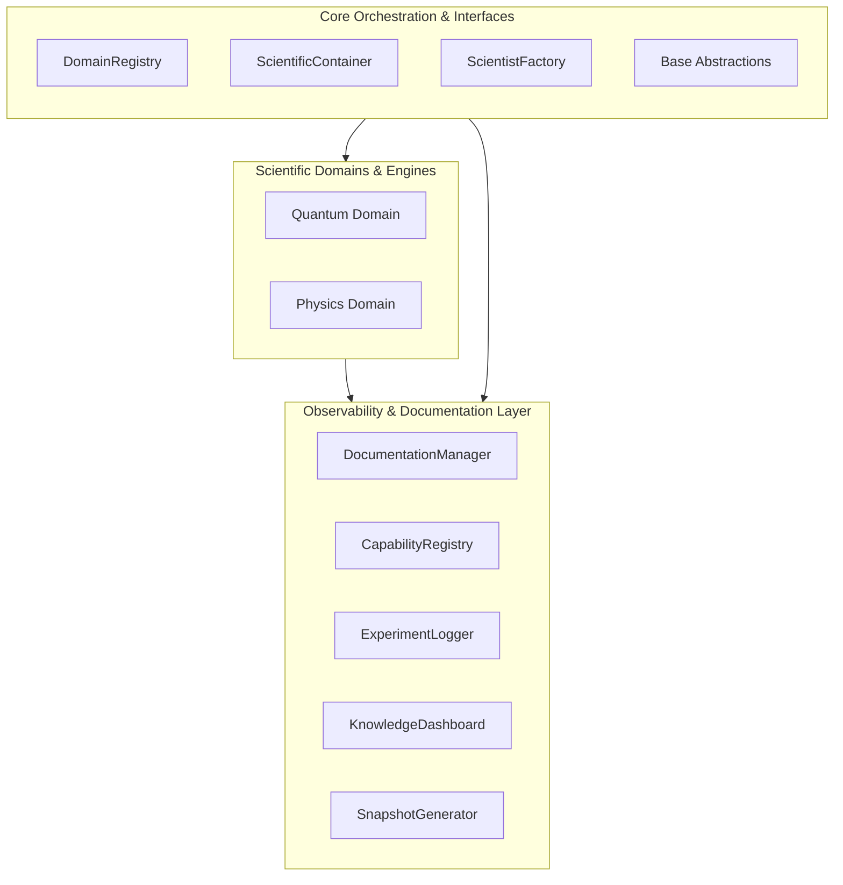
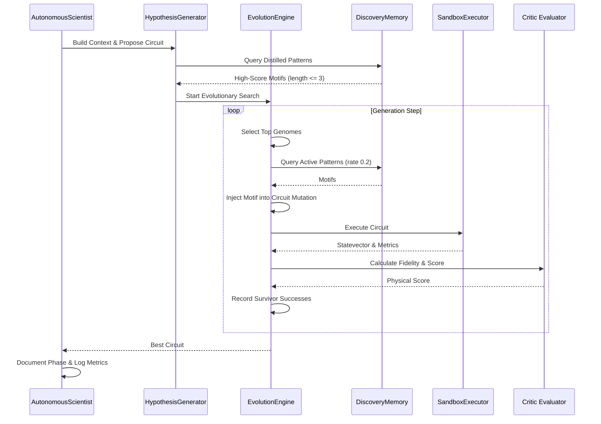

# System Architecture Snapshot

This document provides a live overview of the discovery platform's components, dependencies, data flows, and active capabilities.

---

## 1. Active Capabilities Matrix

Below are the emergent capabilities verified and registered in the system:

| Capability | Phase Introduced | Description |
| :--- | :---: | :--- |
| **CAUSAL_FACTOR_AUDIT** | Phase 1G | Emergent capability enabled dynamically during phase completion. |
| **KNOWLEDGE_DISTILLATION** | Phase 1B.4 | Extraction of canonical representations and reusable motif graphs. |
| **MULTI_DOMAIN_RUNTIME** | Phase 0E | Multi-domain runtime loading dynamic domain plugin adapters. |
| **OUT_OF_SAMPLE_PREDICTION** | Phase 1G | Emergent capability enabled dynamically during phase completion. |
| **QUANTUM_EVOLUTION_ENGINE** | Phase 1B.3 | Genetic optimization sweep of quantum circuits. |
| **QUANTUM_EXECUTION** | Phase 1B.1 | Execution of abstract circuit specs in a Qiskit statevector sandbox. |
| **QUANTUM_FITNESS_FUNCTION** | Phase 1B.2 | Physical fidelity evaluation scoring of candidate circuits. |
| **SCIENTIFIC_OBSERVABILITY** | Phase 1D | Documentation-as-code updates, capability registries, and logs. |
| **SYMBOLIC_RULE_EXTRACTION** | Phase 1G | Emergent capability enabled dynamically during phase completion. |
| **TRANSFERABILITY_FEATURE_ENGINE** | Phase 1G | Emergent capability enabled dynamically during phase completion. |
| **TRANSFERABILITY_PREDICTOR** | Phase 1G | Emergent capability enabled dynamically during phase completion. |
| **TRANSFER_LEARNING** | Phase 1C | Mutation guiding and transfer learning from sub-problems. |

---

## 2. Component Directory Structure

The platform is organized into three major layers: the domain-agnostic **Core**, the domain-specific **Scientific Plugins**, and the shared **Observability Layer**.

### A. Core Layers (`core/`)
* **`core/abstractions/`**: Defines basic abstract classes (`BaseSandbox`, `BaseCritic`, `BaseMemory`, `BaseHypothesisGenerator`) ensuring type safety and interchangeability.
* **`core/domains/`**: Domain loading infrastructure. Implements dynamic adapter scanning and registering.
* **`core/orchestration/`**: Implements the dependency injection container (`ScientificContainer`) and orchestrator instantiators.

### B. Quantum Domain (`quantum/`)
* **`quantum/sandbox/`**: Statevector simulation executor using `Qiskit` to simulate noise-free circuit execution.
* **`quantum/critics/`**: Mathematical evaluation of circuit outputs against targets using physical state vector fidelity.
* **`quantum/evolution/`**: Genetic optimization engine containing selection, crossover/mutation operations, and knowledge-guided mutation injection.
* **`quantum/knowledge/`**: The knowledge distillation loop. Extracts canonical gate subsequences, structural motifs, and maintains the in-memory graph.
* **`quantum/memory/`**: Non-volatile storage of patterns and metrics.

### C. Observability Layer (`core/observability/`)
* **`CapabilityRegistry`**: Tracks active system capabilities across phases.
* **`DocumentationManager`**: Automates roadmaps, phase status, and capability matrix updates.
* **`ExperimentLogger`**: Log benchmark executions chronologically.
* **`KnowledgeDashboard`**: Computes pattern reuse, evolution, and transfer performance.
* **`ArchitectureSnapshotGenerator`**: Generates this document.

---

## 3. Scientific Discovery Loop & Data Flow

The Discovery Engine executes an iterative search and selection flow. Knowledge extracted in past cycles is injected to guide and accelerate future mutations.

---

## 4. Operational Boundaries

* **Sandbox Isolation:** No operations inside the Qiskit sandbox can write to the local filesystem or access network resources.
* **Epistemic Isolation:** The evaluation process is strictly mathematical (fidelity). The search space mutation does not memorize absolute circuits, only local motifs.
