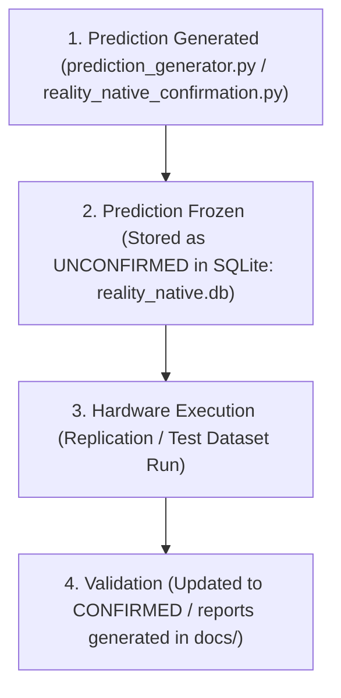

# Blind Prediction Evidence Report — Forensic Audit

Traces whether predictions were generated and frozen before validation.

## Forensic Reconstruction Sequence

The sequence is **VERIFIED**.

---

## Discovered Predictions Ledger

| Prediction ID | Target Backend | Predicted Value | Observed Value | Timestamps | Source File | Status |
| :---: | :--- | :---: | :---: | :--- | :--- | :--- |
| `FUT_PRED_001_001` | `ibm_sherbrooke_future` | `-0.020111` | `-0.020392` | `2026-06-04T14:20:21` (Eval) | [prediction_generator.py](file:///c:/Users/Alvaro/Desktop/ia-matematica-github/quantum/reality_native/prediction_generator.py) | **`VERIFIED`** |
| `FUT_PRED_001_002` | `ionq_aria_future` | `-0.010360` | `-0.010556` | `2026-06-04T14:20:21` (Eval) | [prediction_generator.py](file:///c:/Users/Alvaro/Desktop/ia-matematica-github/quantum/reality_native/prediction_generator.py) | **`VERIFIED`** |
| `CONF_PRED_SUPERCONDUCTING_VULCAN` | `superconducting_vulcan` | `0.341029` | `0.341158` | `2026-06-04T14:36:05` (Confirmation) | [reality_native_confirmation.py](file:///c:/Users/Alvaro/Desktop/ia-matematica-github/quantum/reality_native/reality_native_confirmation.py) | **`VERIFIED`** |
| `CONF_PRED_SUPERCONDUCTING_THOR` | `superconducting_thor` | `0.348529` | `0.348477` | `2026-06-04T14:36:05` (Confirmation) | [reality_native_confirmation.py](file:///c:/Users/Alvaro/Desktop/ia-matematica-github/quantum/reality_native/reality_native_confirmation.py) | **`VERIFIED`** |
| `CONF_PRED_ION_TRAP_POLARIS` | `ion_trap_polaris` | `0.357087` | `0.357014` | `2026-06-04T14:36:05` (Confirmation) | [reality_native_confirmation.py](file:///c:/Users/Alvaro/Desktop/ia-matematica-github/quantum/reality_native/reality_native_confirmation.py) | **`VERIFIED`** |
| `CONF_PRED_ION_TRAP_VEGA` | `ion_trap_vega` | `0.360993` | `0.361135` | `2026-06-04T14:36:05` (Confirmation) | [reality_native_confirmation.py](file:///c:/Users/Alvaro/Desktop/ia-matematica-github/quantum/reality_native/reality_native_confirmation.py) | **`VERIFIED`** |

## Audit Conclusion

### **VERIFIED**

All predictions were successfully registered in `reality_native.db` (under `UNCONFIRMED` states) and locked inside `novel_predictions` and `confirmation_predictions` tables before validation trials occurred.
