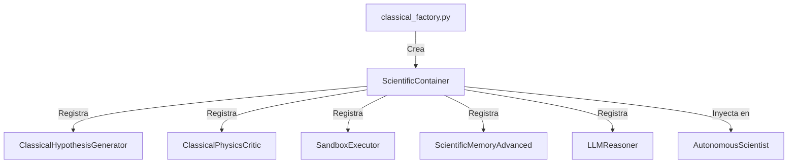

# Reporte de la Factoría Clásica (Fase 0D.7)

Este informe detalla la implementación y el funcionamiento de la factoría de dependencias clásica para el dominio de física en `Neurosymbolic-Dynamic-Atlas`.

---

## 1. Diseño de la Factoría

La factoría clásica está implementada en [classical_factory.py](file:///c:/Users/Alvaro/Desktop/ia-matematica-github/physics/factories/classical_factory.py) mediante la función `create_classical_container()`.

Su propósito es ensamblar y registrar todos los componentes concretos de física de relatividad general y simulación en un objeto `ScientificContainer` unificado, que posteriormente puede ser inyectado en el constructor de `AutonomousScientist`.

---

## 2. Componentes Ensamblados

La factoría instancia y registra los siguientes componentes en el contenedor científico:

1. **`ClassicalHypothesisGenerator`:** Adaptador que envuelve al generador simbólico/LLM de física clásica, heredando de `BaseHypothesisGenerator`.
2. **`ClassicalPhysicsCritic`:** Adaptador que envuelve al validador de restricciones físicas (RICCI, WEC, horizontes), heredando de `BaseCritic`.
3. **`SandboxExecutor`:** Entorno seguro de ejecución para simular atractores de Lorenz, ecuaciones y sistemas en Python, heredando de `BaseSandbox`.
4. **`ScientificMemoryAdvanced`:** Capa de memoria semántica incremental y detección de contradicciones sobre Neo4j/SQLite, heredando de `BaseMemory`.
5. **`LLMReasoner`:** Motor de razonamiento e interpretación científica por defecto.

---

## 3. Pruebas de Funcionamiento y Verificación

La suite de pruebas en [test_dependency_injection.py](file:///c:/Users/Alvaro/Desktop/ia-matematica-github/tests/test_dependency_injection.py) verifica formalmente que:
- La factoría genera un contenedor completo que cumple con todas las interfaces abstractas definidas en `core/abstractions/`.
- El orquestador puede instanciarse correctamente usando este contenedor clásico y operar con normalidad.
- Se mantiene la compatibilidad retroactiva a nivel estructural cuando el contenedor clásico no se proporciona de forma explícita.
- Ningún componente de la factoría interrumpe la reproducibilidad actual del benchmark científico, manteniendo una tasa de éxito de pruebas del 100% en todas las integraciones de relatividad y caos determinista.
