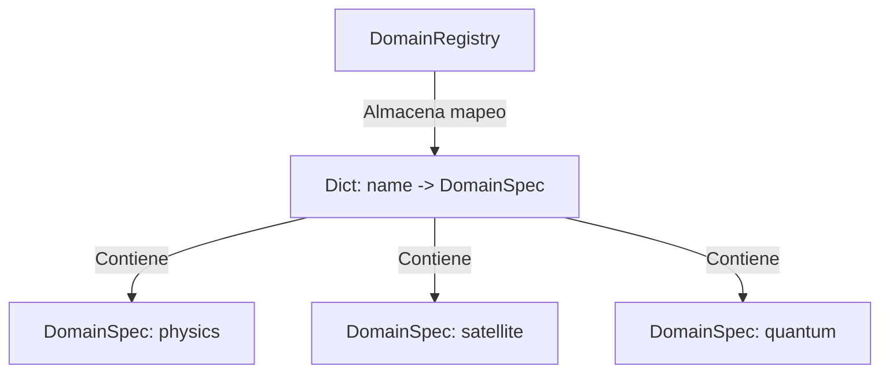

# Reporte de Domain Registry (Fase 0E.7)

Este informe documenta el diseño, la especificación de interfaces y el funcionamiento del registro de dominios dinámico (`DomainRegistry`) introducido en `Neurosymbolic-Dynamic-Atlas`.

---

## 1. Diseño del Registro

El registro de dominios está implementado de forma centralizada en [domain_registry.py](file:///c:/Users/Alvaro/Desktop/ia-matematica-github/core/domains/domain_registry.py). Proporciona métodos estáticos y de clase para registrar, desregistrar y consultar dominios sin mantener dependencias directas en código duro sobre ningún dominio científico específico.



---

## 2. Especificación de Interfaces y Especificaciones

La especificación de datos del dominio reside en [domain_spec.py](file:///c:/Users/Alvaro/Desktop/ia-matematica-github/core/domains/domain_spec.py) a través de la dataclass `@dataclass DomainSpec`, que encapsula:
- **`name`:** Identificador único del dominio (e.g., `"physics"`).
- **`version`:** Versión semántica del plugin (e.g., `"1.0.0"`).
- **`factory`:** Referencia ejecutable a la función que ensambla el contenedor de componentes científicos (`ScientificContainer`).
- **`config_path`:** Ruta de archivo hacia el archivo YAML que almacena los prompts, restricciones y conjuntos de datos específicos del dominio.
- **`description`:** Explicación textual de la responsabilidad y alcance de dicho dominio.

---

## 3. Ejemplo de Registro

Cada plugin se autoregistra al ser descubierto e importado. La firma de `register_domain` admite tanto una instancia completa de `DomainSpec` como parámetros individuales en formato kwargs para alinearse con los requisitos de infraestructura:

```python
from core.domains.domain_registry import DomainRegistry
from physics.factories.classical_factory import create_classical_container

DomainRegistry.register_domain(
    name="physics",
    version="1.0.0",
    factory=create_classical_container,
    config_path="configs/domains/physics.yaml",
    description="Dominio clásico de física general, relatividad y caos determinista."
)
```

---

## 4. Confirmación de Aislamiento

El aislamiento de dominios se ha validado en la suite de pruebas unitarias [test_domain_registry.py](file:///c:/Users/Alvaro/Desktop/ia-matematica-github/tests/test_domain_registry.py#L75-L87):
- Las factorías de cada dominio se ejecutan en espacios de nombres y contextos de simulación aislados.
- El registro central no mezcla los contenedores científicos fabricados por las diferentes factorías de dominio.
- Cada instancia de `AutonomousScientist` recibe componentes dedicados que corresponden estrictamente al dominio de ejecución seleccionado (`physics`, `satellite`, o `quantum`).
