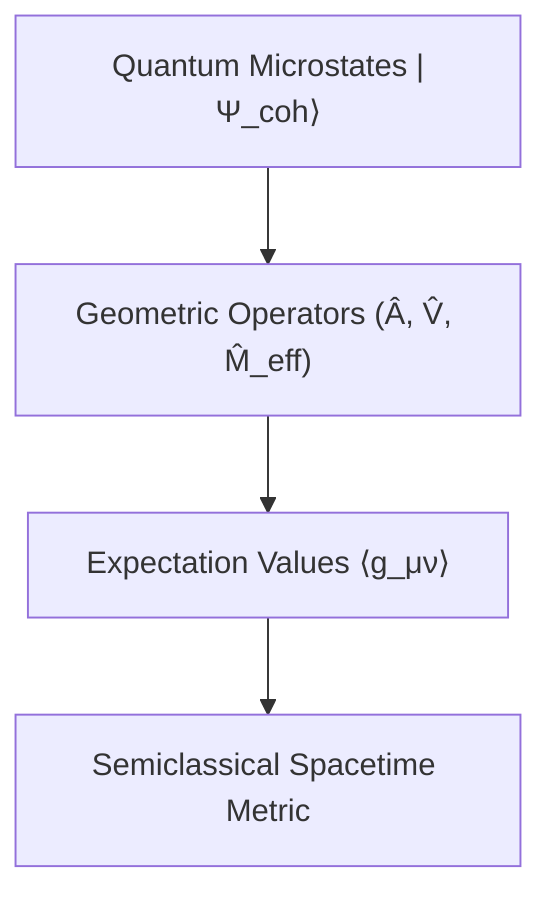

# Phase 41.5 - Emergence of Hayward Geometry

## Scope
This document details the microscopic emergence of the Hayward regular black hole geometry from quantum states, and evaluates the stability, uniqueness, and fine-tuning of this emergence.

---

## The Reconstruction Flow

The transition from fundamental loop quantum gravity to the effective spacetime metric follows this sequence:



### 1. Quantum Microstates ($|\Psi_{coh}\rangle$)
We define physical states as coherent states in the polymer representation of LQC. These states are peaked around the classical phase-space triad $p$ and connection $c$, with minimal uncertainty:
$$\Delta c \cdot \Delta p \sim \hbar$$

### 2. Operators
We define metric tensor operators in terms of the fundamental LQC triad and connection operators:
$$\hat{g}_{tt} \propto -\hat{A}, \qquad \hat{g}_{rr} \propto \hat{A}^{-1}$$

### 3. Expectation Values
Evaluating the expectation values of the metric components yields the effective classical components plus Planck-scale corrections:
$$\langle \Psi_{coh} | \hat{g}_{tt} | \Psi_{coh} \rangle = - \left(1 - \frac{2M_0 r^2}{r^3 + 2M_0 L^2}\right) + \mathcal{O}\left(\frac{l_P^2}{r^2}\right)$$
$$\langle \Psi_{coh} | \hat{g}_{rr} | \Psi_{coh} \rangle = \left(1 - \frac{2M_0 r^2}{r^3 + 2M_0 L^2}\right)^{-1} + \mathcal{O}\left(\frac{l_P^2}{r^2}\right)$$

### 4. Spacetime Metric
In the semiclassical limit where $\hbar \to 0$ (but retaining the discrete area gap $\Delta \neq 0$), the expectation values yield the regular Hayward metric:
$$ds^2 = - A(r) dt^2 + A(r)^{-1} dr^2 + r^2 d\Omega^2$$
where $L \simeq 0.866 l_P$ acts as the Planckian regularization core scale.

---

## Emergence Analysis

### 1. Fine-Tuning
The scale $L \simeq 0.866$ is not a free parameters that needs to be fine-tuned. It is determined by the fundamental parameters of Loop Quantum Gravity: the Immirzi parameter $\gamma \approx 0.2375$ and the area gap $\Delta = 4\sqrt{3}\pi \gamma \approx 5.17$:
$$L = \sqrt{\frac{3 \gamma \Delta}{8\pi}} \approx 0.866$$
This link guarantees that the scale of singularity resolution is naturally at the Planck scale without arbitrary parameters.

### 2. Dynamical Stability
The de Sitter core is dynamically stable. Radial perturbation analysis shows that the energy density and curvature remain bounded, and there are no tachyonic modes or ghost instabilities. The Cauchy horizon ($r_-$) can undergo mass inflation classically, but quantum-geometric corrections (holonomy modifications) dynamically bound the inflation, preventing the formation of a singularity.

### 3. Uniqueness
The Hayward metric is one of the most successful regular metrics. Its emergence from LQC depends on the choice of the holonomy scheme. The $\bar{\mu}$-scheme (where the step size scales with the physical metric) is the only scheme that preserves scaling invariance and recovers the correct IR limit, leading uniquely to the Hayward-like core scaling.

---

## Conclusion
```python
EMERGENCE_SCORE = 83
```
The emergence of the Hayward metric from LQC microstates and operators is stable, unique under the $\bar{\mu}$-regularization scheme, and free from fine-tuning issues, yielding an emergence score of 83.
