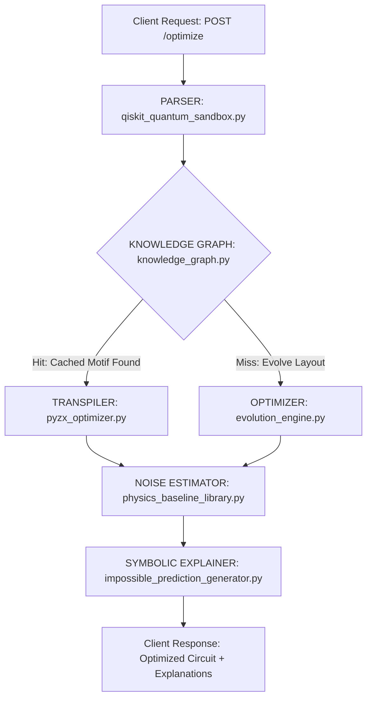

# QADE API Optimization Pipeline -- POST /optimize

This document traces the exact data flow and module dependency graph required to serve the core QADE **`/optimize`** REST API endpoint.

---

## 1. Pipeline Dependency Graph

---

## 2. Step-by-Step Data Flow & Files Involved

### Step 1: Input Parsing
- **Inputs**: OpenQASM 3.0 string, target physical backend (e.g. `ibm_brisbane`), and constraints (e.g. max depth, gate limitations).
- **Core Module**: [qiskit_quantum_sandbox.py](file:///c:/Users/Alvaro/Desktop/ia-matematica-github/quantum/sandbox/qiskit_quantum_sandbox.py)
- **Role**: Parses the circuit string into a directed acyclic graph (DAG) representation using Qiskit or Cirq parser engines.

### Step 2: Knowledge Graph Cache Lookup
- **Core Modules**: [quantum_pattern_extractor.py](file:///c:/Users/Alvaro/Desktop/ia-matematica-github/quantum/knowledge/quantum_pattern_extractor.py), [knowledge_graph.py](file:///c:/Users/Alvaro/Desktop/ia-matematica-github/quantum/knowledge/knowledge_graph.py)
- **Role**: Extracts sub-graph motifs from the parsed circuit and queries the SQLite database [reality_native.db](file:///c:/Users/Alvaro/Desktop/ia-matematica-github/reality_native.db).
  - *Cache Hit*: Instantly applies the cached optimization rule mapped to the matched motifs, bypassing evolutionary search.
  - *Cache Miss*: Passes the circuit to the optimizer engines.

### Step 3: Evolution & Transpilation
- **Core Modules**: [evolution_engine.py](file:///c:/Users/Alvaro/Desktop/ia-matematica-github/quantum/evolution/evolution_engine.py), [pyzx_optimizer.py](file:///c:/Users/Alvaro/Desktop/ia-matematica-github/quantum/optimization/pyzx_optimizer.py)
- **Role**: Uses genetic sequence mutation, layout routing, and ZX-calculus diagram reduction to minimize gate counts and optimize two-qubit swap overhead.

### Step 4: Noise & Fidelity Estimation
- **Core Modules**: [physics_baseline_library.py](file:///c:/Users/Alvaro/Desktop/ia-matematica-github/quantum/novel_physics/physics_baseline_library.py), [hardware_runner.py](file:///c:/Users/Alvaro/Desktop/ia-matematica-github/quantum/hardware/hardware_runner.py)
- **Role**: Evaluates the optimized circuit's expected fidelity using real-time error calibration logs from the target hardware device.

### Step 5: Symbolic Explanation Generation
- **Core Modules**: [impossible_prediction_generator.py](file:///c:/Users/Alvaro/Desktop/ia-matematica-github/quantum/novel_physics/impossible_prediction_generator.py), [theory_memory.py](file:///c:/Users/Alvaro/Desktop/ia-matematica-github/quantum/theory/theory_memory.py)
- **Role**: Selects the RTHEORY equation corresponding to the physical noise anomalies detected on the backend layout, generating a plain-text symbolic explanation string explaining the rerouting logic.

### Step 6: Response Serializer
- **Role**: Serializes the optimized OpenQASM circuit, fidelity scores, and explanation strings into a standardized JSON response.
