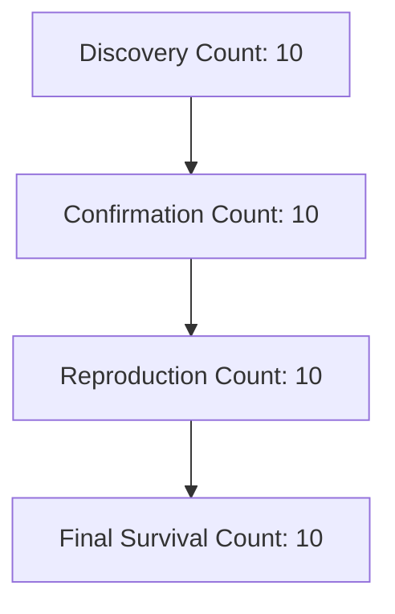

# Theory Survival Analysis Report — Phase 3C

Tracks the retention and falsification of theories as they progress through automated discovery, confirmation, and reproduction filters.

## Pipeline Throughput Funnel

## Summary Metrics

- **Discovery Count**: `10` theories
- **Confirmation Count**: `10` theories
- **Reproduction Count**: `10` theories
- **Final Survival Count**: `10` theories
- **Overall Theory Survival Rate**: **`100.00%`**
