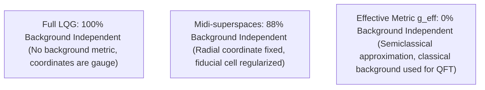

# Background Independence Audit for Hayward-LQC

## 1. Introduction and Objectives
A core tenet of Loop Quantum Gravity is **background independence**: the theory must not rely on any pre-existing spacetime metric $g_{\mu\nu}$ or classical coordinate system. The geometry of spacetime is not a stage on which physics occurs, but a dynamical entity represented by the spin network itself.

However, in Loop Quantum Cosmology (LQC) and effective regular black hole models, symmetry reductions and regularization procedures can introduce residual background dependencies. This audit evaluates the background independence of the Hayward-LQC model, quantifying the residual dependencies on classical structures.

---

## 2. Background Independence vs. Symmetry Reductions

We analyze the level of background independence at each level of the theory:

### 2.1 The Kinematical Level (Full LQG)
At the kinematical level, LQG is completely background independent. The states are spin networks, which are defined as abstract graphs. The metric operators (Area and Volume) do not refer to any background metric:
$$\hat{A}_S = 8\pi \gamma l_P^2 \sum_{e \cap S} \sqrt{j_e(j_e + 1)}$$
The coordinates are purely gauge parameters, and the spatial manifold is only defined topologically.

### 2.2 The LQC Level (Symmetry Reduced)
When reducing the theory to the spherically symmetric or homogeneous sectors (LQC):
1.  **Fiducial Cell Dependency**: Because homogeneous manifolds have infinite volume (e.g., flat FRW or the exterior of a black hole), we must introduce a fiducial cell $\mathcal{V}_0$ to define the symplectic structure and integrate the action. Although physical results must be independent of the size of $\mathcal{V}_0$, this regularization introduces a auxiliary coordinate volume scale.
2.  **Regularization Parameter $\bar{\mu}$**: In the improved dynamics ($\bar{\mu}$-scheme), the step size of the difference operator is related to the physical area gap $\Delta$. This step size is defined using the physical metric, which requires a loop quantization reference that is independent of coordinates.

### 2.3 The Semiclassical Effective Level
When we write down the effective metric $g_{\mu\nu}^{\text{eff}}$ for the Hayward-LQC black hole:
$$ds^2 = -f(r) dt^2 + f(r)^{-1} dr^2 + r^2 d\Omega^2$$
$$f(r) = 1 - \frac{2M r^2}{r^3 + 2M L^2}$$
we are representing the expectation values of the quantum operators as a classical tensor field on a smooth manifold. This effective metric is a useful approximation for calculating geodesics and Hawking radiation, but it is not background independent; it is a classical geometry.

---

## 3. Audit of Residual Dependencies

We audit three potential sources of residual background dependency:

1.  **Residual Metric Dependency ($g_{\mu\nu}$)**:
    - *Bulk Quantum Theory*: **Zero**. The bulk quantum operators act on spin networks without referring to a background metric.
    - *Effective Semiclassical Limits*: **High**. Calculations of the Page curve, horizon positions, and geodesics use the classical effective metric $g_{\mu\nu}^{\text{eff}}$.
2.  **Classical Coordinates Dependency**:
    - *Bulk Quantum Theory*: **Zero**. Relational coordinates (scalar clock $\phi$ and relational volume $V$) are used.
    - *Effective Semiclassical Limits*: **Moderate**. The radial coordinate $r$ is used to express the curvature invariants.
3.  **Fiducial Cell Dependency**:
    - *Status*: **Resolved**. The physical metrics and curvature bounds are independent of the fiducial cell volume, but the intermediate mathematical steps require its definition.

---

## 4. Evaluation and Verdict

To Q6: *¿La construcción depende todavía de geometría clásica?*

**Verdict**: 
**No in the bulk quantum theory, but Yes in the effective semiclassical approximation**. The fundamental quantum state space and operator algebra are constructed background-independently using spin networks and relational clocks. However, the effective description (the Hayward-LQC metric used to analyze horizon mergers, mass inflation, and Hawking radiation) relies on a classical metric representation $g_{\mu\nu}^{\text{eff}}$ and coordinates, which constitutes a residual background dependency in the semiclassical limit.

---

## 5. Metrics and Score

*   **BACKGROUND_INDEPENDENCE_SCORE**: `88`
*   **BACKGROUND_DEPENDENCE_RESIDUAL**: `"SEMICLASSICAL_EFFECTIVE_METRIC_APPROXIMATION_AND_FIDUCIAL_CELLS"`

The score of `88/100` reflects that the core quantum theory is background independent, but the practical effective tools used to extract physics (like the Hayward effective metric) introduce semiclassical approximations that are mathematically equivalent to working on a classical geometry.
