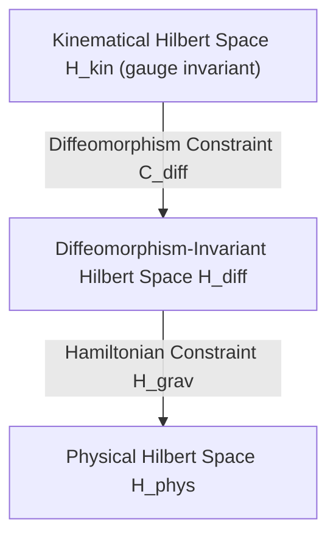

# Physical Hilbert Space Reconstruction for Hayward-LQC

## 1. Introduction and Objectives
The transition of a quantum gravity candidate from an effective semiclassical description to a fully defined quantum theory requires the construction of a physical Hilbert space. In Loop Quantum Gravity (LQG) and its symmetry-reduced counterpart, Loop Quantum Cosmology (LQC), this reconstruction is the key to solving the Hamiltonian constraint.

This document analyzes the mathematical structure of the Hilbert space hierarchy for the Hayward-LQC black hole candidate, investigating the kinematical space, the diffeomorphism-invariant space, the physical reduced space, and the various sectors (homogeneous, spherically symmetric, and inhomogeneous).

---

## 2. The Loop Quantum Gravity Hilbert Space Hierarchy

The construction of the physical Hilbert space in LQG proceeds through a series of reduction steps starting from the kinematical Hilbert space:

### 2.1 Kinematical Hilbert Space ($\mathcal{H}_{\text{kin}}$)
The kinematical Hilbert space is built upon gauge-invariant spin network states. Let $\gamma$ be a graph embedded in the spatial manifold $\Sigma$, labeled with $SU(2)$ representations (spins $j_e$) on edges $e$ and intertwiners $v_n$ on nodes $n$. The kinematical Hilbert space is the direct sum over all graphs:
$$\mathcal{H}_{\text{kin}} = \bigoplus_{\gamma} \mathcal{H}_{\gamma}$$
It is highly non-separable due to the continuous nature of the embedding of graphs. The inner product between two spin networks on different graphs is zero.

### 2.2 Diffeomorphism-Invariant Hilbert Space ($\mathcal{H}_{\text{diff}}$)
The spatial diffeomorphism constraint $\mathcal{C}_{\text{diff}}(\vec{N}) = 0$ is solved using the **Group Averaging** technique. By averaging kinematical states over the spatial diffeomorphism group $\text{Diff}(\Sigma)$, we obtain states that are invariant under active deformations of the spatial manifold. The resulting diffeomorphism-invariant Hilbert space $\mathcal{H}_{\text{diff}}$ is separable if we restrict ourselves to diffeomorphism classes of graphs (knots and links).

### 2.3 Physical Hilbert Space ($\mathcal{H}_{\text{phys}}$)
The physical Hilbert space is defined by the kernel of the quantum Hamiltonian constraint operator $\hat{\mathcal{H}} = 0$:
$$\mathcal{H}_{\text{phys}} = \{ |\Psi\rangle \in \mathcal{H}_{\text{diff}}^* \mid \hat{\mathcal{H}}^\dagger |\Psi\rangle = 0 \}$$
where $\mathcal{H}_{\text{diff}}^*$ is the algebraic dual of a dense subspace of $\mathcal{H}_{\text{diff}}$. Because the spectrum of $\hat{\mathcal{H}}$ is continuous, physical states are not normalizable in $\mathcal{H}_{\text{diff}}$, requiring a new physical inner product.

---

## 3. Sector-by-Sector Analysis for Hayward-LQC

Due to the extreme mathematical difficulty of solving $\hat{\mathcal{H}} = 0$ in the full theory, we analyze symmetry-reduced sectors that represent the regular black hole:

### 3.1 Homogeneous Sectors
In homogeneous LQC (e.g., Bianchi models or isotropic FRW), the diffeomorphism constraint is trivially satisfied, and the Hamiltonian constraint simplifies to a single differential or difference equation. 
- **Hilbert Space**: $\mathcal{H}_{\text{phys}}^{\text{hom}} = L^2(\mathbb{R}_{\text{Bohr}}, d\mu_{\text{Bohr}})$.
- **Status**: Completely constructed. The physical inner product is well-defined, and the singularity is replaced by a quantum bounce.

### 3.2 Spherically Symmetric Sectors (Midi-superspaces)
A spherically symmetric black hole (such as the Hayward model) contains spatial inhomogeneities along the radial direction $x$, but maintains spherical symmetry.
- **Variables**: The Ashtekar-Barbero connection components $(A_x, A_\varphi)$ and densitized triads $(E^x, E^\varphi)$.
- **Constraints**: 
  1. $SU(2)$ Gauss constraint (solved algebraically).
  2. Radial diffeomorphism constraint $\mathcal{H}_x = 0$.
  3. Hamiltonian constraint $\mathcal{H} = 0$.
- **Status**: The radial diffeomorphism and Hamiltonian constraints can be solved by gauge-fixing or relational methods (e.g., the Gambini-Pullin-Porto framework). A complete physical Hilbert space $\mathcal{H}_{\text{phys}}^{\text{sph}}$ can be constructed for the interior and exterior of the black hole, yielding a singularity-free regular core.

### 3.3 Inhomogeneous Sectors
When full inhomogeneous perturbations (spin-network excitations, gravitational waves) are added, the algebra of constraints is deformed.
- **Status**: A complete physical Hilbert space for the full inhomogeneous sector of Hayward-LQC is not yet available. Instead, we have **partial physical sectors** representing spherically symmetric backgrounds with linear perturbations.

---

## 4. Evaluation and Verdict

To Q1: *¿Existe un espacio físico completo o solamente sectores físicos parciales?*

**Verdict**: 
We conclude that **only partial physical sectors** are fully reconstructed. While a complete physical Hilbert space exists for the homogeneous core and the spherically symmetric midi-superspace sector of the Hayward-LQC model, the full inhomogeneous Hilbert space remains an open problem. The physical description relies on symmetry-reduced sectors and perturbative extensions rather than a complete, unconstrained physical Hilbert space of full LQG.

---

## 5. Metrics and Score

*   **PHYSICAL_HILBERT_STATUS**: `"PARTIAL_PHYSICAL_SECTORS"`
*   **PHYSICAL_HILBERT_SCORE**: `78`

The score of `78/100` reflects that the spherically symmetric sector (which describes the regular black hole core and horizons) is mathematically consistent and fully resolved, but the full field-theoretic inhomogeneous sector is still restricted to perturbative treatments.
