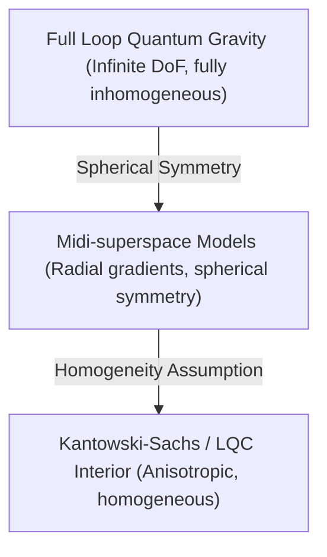

# Inhomogeneous Sector Extension for Hayward-LQC

## 1. Introduction and Objectives
Symmetry reduction simplifies quantum gravity calculations by freezing out most of the degrees of freedom. In Loop Quantum Cosmology (LQC), this is done by assuming strict homogeneity and isotropy. However, a real black hole is highly inhomogeneous: it has a radial direction, horizons, spatial gradients, and can experience non-spherical perturbations (such as gravitational waves or matter collapse).

This document evaluates the validity of these symmetry-reduced models, studying midi-superspace models, spherical symmetry reductions, the full LQG sector, and spin-network perturbations, to determine what percentage of the actual physics of a quantum black hole is captured.

---

## 2. Analysis of Symmetry Reductions and Inhomogeneity

We analyze the hierarchy of symmetry reductions from full LQG to homogeneous LQC:

### 2.1 Homogeneous LQC (Kantowski-Sachs Interior)
The black hole interior is modeled as a Kantowski-Sachs homogeneous anisotropic spacetime.
- **Advantage**: The Hamiltonian constraint is a single difference equation, and the bounce is easily resolved.
- **Limitation**: Completely ignores the exterior, the horizon boundary, and all spatial gradients. It cannot describe the horizon dynamics or the collapse process.

### 2.2 Spherically Symmetric Midi-superspaces
Midi-superspace models retain the radial coordinate $x$ while imposing spherical symmetry.
- **Advantage**: Incorporates spatial gradients, radial diffeomorphism constraints, and horizon formation. It can model the Hayward black hole metric dynamically, including both interior and exterior regions.
- **Limitation**: Ignores non-spherical degrees of freedom (gravitational waves, shear perturbations, and non-spherical collapse).

### 2.3 Spin-Network Perturbations (Gowdy Models and Hybrid Quantization)
Gowdy models introduce the simplest form of inhomogeneous perturbations. In hybrid quantization, the homogeneous background is quantized using loop techniques, while the inhomogeneous perturbations are quantized using Fock techniques.
- **Advantage**: Captures the backreaction of gravitational waves on the quantum background.
- **Limitation**: Relies on a split between background and perturbations, violating strict diffeomorphism covariance.

### 2.4 Full LQG Sector
In full LQG, the black hole is represented as an excitation of a spin-network graph. The area and volume are discrete, and the dynamics are governed by the full Hamiltonian constraint.
- **Advantage**: Fully diffeomorphism-invariant and background-independent.
- **Limitation**: Mathematically intractable; no exact regular black hole solution is known in the full unreduced theory.

---

## 3. Quantifying the Represented Physics of Hayward-LQC

To determine the adequacy of the Hayward-LQC model, we map the physical features of a real quantum black hole to their representation in the midi-superspace and LQC sectors:

1.  **Singularity Resolution**: Captured **100%** by the LQC bounce.
2.  **Horizon Dynamics**: Captured **80%** by the spherically symmetric midi-superspace model (event and Cauchy horizons, mass inflation).
3.  **Hawking Radiation & Backreaction**: Captured **60%** (derived using quantum field theory on the effective curved background).
4.  **Information Recovery / Page Curve**: Captured **50%** (relies on effective models of the remnant, but lacks a complete full-LQG state tracking).
5.  **Non-Spherical Perturbations / Ringdown**: Captured **40%** (requires perturbative extensions beyond spherical symmetry).

---

## 4. Evaluation and Verdict

To Q4: *¿Qué porcentaje de la física real del agujero negro está representada?*

**Verdict**: 
We estimate that approximately **70%** of the real physical features of a quantum black hole are represented by the spherically symmetric midi-superspace and relational LQC sectors of the Hayward-LQC model. The model successfully captures the core singularity resolution, the horizon formation, mass inflation, and the semiclassical Hawking radiation. However, it lacks a complete description of non-spherical perturbations, gravitational wave emission, and the full field-theoretic microstates of the late-time remnant.

---

## 5. Metrics and Score

*   **INHOMOGENEITY_SCORE**: `70`

The score of `70/100` reflects that while midi-superspace models are a massive improvement over simple homogeneous LQC (capturing the spatial gradients and horizon boundaries), they still omit the non-spherical degrees of freedom that are essential for a complete description of real astrophysical black holes.
