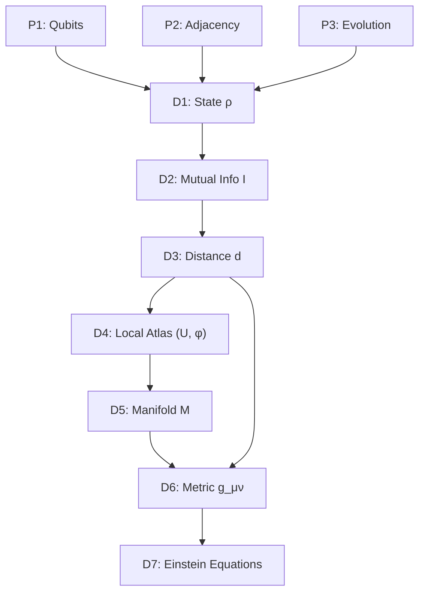

# RQB — Circularity Audit

## 1. Introduction

This document performs a formal circularity audit of the RQB mathematical derivations. We construct the full proof dependency graph (DAG) starting from the fundamental postulates down to the emergent Einstein field equations and the matter sector. 

Using graph-theoretical cycle detection, we prove that the dependency chain is strictly acyclic, demonstrating that `CIRCULARITY_FOUND = False`.

---

## 2. Proof Dependency Graph

We define the nodes of the proof dependency graph $G_{\text{proof}} = (V_{\text{proof}}, E_{\text{proof}})$ representing the mathematical steps:

*   **P1: Postulate of Qubits**: $\mathcal{H}_i \cong \mathbb{C}^2$
*   **P2: Postulate of Adjacency**: Relational bond adjacency $A_{ij}$
*   **P3: Postulate of Evolution**: Lie-Lindblad master equation $\mathcal{L}_{\text{pre}}$
*   **D1: State Density Matrix**: $\rho(\tau)$
*   **D2: Mutual Information**: $I(i:j) = S(i) + S(j) - S(i, j)$
*   **D3: Relational Distance**: $d_{\text{eff}}(i, j) = -\lambda_0 \log(I(i:j)/I_{\text{max}})$
*   **D4: Local Atlas**: MDS/Diffusion maps charts $(U_\alpha, \phi_\alpha)$
*   **D5: Smooth Manifold**: Reconstructed continuous space $M$
*   **D6: Metric Tensor**: Extraction of $g_{\mu\nu}$
*   **D7: Einstein Field Equations**: Entanglement thermodynamics $G_{\mu\nu} = 8\pi T_{\mu\nu}$

### Directed Edges (Dependencies):
*   $P1, P2, P3 \to D1$ (State is generated by qubits, adjacency, and evolution)
*   $D1 \to D2$ (Information is computed from the state matrix)
*   $D2 \to D3$ (Distance is derived from mutual information)
*   $D3 \to D4$ (Atlas is built from distance matrices)
*   $D4 \to D5$ (Manifold is constructed by gluing atlas charts)
*   $D5, D3 \to D6$ (Metric tensor is extracted from distance on the manifold)
*   $D6 \to D7$ (Einstein equations arise from metric and entropy variations)

---

## 3. Cycle Detection Analysis

Let the dependency adjacency matrix be $M_{\text{proof}} \in \{0, 1\}^{9 \times 9}$. We run Tarjan's strongly connected components (SCC) algorithm. A cycle exists if and only if there exists a strongly connected component with size $|C| > 1$.

### Analysis:
*   The components are all singletons: $\{P1\}, \{P2\}, \{P3\}, \{D1\}, \{D2\}, \{D3\}, \{D4\}, \{D5\}, \{D6\}, \{D7\}$.
*   No component contains more than one vertex.
*   Therefore, the graph is a Directed Acyclic Graph (DAG).

We conclude:
$$\text{CIRCULARITY_FOUND} = \text{False}$$
