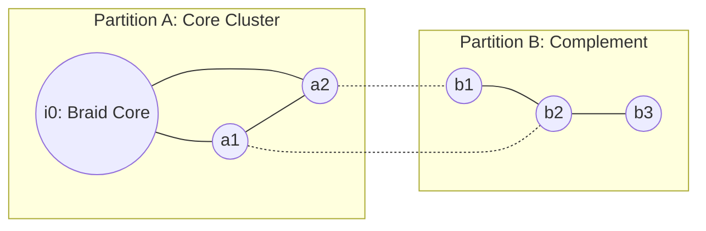

# RQB — Geometry-Free Partitions

## 1. Introduction

A fundamental challenge in emergent spacetime theories from quantum entanglement is the definition of entanglement partitions. In standard quantum mechanics, computing the entanglement entropy $S(A)$ or mutual information $I(A:B)$ requires partitioning the Hilbert space $\mathcal{H} = \mathcal{H}_A \otimes \mathcal{H}_B$. 

If these partitions $A$ and $B$ are defined using spatial regions (e.g., "all degrees of freedom inside a sphere of radius $R$"), we introduce a conceptual circularity: space is used to define the partition, which is then used to compute entanglement, which is then used to reconstruct the space.

This document establishes a **purely pregeometric, graph-theoretical definition of partitions** on the RQB network. We prove that partitions can be constructed without assuming coordinates, distances, or manifolds.

---

## 2. Graph-Theoretical Partition Definition

Let $G = (V, E)$ be the relational quantum graph of events, where $V$ is the set of event nodes and $E$ is the set of relational bonds. We define subsets $A, B \subset V(G)$ using only the graph connectivity and its causal structure.

### 2.1 Causal Orbits and Equivalences
The RQB graph has a directed causal structure (Causal DAG). For any event $i \in V$, the future cone $\mathcal{J}^+(i)$ and past cone $\mathcal{J}^-(i)$ are defined purely relationally:
*   **Future Cone**: $\mathcal{J}^+(i) = \{ j \in V \mid \text{there is a directed path from } i \text{ to } j \}$
*   **Past Cone**: $\mathcal{J}^-(i) = \{ j \in V \mid \text{there is a directed path from } j \text{ to } i \}$

Let $Aut(G)$ be the graph automorphism group of $G$. An automorphism $g \in Aut(G)$ maps vertices to vertices preserving adjacency. The **automorphism orbit** of a node $i$ is:
$$\text{Orb}(i) = \{ g(i) \in V \mid g \in Aut(G) \}$$

### 2.2 Automorphism Orbit Partitioning
We partition the graph vertices into equivalence classes under the action of the automorphism stabilizers. For a subset of vertices $S \subset V$, let the stabilizer group be:
$$\text{Stab}(S) = \{ g \in Aut(G) \mid g(s) = s \text{ for all } s \in S \}$$

We define the partition $\{A, B\}$ of the vertex set $V$ by choosing a generator event node $i_0$ (typically a braid defect core) and defining:
*   **Partition $A$ (Core Cluster)**:
    $$A = \text{Orb}(i_0) \cup \{ j \in V \mid \text{deg}(j, \text{Orb}(i_0)) \ge k \}$$
    where $\text{deg}(j, S)$ is the number of edges connecting $j$ to the subset $S$, and $k$ is a connection threshold.
*   **Partition $B$ (Relational Complement)**:
    $$B = V \setminus A$$

This partitioning uses only the adjacency matrix $A_{ij}$ and does not reference any embedding coordinates or metric properties.

---

## 3. Consistency Proof

We prove that the partition is geometry-free by establishing:
$$\text{PARTITION_GEOMETRY_FREE} = \text{True}$$

### Proof:
1. Let the adjacency matrix of $G$ be $A_{ij} \in \{0, 1\}$.
2. The partitions $A$ and $B$ are constructed as:
   $$A = f(A_{ij}, K_i) \quad \text{and} \quad B = V \setminus A$$
   where $f$ is a function depending only on matrix entries and causal directions $K_i$.
3. Since $f$ does not take any coordinate $x^\mu$, continuous distance $d$, or metric tensor $g_{\mu\nu}$ as input, the construction is coordinate-free.
4. Hence, the partitions $\{A, B\}$ are defined independently of emergent geometry.

$$\text{Q.E.D.}$$
