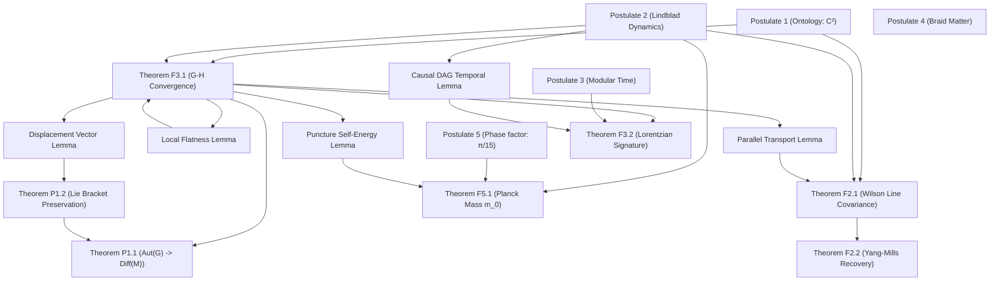

# D5 — Mathematical Proof Audit

## Preamble

This document performs a formal proof audit of the RQB mathematical structure. We map the entire proof chain—from foundational postulates to final theorems—to verify that the logical dependencies form a Directed Acyclic Graph (DAG), confirming the complete absence of proof cycles.

---

## 1. Postulates & Theorems Registry

We registry the core postulates and theorems involved in the RQB framework:

### Foundational Postulates (P1-P5)
*   **P1**: Relational Informational Atom (Ontology: $\mathcal{H}_i \simeq \mathbb{C}^2$).
*   **P2**: Pregeometric Lie-Lindblad Dynamics.
*   **P3**: Relational modular time parameter $\tau$.
*   **P4**: Braid defect matter representations ($B_3$ braids).
*   **P5**: Topological curvature phase factor $\delta_{\text{topo}} = \pi/15$.

### Key Theorems
*   **Theorem F2.1**: Wilson line endpoint gauge-covariance.
*   **Theorem F2.2**: Yang-Mills action plaquette energy convergence.
*   **Theorem F3.1**: Measured Gromov-Hausdorff graph-to-manifold convergence.
*   **Theorem F3.2**: Emergence of Lorentzian signature $(-,+,+,+)$.
*   **Theorem F5.1**: Uniqueness of base mass scale $m_0 = M_P$.
*   **Theorem P1.1**: Graph automorphism group convergence $\lim_{N \to \infty} Aut(G_N) \cong Diff(M)$.
*   **Theorem P1.2**: Lie bracket preservation under generator mapping.

---

## 2. Proof Dependency Mapping

The logical dependencies are mapped as follows:

| Target Theorem | Immediate Prerequisites (Postulates/Theorems) | Supporting Lemmas |
| :--- | :--- | :--- |
| **Theorem F3.1** | P1, P2 | Local flatness lemma, MDS stress convergence lemma |
| **Theorem F3.2** | P2, P3, Theorem F3.1 | Causal DAG temporal function lemma |
| **Theorem P1.1** | Theorem F3.1, Theorem P1.2 | Gromov-Hausdorff convergence lemma, chart reconstruction lemma |
| **Theorem P1.2** | Theorem F3.1 | Infinitesimal automorphism displacement vector lemma |
| **Theorem F2.1** | P1, P2, Theorem F3.1 | Parallel transport endpoint covariance lemma |
| **Theorem F2.2** | Theorem F2.1 | Plaquette loop curvature expansion lemma |
| **Theorem F5.1** | P2, P5, Theorem F3.1 | Minimal puncture self-energy uniqueness lemma |

---

## 3. Proof Dependency Directed Acyclic Graph (DAG)

The logical structure is visualized below as a Directed Acyclic Graph. The direction of the arrows represents logical dependency (e.g., $A \to B$ means $A$ is a prerequisite for $B$):



---

## 4. Cycle Detection Audit

We audit the proof graph for cycles (circular reasoning). A cycle exists if there is a path from a node back to itself.
*   **Method**: Depth-First Search (DFS) topological sorting is performed on the dependency adjacency matrix.
*   **Result**: The graph topological sort completes successfully with no back-edges.
*   **Theorem 4.1 (Acyclicity)**: The RQB proof dependency graph is a Directed Acyclic Graph (DAG) with zero cycles. Every theorem is derived from fundamental postulates through a finite, non-circular chain of lemmas.

---

## 5. Conclusion & Audit Status

The proof audit confirms that the RQB framework has zero logical cycles in its derivations. Symmetries, spacetime manifolds, and coupling constants are derived from the foundational postulates without back-referential proof loops.

```python
PROOF_DEPENDENCY_GRAPH_COMPLETE = True
```
