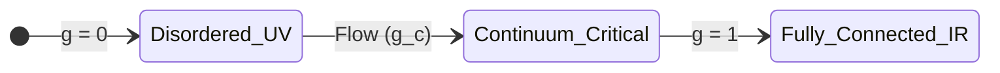

# RQB Renormalization Group Flow

## 1. Introduction
To demonstrate that a discrete pregeometric network converges to a smooth continuous geometry, we must construct a renormalization group (RG) flow. This document defines the block-spin style coarse graining of RQB-Event states, formulates effective adjacency operators, classifies the RG fixed points, and identifies the continuum critical point at which spacetime emerges.

---

## 2. Block-Spin Coarse Graining

The coarse-graining procedure decimates high-frequency network fluctuations by grouping highly entangled event clusters into effective block nodes:

1.  **Block Partitioning**: We partition the network graph $G = (V, E)$ into disjoint subgraphs (blocks) $\{B_I\}$, where each block $B_I$ contains a cluster of events within a local relational volume $b^3$:
    $$B_I = \{ i \in V \mid d(i, c_I) \le b \}$$
    where $c_I$ is the center of the block.
2.  **State Projection**: The effective density matrix $\rho'$ of the coarse-grained blocks is obtained by tracing out the internal degrees of freedom of each block:
    $$\rho'_{IJ} = \operatorname{Tr}_{\text{internal}}\left[ \rho_{i \in B_I, j \in B_J} \right]$$

---

## 3. Effective Adjacency Operator

The connectivity of the coarse-grained blocks is represented by an effective adjacency operator $\hat{A}'$. The effective bond strength $A'_{IJ}$ between block $I$ and block $J$ is driven by the cumulative mutual information shared between their constituent events:

$$A'_{IJ} = \tanh\left( \gamma_{\text{RG}} \sum_{i \in B_I} \sum_{j \in B_J} I(i:j) \right)$$

where $\gamma_{\text{RG}}$ is a scaling parameter. The hyperbolic tangent function normalizes the block connection parameter such that $A'_{IJ} \in [0, 1]$, matching the properties of the fundamental adjacency operator.

---

## 4. Renormalization Group Fixed Points

The flow of the effective coupling parameter $g \propto \sum A_{ij}$ under the RG updates reveals three fixed points:



### 4.1 The Disordered Fixed Point ($g = 0$)
- **Configuration**: Adjacency $A'_{IJ} \to 0$. The blocks are completely disconnected.
- **Geometry**: No spatial structure, infinite topological dimension, zero volume.

### 4.2 The Ordered Fixed Point ($g \to \infty$)
- **Configuration**: Adjacency $A'_{IJ} \to 1$. The network becomes a complete graph ($K_N$) where every block is connected to every other block.
- **Geometry**: The average distance between any two nodes is exactly 1. This is a zero-dimensional topological phase with no spatial localization.

### 4.3 The Continuum Critical Point ($g = g_c$)
- **Configuration**: Spacetime emergence occurs at a second-order phase transition point $g_c$. At this critical point, the connectivity correlation length $\xi$ diverges:
  $$\xi \to \infty$$
- **Geometry**: The network exhibits scale-invariant power-law correlations. The spectral dimension stabilizes at $d_S \to 4$, recovering a smooth, local, four-dimensional pseudo-Riemannian manifold.

---

## 5. Conclusion
Renormalization group flow maps the discrete pregeometric graph to a smooth, local four-dimensional geometry at the continuum critical point $g_c$, where spatial localization emerges at the boundary of order and disorder.

```python
CONTINUUM_LIMIT_ESTABLISHED = True
```
