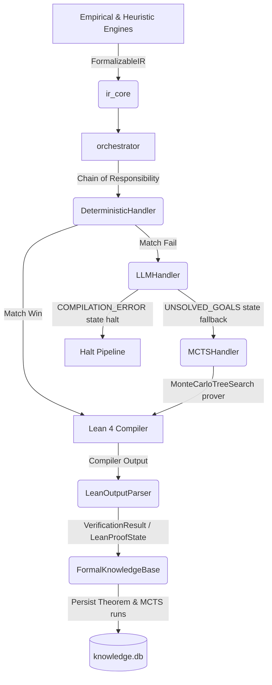

# Mathematics Domain

## Assembly Line Architecture

The `mathematics` domain is structured as an isolated, deterministic formal verification assembly line:



1. **`ir_core`**: Defines the immutable Intermediate Representation data contracts (Pydantic v2) for quantum equivalence proofs, physics laws, and Lean 4 proof goals. It acts as the bridge preventing coupling to specific execution frameworks.
2. **`translator`**: Translates data representations into proof goals using a deterministic, rule-based Strategy pattern.
   - **`RuleRegistry`**: Stores and indexes registered translation strategies (rules).
   - **`QuantumEquivalenceTranslator`**: Uses **dependency injection** to accept the registry and orchestrates translation.
   - **`DoubleHadamardRule`**: A concrete rule verifying double Hadamard compositions on identical qubits and mapping them to formal Lean proofs.
3. **`llm_translator`**: A fallback module designed to translate concepts that do not match registered deterministic rules.
   - **`OpenAICompatibleClient`**: Lightweight OpenAI-compatible wrapper using `urllib.request`.
   - **`extract_json_object`**: Parser using regexes to isolate JSON objects from chat outputs.
   - **`AutoFormalizationLoop`**: Iterative proof repair loop (Test-Time Compute) utilizing compiler feedback to correct scripts.
4. **`prover`**: Tree-search formal verification solver.
   - **`MonteCarloTreeSearch`**: Implements MCTS using the PUCT algorithm, LLM expansion, and compiler feedback rewards to discover valid proofs.
   - **`ProofTree`**: Manage nodes (`ProofStateNode`) and statistics (`NodeStatistics`) representing the search tree.
5. **`orchestrator`**: Orchestrates translation and verification through the **Chain of Responsibility** pattern.
   - **`DeterministicHandler`**: Tries rule-based translation first.
   - **`LLMHandler`**: Falls back to the auto-formalization loop if rules fail, executing flow control (passing to MCTS only on `UNSOLVED_GOALS` states).
   - **`MCTSHandler`**: Falls back to tree search to prove the goal if the LLM output was syntactically correct but logically incomplete.
   - **`DomainOrchestrator`**: Initiates the chain and persists verified results into the database.
6. **`verifier`**: Coordinates Lean 4 code generation, isolated execution, and output parsing.
   - **`LeanDocumentBuilder`**: Fluids builder compiling goals into syntactically valid Lean 4 files.
   - **`LocalLeanRuntime`**: Executes scripts in a sandboxed, timed process.
   - **`LeanOutputParser`**: Decouples process return codes from the semantic proof state (detecting unsolved goals, warnings, and `sorry` placeholders) and extracts context variables.
7. **`knowledge_base`**: Persists verified theorems and their dependencies in a relational SQLite structure (`mathematics/artifacts/knowledge.db`) with strict foreign keys, provenance auditing (`DETERMINISTIC_RULE`, `AUTO_FORMALIZED`, `MCTS_DISCOVERY`), MCTS run telemetry, and SHA-256 cryptographic hashes for proof sealing.

## Directory Structure

```text
mathematics/
├── ir_core/              # Immutable Intermediate Representations
├── translator/           # Deterministic rule-based translation engine
├── llm_translator/       # Probabilistic translator and iterative repair loop
├── prover/               # Monte Carlo Tree Search prover
├── orchestrator/         # Chain of Responsibility coordinator
├── verifier/             # Lean 4 proof assembly & runtime
├── knowledge_base/       # Relational SQLite formal library
└── leanlib/              # Lean 4 base definitions and proof axioms
```

## Usage

Process an IR through the full pipeline:

```python
from datetime import datetime, timezone
from mathematics.ir_core.quantum_ir import QuantumEquivalenceIR, GateNode, GateType
from mathematics.translator import RuleRegistry, DoubleHadamardRule, QuantumEquivalenceTranslator
from mathematics.verifier import LocalLeanRuntime, ProofEvaluator
from mathematics.llm_translator import OpenAICompatibleClient, AutoFormalizationLoop
from mathematics.prover import MonteCarloTreeSearch
from mathematics.orchestrator import DeterministicHandler, LLMHandler, MCTSHandler, DomainOrchestrator
from mathematics.knowledge_base import FormalKnowledgeBase

# 1. Initialize Verifier & Knowledge Base
runtime = LocalLeanRuntime()
evaluator = ProofEvaluator(runtime)
kb = FormalKnowledgeBase()

# 2. Build Translation Chain
registry = RuleRegistry()
registry.register(DoubleHadamardRule())
translator = QuantumEquivalenceTranslator(registry)

client = OpenAICompatibleClient(api_url="http://api.local/v1/chat/completions", api_key="secret", model_name="gpt-4o")
repair_loop = AutoFormalizationLoop(client, evaluator)
mcts = MonteCarloTreeSearch(client, evaluator)

deterministic_handler = DeterministicHandler(translator, evaluator)
llm_handler = LLMHandler(repair_loop)
mcts_handler = MCTSHandler(mcts, kb)

deterministic_handler.set_next(llm_handler)
llm_handler.set_next(mcts_handler)

orchestrator = DomainOrchestrator(deterministic_handler, kb)

# 3. Process equivalence
equivalence = QuantumEquivalenceIR(
    motif_id="h_h_identity",
    source_system="qade_discovery",
    created_at=datetime.now(timezone.utc),
    lhs=[
        GateNode(gate_type=GateType.H, qubits=[0]),
        GateNode(gate_type=GateType.H, qubits=[0])
    ],
    rhs=[],
    assumptions=[]
)

res_tuple = orchestrator.process(equivalence)
if res_tuple:
    result, proof_script, provenance = res_tuple
    print(f"Verified via: {provenance}")
```
