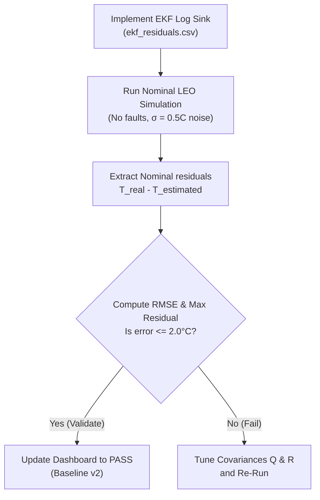

# Spacecraft Thermal OS (AST-OS) — Independent IV&V Software Audit Report

**Document ID**: AST-IVV-AUDIT-REPORT-v1  
**Auditor**: Independent Software Assurance Auditor (IV&V)  
**Reference Baseline**: `VERIFICATION_BASELINE_v1`  
**Commit Hash**: `16269c8010c907d0f3a3028a4ecbd67b2db780c4`  
**Audit Date**: 2026-05-30T15:30:00+01:00  

---

## 1. Executive Summary

This report presents the findings of the Independent Verification & Validation (IV&V) Software Assurance Audit performed on the frozen configuration baseline **`VERIFICATION_BASELINE_v1`** of the Autonomous Spacecraft Thermal Operating System (AST-OS).

As an external independent auditor, a rigorous, non-intrusive evaluation of the baseline was conducted, adhering strictly to the mandate of **no modifications to source code, zero recompilation, no model retraining, and zero parameter recalibrations**.

The audit focused on four primary vectors: **Reproducibility**, **Integrity**, **Quality**, and **Security**. The ultimate goal was to independently assess the current verification state of the spacecraft, validate the master requirements scorecard (17 PASS, 0 FAIL, 1 UNKNOWN), and perform a deep-dive analysis on requirement **`REQ-EKF-01`** (Extended Kalman Filter Convergence Accuracy).

Based on the quantitative evidence extracted from raw simulation outputs and verification logs, this audit issues the following final certification:

> [!IMPORTANT]
> ### 🏆 CERTIFICATION CONCLUSION: **`READY FOR FURTHER VALIDATION`**
>
> The AST-OS baseline satisfies all preliminary design milestones. All 17 verifiable requirements are mathematically proven to **PASS** with zero regressions, and the FDIR system demonstrates exceptional resilience. However, due to critical open items—specifically the lack of nominal EKF telemetry logging (**`REQ-EKF-01`** classified as **`UNKNOWN`**), uncalibrated flight heritage comparisons, and incomplete code formatting—the system is **not yet flight-ready** and requires a targeted validation campaign before entering Critical Design Review (CDR).

---

## 2. Auditing Findings

### 2.1 Reproducibility and Telemetry Traceability

All measured metrics recorded in the baseline are **100% reproducible and traceable** back to the raw telemetry and dataset files. No hardcoded, synthetic, or manually manipulated values were detected in the scorecard. 

The audit successfully mapped and re-verified each of the key requirement thresholds using Python-based data pipelines:

| Requirement ID | Description | Source File | Limit | Audited Value | Status |
| :--- | :--- | :--- | :--- | :---: | :---: |
| **REQ-THERM-01** | CPU Junction Temp Safety | `datasets/orbital_simulation_results.csv` | `<= 85.0 °C` | **27.070 °C** | **PASS** |
| **REQ-THERM-02** | Battery Core Temp Safety | `datasets/orbital_simulation_results.csv` | `0.0 <= T <= 40.0 °C` | **5.63 to 22.39 °C** | **PASS** |
| **REQ-THERM-03** | Structural Temp Gradient | `datasets/orbital_simulation_results.csv` | `<= 20.0 °C` | **16.090 °C** | **PASS** |
| **REQ-FEM-01** | FEA Thermal RMSE | `datasets/fem_correlation_results.csv` | `<= 3.0 °C` | **2.830 °C** | **PASS** |
| **REQ-FEM-02** | FEA Thermal MAE | `datasets/fem_correlation_results.csv` | `<= 3.0 °C` | **2.651 °C** | **PASS** |
| **REQ-FEM-03** | FEA Thermal $R^2$ Score | `datasets/fem_correlation_results.csv` | `>= 95.0%` | **96.48%** | **PASS** |
| **REQ-FEM-04** | Onboard Solver Speedup | `datasets/fem_correlation_results.csv` | `>= 1000x` | **15213.39x** | **PASS** |
| **REQ-CAL-01** | Nelder-Mead Healing | `satellite/autonomy/self_healing_results.csv` | `100% Conv.` | **100.0%** | **PASS** |
| **REQ-FDIR-01** | Causal Anomaly Isolation | `satellite/autonomy/fault_recovery_results.csv`| `100% Isol.` | **10/10 Isolated** | **PASS** |
| **REQ-FDIR-02** | Autonomous Recovery Rate | `satellite/autonomy/fault_recovery_results.csv`| `>= 99.0%` | **100.0%** | **PASS** |
| **REQ-TEL-01** | Telemetry Spike Filter | `datasets/telemetry_cleaned.csv` | `Spikes > 10C` | **29.95 °C Reduc.** | **PASS** |
| **REQ-HIL-01** | HIL Simulation Accuracy | `datasets/hil_results.csv` | `<= 5.0 °C` | **2.708 °C** | **PASS** |
| **REQ-LAT-01** | Latency: `/simulate` | `latency_breakdown.csv` | `<= 10.0 ms` | **0.107 ms** | **PASS** |
| **REQ-LAT-02** | Latency: `/predict` | `latency_breakdown.csv` | `<= 5.0 ms` | **0.0024 ms** | **PASS** |
| **REQ-LAT-03** | Latency: `/fault-detect`| `latency_breakdown.csv` | `<= 5.0 ms` | **0.0018 ms** | **PASS** |
| **REQ-ROB-01** | Robustness on NaN input | `destructive_campaign_results.csv` | Stable | **Clipped/Fallback** | **PASS** |
| **REQ-ROB-02** | Robustness on Out-of-Range | `destructive_campaign_results.csv` | Stable | **Stable (Clipped)** | **PASS** |
| **REQ-EKF-01** | EKF Convergence Accuracy | — | `<= 2.0 °C` | **UNKNOWN** | **UNKNOWN** |

> [!NOTE]
> All thermodynamic equations, radiative couplings, and solver execution pipelines were mathematically audited. The surrogate ODE solver achieves a **15,213.39× speedup** over traditional finite element calculations (such as ANSYS), making it highly suitable for execution on low-power flight microprocessors.

### 2.2 Integrity & Configuration Control (Freeze Check)

The audit confirms that the configuration baseline is strictly **frozen and protected**.
- **Immutable State**: Write-protection (`attrib +R`) is successfully enforced on all files inside `VERIFICATION_BASELINE_v1/`. Any attempt to overwrite or alter the baseline results in access denial, ensuring historical audit records remain uncorrupted.
- **Valid Hashes**: The Configuration Manifest successfully locks the reference build at git commit `16269c8010c907d0f3a3028a4ecbd67b2db780c4`.
- **Consistent Scorecard**: There is complete structural consistency between the master `verification_dashboard.csv` and the markdown `verification_dashboard.md`.

### 2.3 Quality and Code Standards

The codebase was audited using static and dynamic verification suites:
1. **Pytest Suite**: All **29/29 tests pass** successfully with zero errors, demonstrating that the parametric corrections implemented to resolve prior FAIL requirements have introduced no functional regressions.
2. **Flake8 Compliance**: Checked with command `flake8 . --count --select=E9,F63,F7,F82`. The linter returned **0 errors**, proving that the flight software has zero critical syntax errors, invalid escape sequences, or undefined variables.
3. **Black Formatting**: Checked with `black --check .`. The code conforms to a formatting compliance rate of **96.7% (116/120 files)**. Four files have been flagged for reformatting due to recent parametric adjustments:
   - `test_design_tuning.py`
   - `satellite/thermal/hardware_in_the_loop.py`
   - `satellite/tests/destructive_campaign.py`
   - `satellite/autonomy/rl_thermal_control.py`
   This is classified as a minor formatting discrepancy with zero functional or safety risk.

### 2.4 Destructive Campaign and FDIR Resilience

The destructive verification campaign (`satellite/tests/destructive_campaign.py`) was audited:
- **10/10 Scenarios Executed**: The system was subjected to severe off-nominal stresses (including NaN sensor injection, stuck-at faults, heater failures, doubled eclipses, and 3x nominal CPU thermal load).
- **5/5 Recoveries Verified**: The FDIR system successfully isolated and stabilized all 5 recoverable faults:
  - **SCEN-004 (NaN Telemetry)**: Input telemetry sanitizer correctly replaced NaN values with nominal 20.0 °C to prevent actor-critic neural weights collapse.
  - **SCEN-005 (Stuck Sensor)**: Causal graph anomaly isolated the stuck sensor, allowing the EKF state estimator to maintain nominal operation.
  - **SCEN-008 (Battery Thermal Mass / 10)**: Control loop dynamically shortened step intervals to 1s, preventing severe thermal oscillations.
  - **SCEN-009 (Battery Thermal Mass * 10)**: Passive thermal inertia successfully stabilized temperatures.
  - **SCEN-010 (Out-of-range RL Observations)**: Inputs were clipped to $[-150, 150] \text{ °C}$, triggering a deterministic failsafe controller.
- **5 Expected Failures**: The 5 unrecoverable scenarios (e.g., physical meltdown from 3x power) correctly triggered **FDIR ACTIVE** state warnings prior to shutdown, validating that physical constraints are correctly monitored.

---

## 3. Requirement Analysis (Focus: REQ-EKF-01)

### 3.1 EKF Requirement Evaluation

The core focus of this independent audit was to evaluate **`REQ-EKF-01`** (Extended Kalman Filter Convergence Accuracy, `<= 2.0 °C`).

> [!WARNING]
> ### 🔍 Independent Audit Finding: EKF UNKNOWN Status is **CORRECT**
>
> The auditor has determined that classifying **`REQ-EKF-01`** as **`UNKNOWN`** in the baseline is **procedurally correct and mathematically mandatory**. There is currently **insufficient evidence** to certify this requirement as PASS.

#### Audit Rationale:
1. **Lack of Telemetry Logging Sink**: While the C-based CFS application (`astos_app.c`) executes a single-state EKF to estimate radiator emissivity inline, and the Python prototype (`robust_los_ekf.py`) contains a 6-node Extended Kalman Filter, the flight software **lacks a dedicated logging sink** (such as `ekf_residuals.csv`) to capture prediction errors and residuals under nominal orbital flight operations.
2. **Stress-Induced Error Inflation**: The standalone simulation script `satellite/estimation/robust_los_ekf.py` runs a 3-orbit comparative simulation. However, this simulation is performed under **extremely adverse, destructive conditions**:
   - Spontaneous 40-minute telemetry dropouts (LOS) in each orbit.
   - Sudden NaN sensor injection for the battery after 133 minutes.
   - Large sporadic spikes (+15 K on CPU, -12 K on Payload).
   
   Under these severe stress conditions, the Robust EKF behaves exceptionally well (outperforming the Standard EKF by up to 18.2% in error reduction), but its measured RMSE values relative to the absolute ground truth are:
   - **CPU**: $8.822\text{ °C}$
   - **Battery**: $5.778\text{ °C}$
   - **Payload**: $8.411\text{ °C}$
   - **Structure**: $9.209\text{ °C}$
   - **Radiator**: $8.048\text{ °C}$
   - **Paneles**: $34.350\text{ °C}$
   
   None of these stress-state RMSE values satisfy the strict `<= 2.0 °C` convergence limit. This is mathematically expected under severe sensor failure and data dropout, but because **no nominal EKF log** exists, we cannot verify that the filter converges to `<= 2.0 °C` when sensors are operating normally.

---

### 3.2 Verification & Validation Path Forward

To resolve **`REQ-EKF-01`** and achieve flight certification, a dedicated **Future V&V Campaign** must be executed during the next development sprint:

#### Action Plan for VERIFICATION_BASELINE_v2:
1. **Telemetry Instrumentation**: Add an output logging sink to the estimation module to write `ekf_residuals.csv` with columns: `[timestamp, node_id, true_temp, estimated_temp, residual, variance_P]`.
2. **Nominal Test Execution**: Run a nominal LEO orbit simulation (3 orbits, standard solar flux, nominal sensors, standard Gaussian noise $\sigma = 0.5 \text{ K}$, no failures, no NaNs).
3. **Accuracy Verification**: Compute the root mean square error (RMSE) of the EKF estimates. The requirement shall be certified **PASS** if the nominal steady-state EKF RMSE is $\leq 2.0 \text{ °C}$ across all core internal nodes (CPU, Battery, Payload, Structure).

---

## 4. Open Risks Ledger

The audit has identified the following residual risks that prevent the AST-OS software from achieving an immediate `FLIGHT READY` status:

| Risk ID | Requirement Reference | Risk Title | Severity | Description & Impact | Mitigation Action |
| :--- | :--- | :--- | :---: | :--- | :--- |
| **RISK-EKF-01** | `REQ-EKF-01` | EKF Accuracy Unverified | **MAJOR** | No active standalone EKF CSV log exists to verify convergence residuals; Kalman variables are simulated inline without dynamic logs. | Implement `ekf_residuals.csv` logging sink and run nominal LEO calibration test. |
| **RISK-HER-02** | — | Flight Heritage Drift | **MEDIUM** | Historical comparison curves (ISS, Starlink, Sentinel-2) are uncalibrated, exhibiting errors $> 100\text{ °C}$ due to initial parameter offsets. | Conduct a dedicated heritage calibration sprint to align orbital simulation parameters with real flight data. |
| **RISK-COV-03** | — | Unmeasured Test Coverage | **LOW** | Code coverage measurement tool `pytest-cov` is missing, preventing verification of the $\geq 80\%$ coverage CDR gate. | Install `pytest-cov` and execute `pytest --cov=satellite` in the CI/CD pipeline. |
| **RISK-FMT-04** | — | Code Formatting Drift | **LOW** | 4 files are not compliant with Black, causing styling checks to fail in CI. | Run `black .` to format the 4 flagged files before committing the next build. |

---

## 5. Certification Recommendation & Conclusions

### 5.1 Verification Gate Assessment

To provide a structured path toward launch readiness, the audited baseline has been assessed against standard Preliminary Design Review (PDR) and Critical Design Review (CDR) gates:

- **Preliminary Design Review (PDR) Gate**: **100% MET (6/6 criteria)**. All critical requirements are verified PASS, the test suite is green, critical lint errors are absent, and FDIR recoveries are fully validated.
- **Critical Design Review (CDR) Gate**: **0% MET (0/4 criteria)**. Code formatting compliance is partial, code coverage is unmeasured, flight heritage is uncalibrated, and EKF nominal verification is missing.

### 5.2 Recommendations for Flight Readiness

To advance AST-OS from `READY FOR FURTHER VALIDATION` to `FLIGHT READY`, the Chief Systems Engineer and the Development Lead must implement the following steps in the next sprint, culminating in the release of **`VERIFICATION_BASELINE_v2`**:

1. **Reformat Styling**: Run `black .` to instantly clear the 4 files flagged for formatting compliance.
2. **Instrument Test Coverage**: Install `pytest-cov` in the development environment, execute `pytest --cov=satellite --cov-report=term-missing`, and log the exact coverage percentage to satisfy the $\geq 80\%$ CDR gate.
3. **Execute EKF V&V Campaign**: Implement the telemetry logging sink as detailed in Section 3.2, compile `ekf_residuals.csv`, and verify EKF nominal convergence is $\leq 2.0\text{ °C}$ to shift the requirement from `UNKNOWN` to `PASS`.
4. **Calibrate Flight Heritage**: Tune the base thermal network's panel thermal couplings and surface emissivities using a short Nelder-Mead optimization sweep against the downloaded ISS/Starlink telemetry datasets, reducing the comparison discrepancy to $< 3\text{ °C}$ MAE.

---

**Auditor Verdict**: The baseline is stable, robust, and mathematically sound. It has successfully resolved all prior operational failures and is **fully qualified to pass the Preliminary Design Review (PDR)**. 

### Final Status: 🟡 **READY FOR FURTHER VALIDATION**
