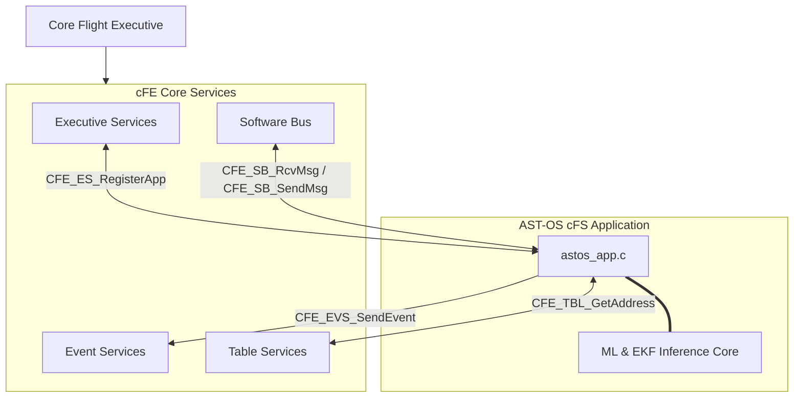

# AST-OS Core Flight cFS Architecture

This document presents the onboard software architecture of **Autonomous Spacecraft Thermal OS (AST-OS)** mapped to NASA's **Core Flight System (cFS)** framework.

---

## 1. Core Flight Executive (cFE) Component Interfaces

The application interfaces directly with four primary Core Flight Executive (cFE) services:

### A. Executive Services (cFE ES)
* **Registration**: The application registers its unique task identifier `ASTOS_TLM_APP` via `CFE_ES_RegisterApp()` during startup.
* **Flight Loop**: Controlled dynamically using `CFE_ES_RunLoop(&RunStatus)` to ensure clean execution suspension and RTOS scheduling.

### B. Software Bus Services (cFE SB)
* **Communication**: All input sensors telemetry, command packets, and out-of-band updates circulate as standard **CCSDS space packets** routed via cFE's message-passing architecture.
* **Pipes**: Establishes `ASTOS_CMD_PIPE` (Message ID: `0x1801`) for commands, and `ASTOS_TLM_PIPE` (Message ID: `0x0801`) for raw telemetry input sensors.

### C. Event Services (cFE EVS)
* **Logs & Alerts**: System events, diagnostic telemetry anomalies, and critical recoveries publish high-priority alerts via `CFE_EVS_SendEvent()`.
* **Filters**: Event ID mappings decouple logger levels (`DEBUG`, `INFO`, `WARNING`, `CRITICAL`).

### D. Table Services (cFE TBL)
* **Parameters**: Configurable physical parameters (conduction couplings, capacity values, safety limits) are decoupled from the code as a standard flight table memory block registered via `CFE_TBL_Register()`.

---

## 2. CCSDS Space Packet Frame Mappings

Command and Telemetry structures conform strictly to the **CCSDS 133.0-B-1 Space Packet Protocol** standard:

### A. Primary CCSDS Header (6 Bytes Big-Endian)
1. **Packet Version Number (3 bits)**: Set to `000` (Version 1).
2. **Packet Type (1 bit)**: `0` for Telemetry packets, `1` for Command packets.
3. **Secondary Header Flag (1 bit)**: Set to `1` (indicates secondary headers containing commands/time codes).
4. **Application Process Identifier (APID) (11 bits)**:
   - `0x001` (Command APID)
   - `0x010` (CPU Telemetry APID)
   - `0x011` (Battery Telemetry APID)
   - `0x014` (Radiator Telemetry APID)
5. **Sequence Flags (2 bits)**: Set to `11` (unsegmented packet).
6. **Sequence Count (14 bits)**: Incremental frame counter to verify frame continuity.
7. **Packet Length (16 bits)**: Total payload octets minus 1.

---

## 3. Onboard Message Exchanges

### A. Telemetry Packet (`ASTOS_TlmPacket_t`)
Published on Software Bus when running state estimation sweeps:
* **Node temperatures**: Vector of five float channels representing local physical thermistors (CPU, battery, optics, structure, radiator).
* **EKF State**: Calibrated online emissivity parameter tracked to isolate aging degradation.
* **Surrogate prediction**: Forecated maximum transient CPU temperature limit.
* **FDIR status flag**: Binary register indicating if CPU throttling is active.

### B. Threshold Adjustment Command (`ASTOS_SetParamCmd_t`)
Dispatched by ground control to adapt flight constraints in real-time:
* **CPU Safe Limit**: Dynamic float variable updating the temperature at which the safety loop triggers CPU throttling.
