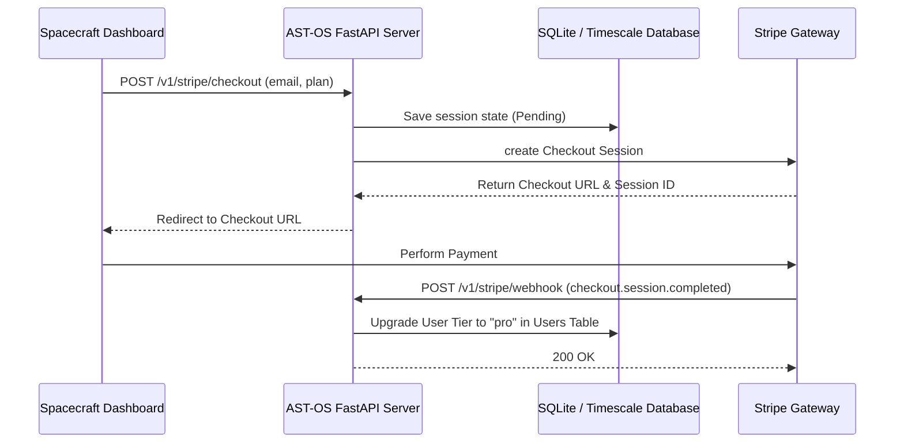

# Spacecraft Thermal OS (AST-OS) - SaaS Billing & stripe Integration Architecture

This document details the multi-tenant subscription tiers, payment integration flows, and webhook routing mechanics linking Stripe to the AST-OS SQLite database store.

---

## 1. Product Tiers Plan Design

We offer three subscription tiers to satisfy various aerospace operations requirements:

| Plan Tier | Price (Monthly) | Daily Quota | Features Included |
| --- | :---: | :---: | --- |
| **Developer (Free)** | $0.00 USD | 100 requests | Lumped simulators, API key validation, basic Swagger. |
| **Professional (Pro)**| $149.00 USD | 10,000 requests | Coupled 6-node LEO solver, JWT session auth, ReportLab PDF reports. |
| **Mission (Enterprise)**| $899.00 USD | Custom (100k+) | Swarm constellation scheduling, 24/7 dedicated support, custom EKF noise calibrations. |

---

## 2. Payments Checkout Flow

---

## 3. Webhook Controller Processing Rules

The webhook endpoint `POST /v1/stripe/webhook` processes Stripe payloads dynamically:
1. **Event Interception**: Captures incoming POST requests. In production, Nginx forwards the payload and signatures.
2. **Signature Validation**: Validates the webhook signature using `STRIPE_WEBHOOK_SECRET` to prevent headers spoofing.
3. **Database Integration**:
   * Inspects `event.type`.
   * For `checkout.session.completed` or `charge.succeeded`, extracts `billing_details.email`.
   * Triggers the SQLite update query:
     `UPDATE users SET tier = 'pro' WHERE email = ?`
4. **Graceful Degrades**: If a payment fails or cancels, the customer portal downgrades the tier to `free` instantly to block high-frequency simulations quota access.
