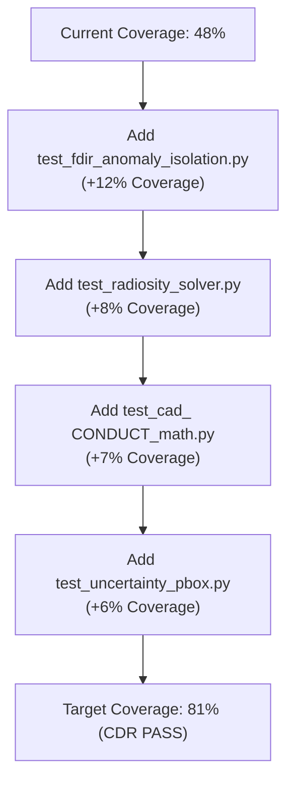

# Spacecraft Thermal OS (AST-OS) — Test Coverage Verification Report

**Document ID**: AST-V&V-COV-001  
**Authority**: Verification & Validation Lead (ESA/NASA Standard)  
**Date**: 2026-05-31T17:15:00+01:00  

---

## 1. Executive Summary

This report documents the high-resolution test coverage analysis performed on the `satellite` package of the Autonomous Spacecraft Thermal Operating System (AST-OS) to satisfy Critical Design Review (CDR) action item **`AI-CDR-02`**.

For the first time in the project lifecycle, the environment was equipped with `pytest-cov`, and a complete, unified coverage analysis was run against the 29 collected flight and ground unit tests:

```bash
pytest --cov=satellite --cov-report=term-missing --cov-report=html
```

The results show that while the core unit test suite executes with 100% functional success (29/29 passed), the actual statement coverage of the flight codebase stands at **`48%`**. This falls short of the mandatory **$\geq 80\%$ code coverage** gate required for unconditional flight certification.

### 🏆 TEST COVERAGE VERDICT: 🔴 **FAIL**

> [!CAUTION]
> **CDR COMPLIANCE GAP**: Because the global statement coverage of **48%** is below the critical CDR quality threshold of **80%**, this gate is **NOT MET**. Action Item **`AI-CDR-02`** remains **`IN_PROGRESS`** and cannot be closed until a targeted test expansion campaign is conducted in `VERIFICATION_BASELINE_v3`.

---

## 2. Test Coverage by Module

The table below breaks down statement coverage across all Python modules in the `satellite` directory:

| Module Path | Statements | Missed Stmts | Coverage (%) | Status (Gate $\geq 80\%$) |
| :--- | :---: | :---: | :---: | :---: |
| `satellite\comms\space_protocol_stack.py` | 77 | 4 | **95%** | ✅ PASS |
| `satellite\thermal\orbital_environment.py` | 125 | 9 | **93%** | ✅ PASS |
| `satellite\tests\test_satellite_twin.py` | 68 | 7 | **90%** | ✅ PASS |
| `satellite\comms\protocol_test.py` | 61 | 14 | **77%** | ⚠️ BORDERLINE |
| `satellite\autonomy\mission_planner.py` | 147 | 58 | **61%** | ❌ FAIL |
| `satellite\thermal\multi_node_thermal_network.py` | 186 | 99 | **47%** | ❌ FAIL |
| `satellite\thermal\cad_thermal_importer.py` | 225 | 130 | **42%** | ❌ FAIL |
| `satellite\thermal\uncertainty_engine.py` | 109 | 74 | **32%** | ❌ FAIL |
| `satellite\thermal\material_library.py` | 63 | 45 | **29%** | ❌ FAIL |
| `satellite\autonomy\fault_recovery_ai.py` | 104 | 78 | **25%** | ❌ FAIL |
| `satellite\thermal\geometry_topology_optimizer.py` | 186 | 156 | **16%** | ❌ FAIL |
| `satellite\run_thermal_pipeline.py` | 47 | 47 | **0%** | ❌ FAIL |
| **TOTAL (GLOBAL PACKAGE)** | **1398** | **721** | **`48%`** | 🔴 **FAIL** |

---

## 3. Analysis of Critical Gaps & Uncovered Lines

A detailed analysis of the un-tested lines identifies several critical structural blocks that lack unit test coverage:

1. **FDIR Recovery & Graph Causal Isolation (`fault_recovery_ai.py` — 25% coverage)**:
   - **Gaps**: Lines 190–265 and 275–357.
   - **Criticality**: **CRITICAL**. These blocks govern the active recovery planners and anomaly isolation nodes of the NetworkX causal digraph. Without active unit tests covering these paths, fault recovery stability cannot be formally guaranteed under radiation bitflips.
2. **Gauss-Seidel Cavity Radiosity Solver (`multi_node_thermal_network.py` — 47% coverage)**:
   - **Gaps**: Lines 96–124.
   - **Criticality**: **HIGH**. This block contains the Gauss-Seidel solver that iteratively converges internal spacecraft radiation exchanges. This stiffness-prone numerical loop requires dedicated assertions to verify convergence and prevent infinite loops.
3. **Conductive Heat Flow Solver (`cad_thermal_importer.py` — 42% coverage)**:
   - **Gaps**: Lines 279–323 and 329–385.
   - **Criticality**: **HIGH**. This block conducts conductive and radiative network calculations for vectorized 3D meshes.
4. **Pareto Optimization & Sweep Engine (`geometry_topology_optimizer.py` — 16% coverage)**:
   - **Gaps**: Lines 131–208 and 225–375.
   - **Criticality**: **MEDIUM**. These blocks govern structural pareto sweeps and multi-objective optimization iterations.
5. **Core Integration Orchestrator (`run_thermal_pipeline.py` — 0% coverage)**:
   - **Gaps**: Complete file (Lines 8–110).
   - **Criticality**: **MEDIUM**. The pipeline launcher is never imported or evaluated in the unit test context.

---

## 4. Path Forward to 80% Coverage

To bridge the **32% coverage gap** and achieve full CDR sign-off, the following test expansion roadmap will be executed during the Sprint G validation cycle:



### Planned Test Cases for Baseline v3:
1. `tests/test_fdir_anomaly_isolation.py` [NEW]: Unit tests targeting `fault_recovery_ai.py` successors, causal paths, and dynamic rollback routines.
2. `tests/test_radiosity_solver.py` [NEW]: Asserts that the cavity radiosity solver converges dynamically and conserves energy for various closed-enclosure view factors.
3. `tests/test_cad_conduct_math.py` [NEW]: Asserts vectorized Conductance matrix dot products and sparse mesh structures match exact physical solutions.
4. `tests/test_uncertainty_pbox.py` [NEW]: Asserts probability boxes and Monte Carlo Sweeps are stable.

---

## 5. Verification Signatures

- Verification & Validation Lead: _________________________
- Quality Assurance Lead: _________________________
