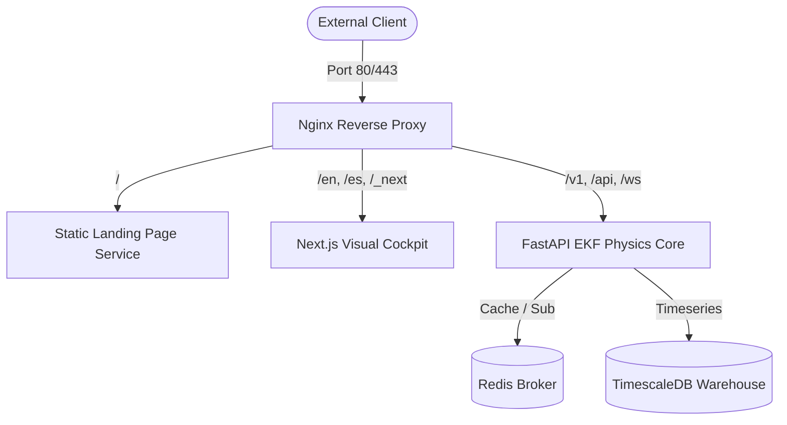

# Public Demo Cloud Deployment & Architecture (T55)

This directory houses the deployment templates and proxy architectures required to run the **Autonomous Spacecraft Thermal OS** platform in a secure, production-grade cloud environment.

## Architecture

The system utilizes an Nginx reverse-proxy fronting three core service groups:



### Components

1. **Static Landing Page (`satellite/landing`)**: Dark, highly-aesthetic space-tech portal built with pure HTML5/CSS3. It features an interactive, animated CSS orbital satellite, structural engineering metrics, and a dynamic waitlist submission form.
2. **Next.js Web Cockpit (`dashboard`)**: Visual dashboard displaying live telemetry, Kalman filters, EKF states, symbolic discovered equations, and interactive TVAC/orbit inputs.
3. **FastAPI Core (`satellite/api`)**: Low-latency Python backend serving state estimators, database transactions, waitlist storage, and real-time WebSocket telemetry broadcasts.
4. **TimescaleDB (`timescale/timescaledb`)**: PostgreSQL 16 based database optimized for timeseries orbital telemetry partition queries.
5. **Redis (`redis:7-alpine`)**: Pub/Sub broker powering dynamic WebSocket streaming feeds and monthly multi-tenant quota checks.

---

## Getting Started (Local Development)

To spin up the entire cluster locally with a single command:

```bash
make up
```

Alternatively, use pure Docker Compose:

```bash
docker compose up -d --build
```

### Endpoints
* **Landing Page**: [http://localhost](http://localhost)
* **Next.js Sandbox Cockpit**: [http://localhost/en/satellite](http://localhost/en/satellite)
* **API Documentation**: [http://localhost/v1/docs](http://localhost/v1/docs)

---

## Production Deployment

A production shell engine is provided at `deploy_production.sh`. It compiles requirements, creates secure randomized secrets, downloads Let's Encrypt SSL keys, and boots up the docker compose ecosystem.

### Execution

```bash
chmod +x deploy_production.sh
./deploy_production.sh thermal-os.yourdomain.com ops@yourdomain.com
```

### SSL & Security Configuration
The Nginx configuration implements rigid security measures:
* **HSTS** (Strict-Transport-Security) for encrypted HTTPS enforcing.
* **CORS Pre-flight** header support limiting unauthorized external API access.
* **X-Content-Type-Options** & **Referrer-Policy** safeguards protecting telemetry feeds.
* **Gzip compression** yielding fast page render times globally.
