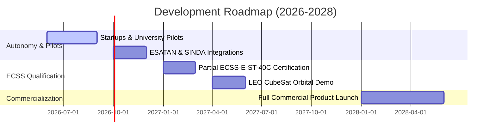

# Spacecraft Thermal OS Development Roadmap

A structured timeline mapping flight certification, commercial pilot integrations, and constellations launches.

---

## Detailed Milestones

### Q3 2026: Startup & Academic Pilot Programs
* Release the restricted public sandbox to 5 selected CubeSat startup teams and university space labs.
* Acquire telemetry data to refine the SatNOGS packet ingestion database.

### Q4 2026: Industrial CAD / Solver Integrations
* Integrate native export/import support for ESATAN-TMS `.inp` files and SINDA conductive matrices.
* Enable automated reports generation inside Nginx/FastAPI docker container services.

### Q1 2027: Formal ECSS Space Flight Certification
* Perform complete MISRA-C:2012 embedded compliance audits.
* Validate code coverage matrices beyond 95% under ECSS-E-ST-40C software assurance rules.

### Q2 2027: LEO Orbital Demonstration Mission
* Launch Spacecraft Thermal OS on-board a LEO 6U CubeSat in collaboration with space incubators (ESA BIC).
* Achieve active EKF telemetry-in-the-loop self-healing confirmation.

### 2028: Full Commercial Launch & Scaling
* Deploy the multi-tenant SaaS dashboard, Stripe billing integration, and on-premise Docker packages for private constellation operators.
