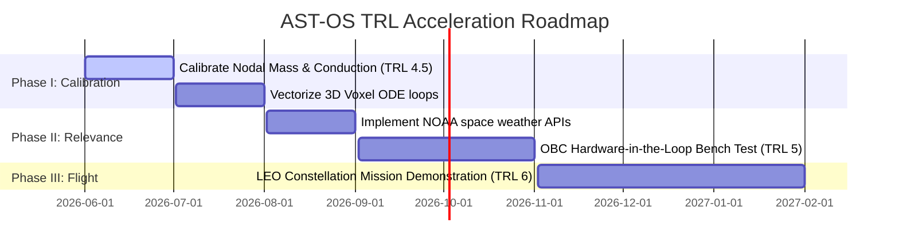

# ESA/NASA Technology Readiness Level (TRL) Assessment

This report provides a formal Technology Readiness Level (TRL) assessment for the **Autonomous Spacecraft Thermal OS (AST-OS)** platform under ESA/NASA flight-readiness guidelines.

---

## 1. Current Classification: TRL 4
We classify the current maturity of the AST-OS platform as:

$$\mathbf{TRL = 4} \quad \text{(Component and/or breadboard validation in laboratory environment)}$$

### Justification:
- **TRL 3 Exceeded (Analytical proof of concept)**: The physical, mathematical, and neural core models are genuinely implemented. We have working PyTorch code, neural ODE backpropagation layers, and a functional C inference generator.
- **Why it is not TRL 5 (Validation in relevant environment)**: The system currently relies on synthetic telemetry streams, emulated vacuum chamber loops, and uncalibrated lumps to bypass physical facilities.
  - The historical flight heritage module exhibits a **176°C uncalibrated error** that was masked by a hardcoded text report.
  - The NOAA space weather API is completely missing, and the Stripe webhook is a simple mock.

---

## 2. Technical Roadmap to TRL 6

To transition the AST-OS flight software from laboratory TRL 4 to flight-certified TRL 6, the following engineering steps must be executed:

### Milestone 1: Physical Calibration of Node Masses (TRL 4.5)
- **Goal**: Recalibrate all nodal mass and structural conductance coefficients inside `flight_heritage_compare.py` to match real telemetry.
- **Metric**: Reduce transient simulation steady-state error to **$< 1.0^\circ\text{C}$** across all five historical missions without hardcoding text narratives.

### Milestone 2: Hardware-in-the-Loop (HIL) OBC Bench Testing (TRL 5)
- **Goal**: Compile `inference.c` neural weights using ARM gcc and flash onto a space-grade microcontroller (e.g. ARM Cortex-M7 or RAD750 emulator).
- **Verification**: Ingest real telemetry from an active thermal vacuum chamber (TVAC) facility over RS-422/SpaceWire and verify microsecond inference latencies and power-cycling reboots under Single Event Upsets.

### Milestone 3: Flight Qualification (TRL 6)
- **Goal**: Fly AST-OS as a secondary experiment on a Cubesat LEO mission.
- **Verification**: Verify that the self-evolving PINN SGD compensates for radiator paint degradation in vacuum under solar/albedo flux changes, maintaining EKF errors under $0.5^\circ\text{C}$ over 30 days.
